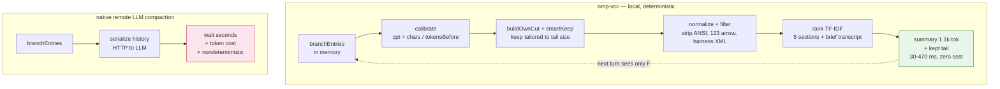
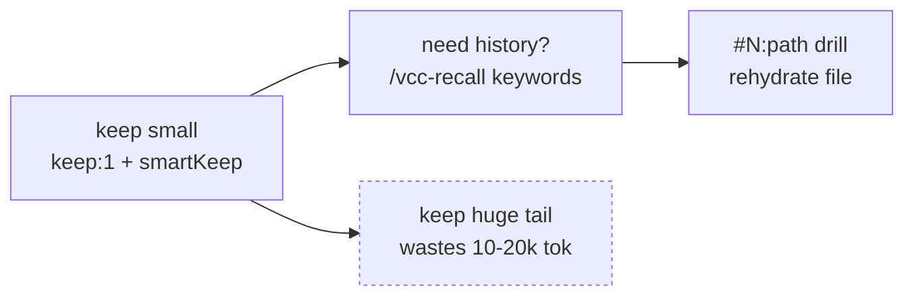

# @zhulinchng/omp-vcc — Algorithmic VCC Compaction for oh-my-pi

> Fast, deterministic, lossless compaction — no LLM calls. Port of [`sting8k/pi-vcc`](https://github.com/sting8k/pi-vcc) (`@0.7.0`) into [oh-my-pi](https://github.com/can1357/oh-my-pi), inspired by [`lllyasviel/VCC`](https://github.com/lllyasviel/VCC) and paper [`arxiv:2603.29678`](https://arxiv.org/pdf/2603.29678) *View-oriented Conversation Compiler for Agent Trace Analysis* (Zhang & Agrawala, 2026-03-31).

## Quick start

> **New here?** → [`docs/setup.md`](docs/setup.md) — 5-minute install with prerequisites, 4 install options (link / npm / git), verify, first `/omp-vcc`, recall, config, and troubleshooting. The commands below are the tldr.

```sh
# from source (local)
omp plugin link /Users/zhu/code/projects/omp-vcc
omp plugin list --json | jq '.[] | select(.name|contains("omp-vcc"))'

# from npm (unscoped)
omp plugin install omp-vcc

# from GitHub Packages (scoped, requires auth — see below)
omp plugin install @zhulinchng/omp-vcc

# from git
omp plugin install github:zhulinchng/omp-vcc
```

## What you get

- **Auto** threshold/overflow compaction via `session_before_compact` hook — no LLM summary, 30–470 ms, 35–99% reduction.
- **Manual** `/omp-vcc [keep:N] [focus]` (and `/pi-vcc` alias) — e.g. `/omp-vcc keep:2 fix auth` keeps last 2 user turns.
- **Recall** `vcc_recall({query:"redis cache", scope:"all", page:1})` or `/vcc-recall hook|inject scope:all page:2` — ranked regex → TF-IDF OR, 5/page, `mode:'touched'` and `#N:path` drill-down.
- **Savings observability** — toast `90.0k→22.0k (76% saved, ~68.0k)`, divider `── compacted · 90K→22K ·`, `vcc_stats` tool + `/vcc-stats` table + `details.savings` + `/tmp/omp-vcc-debug.json` (authoritative `tokensAfter` from host).

## Commands

| Command | Description |
| --- | --- |
| `/omp-vcc [keep:N] [focus]` | Algorithmic compaction, smart-keep may boost `keep:1` to keep more when tail small (5 k → 25 k). `keep:0` compacts all. Add `--stats` / `stats` to show last savings without compacting. |
| `/pi-vcc` | Alias for migration |
| `/vcc-recall [query] [scope:all] [page:N]` | Search compacted history (V_adapt). Plain keywords best. |
| `/pi-vcc-recall` | Alias |
| `/vcc-stats [history\|all]` | Show last compaction `Before→After/Saved/Kept` + history table (from `CompactionStats` 50-capped). |
| `/omp-vcc-stats` | Alias for `/vcc-stats` |

Tool `vcc_recall` mirrors the command, plus `expand:[indices]` and `mode:'touched'` for file index. Tool `vcc_stats({history:true})` mirrors `/vcc-stats` (approval `read`), same 50-capped table.
## Configuration

File `~/.omp/omp-vcc/config.json` (XDG-aware: `$OMP_VCC_CONFIG_PATH` > `$PI_VCC_CONFIG_PATH` (legacy) > `$OMP_DIR`/`$PI_CODING_AGENT_DIR` > `~/.omp/omp-vcc/config.json`, migrates legacy `~/.pi/agent/pi-vcc-config.json`):

```json
{
  "overrideDefaultCompaction": true,
  "smartKeepTail": true,
  "continueAfterThresholdCompact": true,
  "debug": false
}
```

## How it works

VCC compiles the raw JSONL trace via **lex → parse IR → monotonic line assignment → view lowering** into three views sharing one coordinate system:

- `V_full` identity — every message verbatim, defines coordinates `L`
- `V_ui` one-line tool summaries with stable pointers (`* Read "src/pets.py" (file.txt:18-20)`)
- `V_adapt(b, ρ)` projection via predicate `ρ` preserving headers/role tags and `(f:s-e)` pointers, two transposed modalities (document vs index oriented)

`omp-vcc` implements `V_ui` as the structured summary (5 sections + ranked brief transcript) and `V_adapt` as `vcc_recall`. Pointer invariant `V_ui → V_full[s:e]` holds structurally.

### No LLM — just local algorithm (30–470 ms)

Traditional compaction ships the whole history to a remote LLM and waits seconds. `omp-vcc` never calls a model: it reuses `branchEntries` already in memory, calibrates token size, cuts, normalizes, and ranks locally.



**Example** — a 80-turn session at 90k tokens, `keep:1` tail is only 3k (wastes budget):

- raw tail `3k` → `smartKeepTail` grows to `keep:4` with tail `21k` (still ≤ 25k cap)
- older 76 turns are compiled into `V_ui`:

```txt
[Session Goal] Fix auth token refresh
[Files And Changes] src/auth.ts, src/app.ts
[Brief transcript] (ranked, TF-IDF, 78 lines)
  (#12) Read src/auth.ts — missing refresh on expiry
  (#18) Edit src/auth.ts:12-34 — add refreshToken()
  (#33) Test auth flow — 2 failed, 1 passed
---
Kept tail (#77-#80) stays verbatim for immediate continuity.
```

Recall is the same idea: `vcc_recall` runs local regex → TF-IDF `rank.ts` and preserves skeleton. `query: "hook|inject"` returns 5 hits with `(#N)` pointers like `(#33) hook registration`; `query: "#18:src/auth.ts"` drills to `V_full[18:e]` verbatim.

Full diagrams and pipeline in [`docs/architecture.md`](docs/architecture.md); paper mapping in [`docs/paper-notes.md`](docs/paper-notes.md); setup in [`docs/setup.md`](docs/setup.md).

- **pi-vcc** — TypeScript algorithmic compactor, zero LLM, `RANKED_BRIEF_BUDGET_TOKENS=1100` ceil 2000, `charsPerBlock 15`
- **VCC** — Python `VCC.py` adaptive/transposed views, `SEP`, `match_lines`, `_tokenize`, `_trunc`, projection model
- **Paper** — AppWorld evaluation: +1.1–4.2 task_goal points, ½–⅔ token halving, smaller memory

## Best practices

> Goal: keep context small enough to stay fast and cheap, but large enough that the agent doesn't lose what you're working on.

### 1) Let auto do its job

- Keep `overrideDefaultCompaction:true` (default) — threshold/overflow compaction becomes deterministic and instant. Only set `false` if you explicitly want the remote LLM summarizer for `handoff` or you installed the optional native `vcc` dropdown patch and want to toggle per-session in `/settings`.
- Keep `smartKeepTail:true` and `continueAfterThresholdCompact:true` — the plugin grows `keep:1` to `keep:2…4` when the tail is tiny (5 k → 25 k) and auto-continues after a threshold compact so the agent doesn't stall mid-task.
- Don't spam `/omp-vcc` every few turns. Auto threshold (derived from your model's context window) already fires at the right moment. Manual compacts are for deliberate boundaries: finishing a sub-task, before a risky refactor, or when you feel the context getting noisy.

### 2) Pick the right `keep:N`

| Situation | Command | Why |
| --- | --- | --- |
| Default, happy path | `/omp-vcc` or `keep:1` | Smallest tail, max savings. `smartKeepTail` will still grow to `keep:3` if the last turn is only 3 k tok so you don't waste budget. |
| Actively iterating on last edits/tests | `/omp-vcc keep:2` or `keep:3` | Preserves the last 2–3 user turns verbatim (e.g. failing test output + fix). Costs more tokens but avoids recall. |
| Need maximal reduction (e.g. before context overflow) | `/omp-vcc keep:0` | Summarizes everything, no tail. Next turn starts from pure `V_ui`. Useful before pasting a huge spec. |
| With a focus prompt | `/omp-vcc keep:2 focus on auth refresh only` | Preserved tail + an injected follow-up prompt so the agent continues with the narrowed scope. |

Explicit `keep:N` always wins — smart-keep never overrides it.

### 3) Use recall instead of keeping more

Keeping a huge tail is the expensive alternative to recall. Prefer a small keep and search when you need history:

- Plain keywords first: `/vcc-recall redis cache` or `vcc_recall({query:"redis cache"})` — multi-word is OR + TF-IDF ranked (rare terms rank higher).
- Regex when you know the pattern: `/vcc-recall hook|inject`, `/vcc-recall fail.*build`.
- Pagination: `page:2` (5 hits/page): `/vcc-recall auth scope:all page:2`.
- Scope: default is active lineage (what the current branch actually saw). Add `scope:all` to search abandoned branches/edits/retries.
- Drill-down: `/vcc-recall #18:src/auth.ts` expands that turn's file slice verbatim from `V_full` — fastest way to rehydrate an edit.
- Index mode: `vcc_recall({query:"", mode:"touched"})` lists touched files across the session.



### 4) Help the extractor help you

The 5 sections (`[Session Goal]`, `[Files And Changes]`, `[Commits]`, `[Outstanding Context]`, `[User Preferences]`) are regex/heuristics, not an LLM. Make them work better:

- State the goal once, plainly, in the first user message: `Goal: fix auth token refresh in src/auth.ts`. That seeds `[Session Goal]` reliably.
- Declare preferences explicitly with cue words: `always run tests before committing`, `prefer concise diffs`, `never edit src/generated/`. Those go to `[User Preferences]`.
- Commit frequently — commits populate `[Commits]` and survive compaction better than bare edits.
- Mark outstanding items as questions/errors (`TODO:`, `failing:`, `why does …?`) so they land in `[Outstanding Context]` until resolved.

### 5) Know the difference: compact vs clear

- `/omp-vcc` (or `/compact`) **summarizes** — history becomes `V_ui` + searchable `V_full`. The divider `── compacted · 90k→22k · ctrl+o ──` stays in the transcript (expand with `ctrl+o`).
- `/clear` **erases** — inserts a `reset_boundary` after which even `V_full` is no longer compacted. Previous history stays on disk for `/vcc-recall scope:all` but the live context starts empty. Use `/clear` when you truly want a fresh session; use `/omp-vcc` when you want to keep the story.

### 6) Debug/verify habits

- One-shot verification after install: `/omp-vcc keep:1 test` → expect toast `omp-vcc: kept …` and an inline `[Session Goal]` block. No toast = `overrideDefaultCompaction:false` or a competing compactor.
- To tune: set `debug:true` in `~/.omp/omp-vcc/config.json`, run `/omp-vcc`, then `cat /tmp/omp-vcc-debug.json` — check `usedOwnCut`, `tokensBefore`, `tokenEstimate {charsPerToken, mode}`, `summaryLength`, `sections`. Remember to flip `debug:false` after — the file is overwritten every compact.
- For overflow: if you hit `tokensBefore > 50k` and nothing happens, check `omp plugin doctor` and that `vccEnabled:true`.

### 7) Team / long-session hygiene

- One compaction covers 30–100 turns; repeated compactions merge bounded (transcript caps at ~120 lines, sections dedup). Long-running sessions (200+ turns) stay healthy — don't fear auto.
- `snapcompact`/`shake`/`handoff` in `compaction.methodOrder` are orthogonal — `omp-vcc` only intercepts `context-full`. Leave them in the order if you use them; they run when `omp-vcc` explicitly defers (e.g. `vccEnabled:false`).
- Pin the plugin version in CI or shared dots: `omp plugin install github:zhulinchng/omp-vcc#v0.1.x` so the team shares the same `RANKED_BRIEF_BUDGET_TOKENS=1100` behavior.

## Development

```bash
omp plugin link .
omp plugin doctor
bunx tsc --noEmit
bun run smoke       # or bun run scripts/smoke.ts
bun test
```

Capabilities: `extension`, `skill`, `command` — entry `extensions/main.ts`.

## Verification

```sh
bunx tsc --noEmit
bun test          # 377 tests across 36 files, 987 expects
bun run smoke     # 9 checks: 3 hooks + 4 commands + 2 tools (vcc_recall, vcc_stats)
omp plugin link /Users/zhu/code/projects/omp-vcc && omp plugin doctor
```

In a live `omp` session: `/omp-vcc keep:1` shows `[Session Goal]` with toast `omp-vcc: 90.0k→22.0k (76% saved, ~68.0k) · kept 1/5 turns, ~2.1k tok` (fallback `omp-vcc: kept 1/5 turns…` when `tokensBefore` unavailable) + divider `── compacted · 90K→22K · ctrl+o ──`; with `debug:true` check `/tmp/omp-vcc-debug.json` (`savings` + `authoritativeSavings`). `/vcc-stats` / `/omp-vcc --stats` / `vcc_stats({history:true})` show the 50-capped `Before→After/Saved/Kept/Summarized/When` table. Full proof matrix and mermaid flows in [`docs/verification.md`](docs/verification.md).
## Publish

See [`docs/PUBLISHING.md`](docs/PUBLISHING.md) for the full checklist (package shape, gates, dual `omp-vcc` / `@zhulinchng/omp-vcc` flow, verification, deployment matrix, and troubleshooting). TL;DR:

- npmjs (unscoped): `npm publish --access public` (package `omp-vcc`, 2FA `auth-and-writes` → browser or `--otp`)
- GitHub Packages (scoped): `gh release create vX.Y.Z` triggers `.github/workflows/publish-gpr.yml` → `@zhulinchng/omp-vcc` via `GITHUB_TOKEN` (`read:packages, write:packages`); manual fallback `npm pkg set name=@zhulinchng/omp-vcc && GITHUB_TOKEN=$(gh auth token) npm publish --userconfig /tmp/gpr-npmrc --access public` (see guide for the scoped-registry `/tmp/gpr-npmrc` pitfall)
- Consumer GPR auth: add to `~/.npmrc`:

  ```
  @zhulinchng:registry=https://npm.pkg.github.com
  //npm.pkg.github.com/:_authToken=YOUR_GITHUB_PAT
  ```

- Marketplace: add an entry to `.omp-plugin/marketplace.json` (see `plugin-skill/assets/templates/marketplace-entry.json.template`).

## License

MIT — pi-vcc core files retain original MIT.
