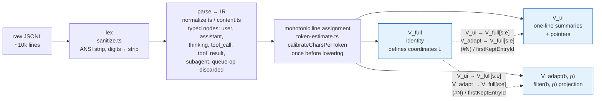
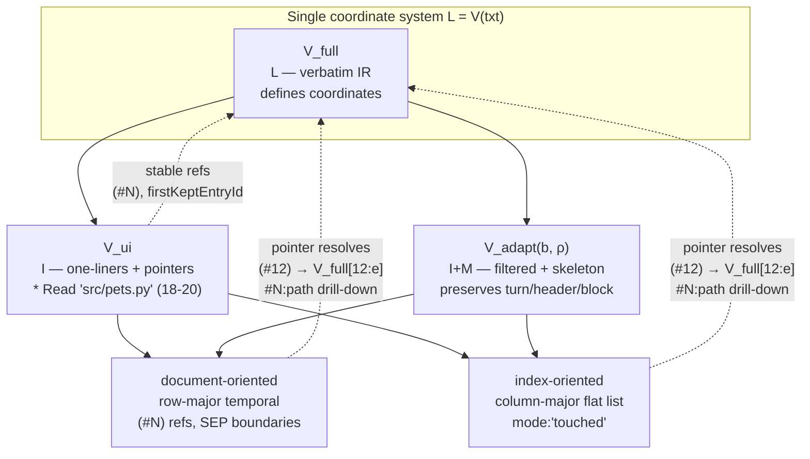
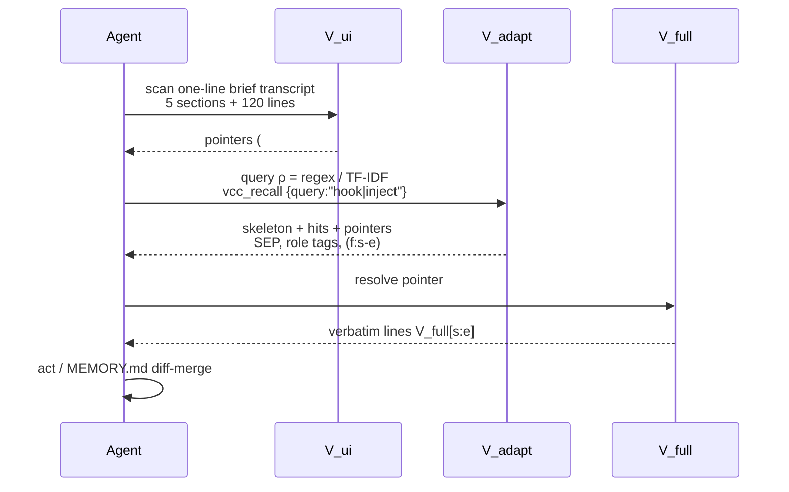
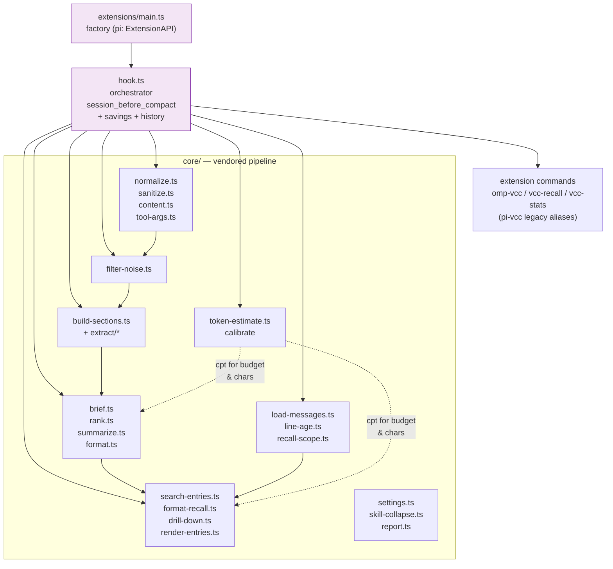
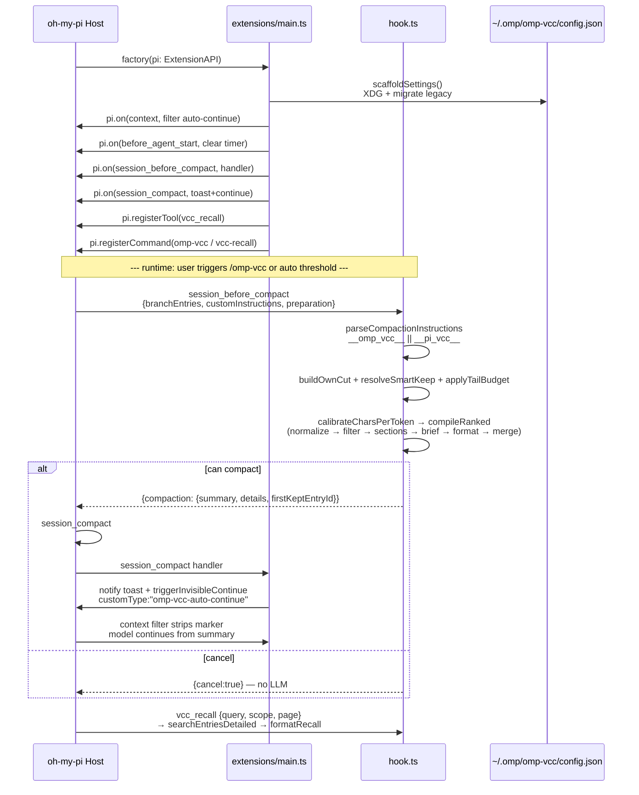
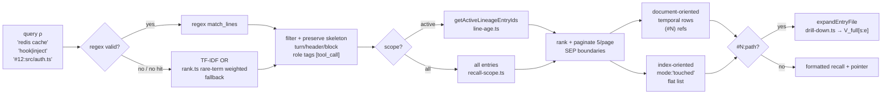
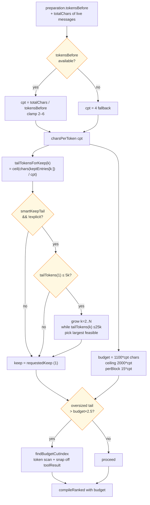
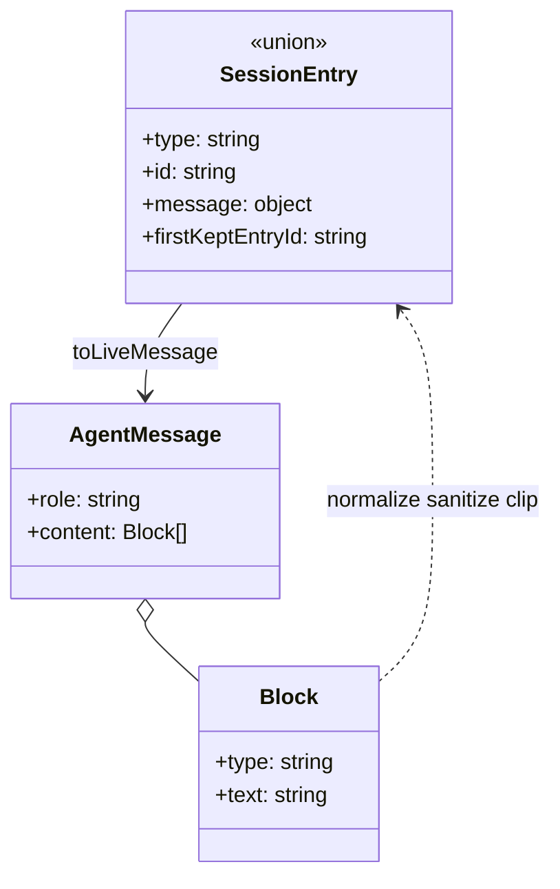
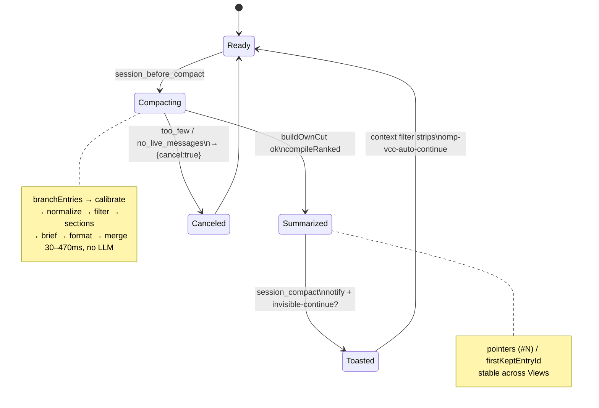

# Architecture — omp-vcc

## Paper foundation (arxiv 2603.29678 §2)

Agent trace = structured document (`user`, `assistant`, `thinking`, `tool_call`, `tool_result`, `subagent`, compaction boundary, harness `<system-reminder>`/`<ide_opened_file>` etc, >10 k JSONL lines). VCC requirement: lossless record + session overview + role-aware retrieval.

**Compiler pipeline** `lex → parse to typed IR → monotonic line assignment → view lowering` (paper §2.2, Fig.1 left). Single assignment before lowering guarantees pointer invariant `V_ui → V_full[s:e]` and `V_adapt → V_full[s:e]` structurally (SSA-like). All pointers are stable `(#N)` refs / `firstKeptEntryId` lineage, not per-view re-numbering.



**Three views** sharing `V_full` coordinate system (paper eq.1–2):

- `V_full` — identity, every IR node verbatim, defines coordinates.
- `V_ui` — one-line tool summaries `* Read "src/pets.py" (file.txt:18-20,23-25)`, elided internals, merged same `message.id` assistant turns (paper Fig.1 center).
- `V_adapt(b, ρ)` — structure-preserving projection `output = filter(b, ρ)` preserving `turn/header/block` delimiters, role tags `[tool_call]/[thinking]`, pointers `(f:s-e)` or `from` truncation; `ρ ∈ {regex, BM25, embedding, LLM}` via `match_lines(b,ρ)` (§2.1). Two transposed modalities: *document-oriented* temporal (row-major) vs *index-oriented* flat list (column-major), same data. Typesets: `V(txt)=L`, `V(min.txt)=I`, `V(view.txt)=I+M` (§3.1).



**Progressive disclosure workflow** §2.4: `V_ui → V_adapt(query) → resolve pointer V_full[s:e]`. AppWorld protocol: generator→reflector→`MEMORY.md` diff-merge.



**Related positioning** §4: vs multi-level memory (MemGPT/RAPTOR precomputed) and flat search — VCC is *projective*, not store. Context-length tradeoffs: Liu et al. lost-in-middle, Xiao et al. 40–60% redundant tokens.

## Implementation pipeline (omp-vcc)

```
Calibrate → Smart keep → Build cut → Normalize (IR) → Filter noise → Build sections → Brief transcript (V_ui) → Format → Merge
```



```mermaid
flowchart LR
  A["Calibrate\ncalibrateCharsPerToken\ncpt = clamp(totalChars/tokensBefore,2,6)"] --> B["Smart keep\nresolveSmartKeepUserTurns\nkeep:1→N while tail ≤25k\nrespect explicit keep:N"]
  B --> C["Build cut\nbuildOwnCut\nfirstKeptEntryId + orphan ''\n>2 live, cutIdx=userIndices[target]\ncompactAll sentinel"]
  C --> D["Tail budget rescue\napplyTailBudget ×2.5\nsnap off toolResult"]
  D --> E["Normalize (lex/parse IR)\nnormalize.ts / sanitize.ts / content.ts\n| block scalars, clip, PATH_KEYS"]
  E --> F["Filter noise\nfilter-noise.ts\n<harness> removed"]
  F --> G["Build sections\nbuild-sections.ts\nextract/* 5 sections"]
  G --> H["Brief V_ui\nbrief.ts + rank.ts TF-IDF\nperBlock 15*cpt"]
  H --> I["Format\nformat.ts\nbracketed + RECALL_NOTE"]
  I --> J["Merge\nsummarize.ts\nsticky dedup, volatile replace\nroll, capBrief 120 lines"]
  J --> K["Output\n{summary, details,\nfirstKeptEntryId, tokensBefore}"]
  K --> L["Savings\nkeptChars→keptTokensEst\nsummaryChars→summaryTokensEst\ntokensAfterEst→savedEst/percent\n+ authoritative enrich"]

  classDef stage fill:#fff3e0,stroke:#ef6c00
  class A,B,C,D,E,F,G,H,I,J stage
  class K,L fill:#e8f5e9,stroke:#2e7d32
```

Mapped from VCC compiler stages (§2.3) and pi-vcc 20-file core:

| Stage | pi-vcc module | VCC anchor | omp-vcc location |
|---|---|---|---|
| Calibrate `charsPerToken` | `token-estimate.ts` `calibrateCharsPerToken(totalChars / tokensBefore)` fallback 4, clamp 2–6, `IMAGE_CONTENT_CHARS 4800` | line assignment before lowering | `extensions/vcc-core/core/token-estimate.ts` |
| Smart keep | `resolveSmartKeepUserTurns` `MIN 5k → MAX 25k`, grows `keep:1` while tail ≤ max, respects explicit `keep:N`, stops at `compactAll` | size-relative budget | `extensions/vcc-core/hook.ts` |
| Build cut | `buildOwnCut(branchEntries, keep:N)` collects live messages via `firstKeptEntryId` + orphan recovery (`""` sentinel or missing id), enforces `>2` live, `cutIdx = userIndices[target]`, `compactAll` sentinel `firstKeptEntryId=""` | IR sequence `I=(n1..nN)` + lineage | `hook.ts` |
| Tail budget rescue | `applyTailBudget` `OVERSIZED_TAIL_FACTOR 2.5`, `findBudgetCutIndex` token-budget scan + snap off `toolResult` boundary | rescue autonomous/oversized | `hook.ts` |
| Normalize (lex/parse IR) | `normalize.ts` uniform blocks, `sanitize.ts` ANSI/control strip, `content.ts` `clip`/`isContentBearing`, `tool-args.ts` `PATH_KEYS` | `normalize.ts` + `load-messages.ts` = lex→parse IR: escaped JSON→`|` block scalars, `digits→` stripped, `<system-reminder>`/`<ide_opened_file>` filtered, `TodoWrite`/`ToolSearch` removed, same `message.id` merged, `queue-operation`/`file-history-snapshot`/`progress`/`api_error` discarded, base64 images extracted | `extensions/vcc-core/core/normalize.ts` etc |
| Filter noise | `filter-noise.ts` | harness filtering | `core/filter-noise.ts` |
| Build sections | `build-sections.ts` regex extractors `extractGoals`, `extractFiles`, `extractCommits`, `extractPreferences`, `collapseSkillText` `RANKED_BRIEF_BUDGET*` | 5 semantic sections | `core/build-sections.ts` + `extract/*` |
| Brief transcript (V_ui) | `brief.ts` chronological one-liners `(#N)` refs, `rank.ts` TF-IDF weighting, `format.ts` bracketed sections `RECALL_NOTE`, `summarize.ts` bounded merge (sticky dedup, volatile replace, transcript roll, `RANKED_BRIEF_BUDGET_TOKENS=1100` ceil 2000, `briefCharsPerBlock 15`, `BRIEF_MAX_LINES 120` cap via `capBrief`) | `V_ui` identity vs UI distinction eq.1, `V_adapt` eq.2 | `core/brief.ts`, `rank.ts`, `format.ts`, `summarize.ts` (`compileRanked`) |
| Recall ranking | `search-entries.ts` `searchEntriesDetailed` regex→OR (`rank.ts` rare-term weighted), `render-entries.ts`, `format-recall.ts`, `drill-down.ts` `#N:path` | `V_adapt` `match_lines(b,ρ)` preserving skeleton + `SEP` | `core/search-entries.ts`, `core/format-recall.ts`, `core/drill-down.ts` |
**Module map** `extensions/vcc-core/`:

```
vcc-core/
  hook.ts                — registerBeforeCompactHook (context filter, before_agent_start, session_before_compact with buildOwnCut/smartKeep/budget/compileRanked + savings, session_compact toast + invisible-continue + authoritative enrich, vcc_stats history/table)
  core/
    brief.ts, rank.ts, build-sections.ts, format.ts, summarize.ts, token-estimate.ts, normalize.ts, filter-noise.ts, content.ts, sanitize.ts, tool-args.ts, report.ts, line-age.ts, load-messages.ts, render-entries.ts, search-entries.ts, format-recall.ts, drill-down.ts, recall-scope.ts, settings.ts, skill-collapse.ts
  extract/
    commits.ts, files.ts, goals.ts, preferences.ts
  types.ts, details.ts (version 2 + savings), sections.ts
  commands/vcc-recall.ts — shim for pi-vcc test compatibility
```

Host pipeline that omp-vcc bypasses is detailed in [harness.md §5.2.1](harness.md) (prune → useless → threshold → prepareCompaction → walk methodOrder) and pinned host docs [omp-compaction.md](omp-compaction.md)/[omp-snapcompact.md](omp-snapcompact.md) @18781d8295.



**Extension lifecycle** `extensions/main.ts` factory `(pi: ExtensionAPI) => void`:

1. `scaffoldSettings()` → `~/.omp/omp-vcc/config.json` (XDG-aware, migrates `~/.pi/agent/pi-vcc-config.json`)
2. `pi.on("context", filter omp/pi auto-continue marker)` strips `customType === "omp-vcc-auto-continue" || "pi-vcc-auto-continue"` (matches pi-vcc's `on('context')` filter)
3. `pi.on("before_agent_start", clearPendingAutoContinue)`
4. `pi.on("session_before_compact", handler)` → `parseCompactionInstructions` (accepts both `__pi_vcc__` and `__omp_vcc__` sentinels), `buildOwnCut`, `resolveSmartKeepUserTurns`, `applyTailBudget`, `calibrateCharsPerToken`, `compileRanked` with size-relative budget, computes `summaryChars → summaryTokensEst`, `keptChars → keptTokensEst`, `tokensAfterEst/savedEst/percent`, writes `details.savings` (`version:2`) + `dbg.savings` + `setLastStats` (per-pi `WeakMap`+`perPiKeys` + global, 50-capped, `timestamp`), returns `{compaction: {summary, details, tokensBefore, firstKeptEntryId}}` or `{cancel:true}` (overflow/willRetry fallback vs cancel). Reuses `convertToLlm` shim (host `session/messages` or identity).
5. `pi.on("session_compact", ...)` enriches `lastStats` with authoritative `compactionEntry.tokensAfter/tokensBefore → saved/percent` *before* `isPiVccLast/willRetry` early returns, then schedules toast (`formatCompactionStats` with `90k→22k (76% saved)` prefix, budgetCut aware, `999→500` vs `1.0k`) and `triggerInvisibleContinue` (`customType:"omp-vcc-auto-continue"` display:false triggerTurn:followUp) filtered in (2); `dbg.authoritativeSavings` when `debug:true`.
6. `pi.registerTool("vcc_recall", ...)` via `pi.zod` (rho: regex→OR, lineage `active` vs `all`, pagination 5, `mode:'touched'`, `expand`, `parseDrillDown`).
7. `pi.registerTool("vcc_stats", {history?:boolean})` (approval read, `perPi`+global history table via `formatStatsTable`/`formatLastStatsDetail`) + `pi.registerCommand("vcc-stats")` single (no `omp-vcc-stats` duplicate).
8. `pi.registerCommand("omp-vcc")` / `"pi-vcc"` (compact only, toast single line; detailed savings via `/vcc-stats`) and `"vcc-recall"` / `"pi-vcc-recall"` — extension-only; no `commands/*.md` file slash commands (removed to avoid duplicate `/omp-vcc`).



**Recall ranking** — TF-IDF `rank.ts`, `normalize.ts` (paper §2.1 `ρ` fallback), regex first. Progressive disclosure pointers `(#N)` and drill-down `#N:path` resolve to `V_full[s:e]`.



**Token estimation math** (paper §2.2 line assignment):

```
cpt = clamp(totalChars / tokensBefore, 2, 6) else 4
estimateTokensFromChars(chars, cpt) = ceil(chars / cpt)
tailTokensForKeep = tokens( keptEntries slice )
RANKED_BRIEF_BUDGET_TOKENS 1100 → maxBriefChars = 1100*cpt
CEILING 2000, perBlock 15*cpt  (size-relative, small/med at floor, large earns up to ceiling, audit 794 sessions: LARGE -5.0pp → -2.3pp, losers 100→67/369)
```



**Layout** `SessionEntry` (`type:"message"` with `message:{role,content}`, `type:"compaction"` with `firstKeptEntryId`, `type:"custom_message"` etc) vs `AgentMessage`/`Message` (pi-ai). `toLiveMessage` converts `custom_message`/`branch_summary`/`message`.



## Performance & invariants

- Latency 30–470 ms, 0 allocations beyond `convertToLlm` slice (reuses `branchEntries`).
- Deterministic, no LLM.
- Empty/missing handled: `normalize` tolerates undefined content, `loadAllMessages` returns `[]`, `estimate*` heuristic fallback.
- Repeated compactions merge bounded: `summarize.ts` sticky dedup, volatile replace, transcript roll.
- `firstKeptEntryId=""` sentinel ensures `buildSessionContext` matches 0 kept, next `buildOwnCut` triggers orphan recovery.



---

See also: [Harness Impact](harness.md) — what omp-vcc adds vs intercepts in oh-my-pi, with verified citations and mermaid. · [Setup — working with strategies](setup.md#working-with-existing-compaction-strategies) · Pinned copies: [omp-compaction.md](omp-compaction.md) / [omp-snapcompact.md](omp-snapcompact.md)
