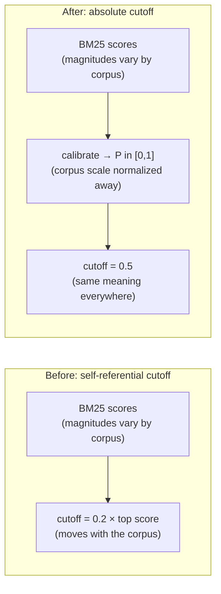
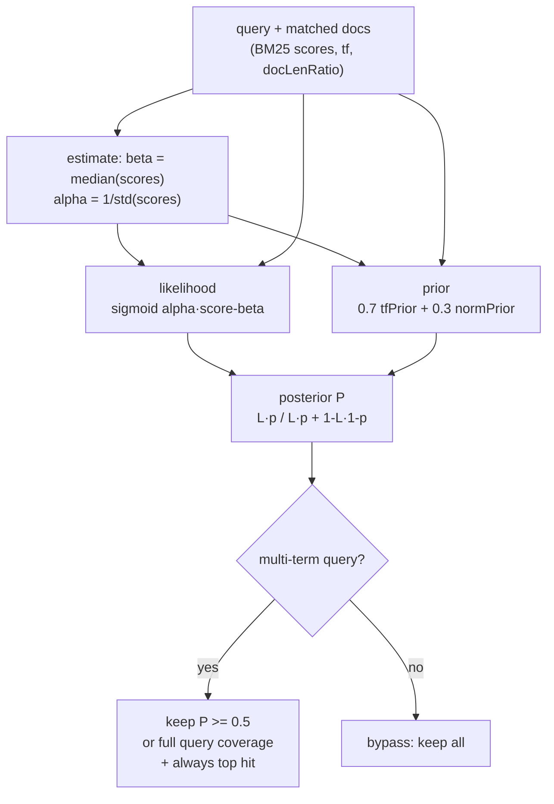
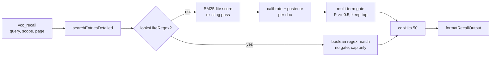

# Bayesian posterior gate for recall search

Tail filter for multi-term `vcc_recall` queries changed from a relative BM25
fraction to an absolute calibrated-probability cutoff. Ranking, single-term
queries, the regex path, and the hard cap are untouched.

## What changed

| Area | Before | After |
|---|---|---|
| Tail filter | `score >= 0.2 × top score` (`BM25_RELATIVE_FLOOR`, `applyRelativeFloor`) | `P(relevance) >= 0.5` **or** full query coverage (`BAYESIAN_PROBABILITY_FLOOR`, `applyProbabilityFloor`) |
| Tuning key | `SearchTuning.relativeFloor` | `SearchTuning.probabilityFloor` |
| New module | — | `core/bayesian-probability.ts`: vendored score→probability port (~90 lines, zero deps) |
| Hit shape | `snippet`, `matchCount` | adds optional `probability` (BM25 path only) |
| Unchanged | sort key (raw BM25 desc), single-term bypass, regex path, `SEARCH_RESULT_CAP 50`, snippets, `capHits` | — |

## Why: raw BM25 scores have no absolute meaning

BM25 scores are unbounded and corpus-dependent — the same query over a short
vs. long session produces different magnitudes. The old code said so itself:
*"a fixed score threshold would behave inconsistently across short vs. long
sessions."* The 0.2 relative floor patched this by anchoring the cutoff to the
top score, but that anchor is self-referential: the threshold moves with the
corpus, so 0.2 means something different on every session. This is exactly
Problem 1.1.2 of Jeong 2026a ("Bayesian BM25"). The fix is the paper's
score→probability transform — sigmoid likelihood × tf/length prior → Bayesian
posterior — which maps any BM25 score into a calibrated `P(relevance)` in
`[0,1]`. Only on calibrated probabilities does one absolute cutoff (0.5 =
"more likely relevant than not", modulo the prior) behave consistently.

## How it works

Per natural-language query, after the existing BM25-lite scoring pass:

1. **Estimate** the sigmoid midpoint/shift from the query's own nonzero scores:
   `beta = median`, `alpha = 1/std` (`std = 0 → 1`). Deterministic, one
   `O(n log n)` pass — the reference scorer's seeded pseudo-query sampling
   reduced to what a live query can actually afford.
2. **Transform** each doc: likelihood `L = sigmoid(alpha·(score − beta))`,
   composite prior `p = clamp(0.7·tfPrior + 0.3·normPrior, 0.1, 0.9)` from total
   term frequency and doc-length ratio, posterior `P = L·p / (L·p + (1−L)(1−p))`.
   One aggregate transform per doc — an approximation of per-term fusion, noted
   in code; sufficient for a noise gate, never used for ranking.
3. **Gate** multi-term queries only (≥2 distinct terms after stopword/case
   normalization): keep `P >= 0.5`, keep docs covering as many distinct query
   terms as the best hit (coverage parity), plus the top hit unconditionally.

> **Subtlety the code comments call out:** `posterior(0.5, p) = p`, so a top-hit
> likelihood ≥ 0.5 does **not** imply posterior ≥ 0.5. The unconditional
> keep-first rule — not the calibration — is the non-empty guarantee, and it
> holds at any threshold override (tested at 0.99).

## Deliberate non-changes

| Candidate | Verdict | Reason |
|---|---|---|
| Full `BayesianBM25Scorer` swap / npm `bayesian-bm25` dep | No | Repo is zero-dependency and the plugin ships `extensions/` only; the needed math is ~40 pure functions, and per-query sampling estimation is overkill |
| Multi-signal fusion (paper 2), vector calibration (paper 3) | No | No second signal, no embeddings — nothing to fuse; revisit only if a vector signal exists |
| Base-rate correction | No | Its estimators need relevance labels a live query cannot provide; stays null |
| Re-ranking by posterior | No | The prior varies per doc, so posterior order can differ from BM25 order; all rank assertions pin BM25 order |

## Benefits

1. **Stable cutoff.** 0.5 means the same thing on a 4-entry session and a
   400-entry one; the old 0.2 meant something different on each.
2. **Cross-session comparability.** Raw BM25 scores cannot be ranked across
   corpora; calibrated probabilities can — this is what the Phase 6
   (`scope:archive`) merge needs to combine hits from different sessions.
   (See `vcc-paper-alignment.md` Phase 6.)
3. **Ranking preserved.** Sort key is still raw BM25; single-term results are
   byte-identical with and without the gate (asserted in tests).
4. **Bounded blast radius.** The gate only trims partial-coverage,
   low-probability OR-tail; coverage parity plus keep-first make empty or
   massacred results impossible.
5. **Probabilities available** on every BM25 hit for future consumers
   (formatters, merge, debugging) at no extra scan cost — `tf` and length
   ratio come out of the existing scoring pass.

## Evidence

Scratch probe over synthetic corpora (run, observed, then removed):

| Corpus | Gate disabled | Default gate |
|---|---|---|
| Graded 5-doc cliff (2 strong, 3 one-term tail) | `[0,1,2,4,3]` — BM25 order | `[0,1]` — kept at `P` 0.97/0.80, tail at 0.28–0.30 |
| 60-entry (5 strong + 55 weak) | 60 hits | exactly `[0..4]`, min kept `P` 0.9956 |
| 6-entry uniform (all match all terms, all `P` < 0.5) | 6 hits | all 6 kept via coverage parity |
| `"root cause auth"` (3-term; #1 matches 1 term) | `[3,1]` — OR layer intact | `[3]` — weak hit at `P` 0.19 |
| Single-term `"alpha"` on 60-entry | 60 hits | identical 60 hits |

### Hit-rate bench: new gate vs prior relative floor vs ungated

Seeded bench (mulberry32 corpora, `N ∈ {20, 60, 150}`, 2–4 planted
full-coverage docs in 1-term OR-tail noise — short one-liner, medium, long,
and an adversarial 400-word dilution — 30 seeds per shape, 180 trials per
query; old filter = pre-gate module resurrected from git, production
defaults on both sides; scratch, removed after the run):

| Query | Planted recall new | Planted recall old | Trials new < old | Noise kept med new / old / ungated | Top-1 == ungated | Zero-hit regress |
|---|---|---|---|---|---|---|
| 4-term | 1.0000 | 1.0000 | 0 | 8 / 12 / 52 | 180/180 both | 0 both |
| 2-term | 1.0000 | 1.0000 | 0 | 12 / 30 / 32 | 180/180 both | 0 both |
| 1-term | 1.0000 | 1.0000 | 0 | 22 / 22 / 22 (bypass) | 180/180 both | 0 both |

Read: hit-rate parity with the old floor on planted relevant docs (1.0 both,
never worse in any single trial), strictly less tail noise on multi-term
queries, top-1 never moves, nothing collapses to zero. In 431/3000 fuzz
trials the new gate additionally keeps a full-coverage hit the old prefix
floor drops — parity rescues below the old cutoff at zero recall cost.

### Known tail-membership divergence (documented, not hidden)

The gate follows posterior order, not BM25 rank order, so the kept set is
not always a rank prefix (non-prefix in 1635/3000 fuzz trials — expected per
Remark 4.3.2, posterior order ≠ BM25 order). Concretely: a corpus with a
strong top hit, a 1-term×5 repetition in a very short doc, and a 2-term
match in a longer note gates to top + repetition (`P` 0.85/0.53) and drops
the 2-term note (`P` 0.33) — the old prefix floor kept top + note instead.
Top-1 is identical either way; the divergence is confined to tail
membership, where the length/tf priors outvote raw term coverage. If seeded
recall ever regresses on this shape in practice, the accepted contingency
applies: lower the default to 0.4 (one line at the constant), never retune
the prior.

Edge battery (all sane, high-value cases committed as tests): all-stopword
query, empty corpus ± query, short-messages fallback to summary, CJK terms,
floor extremes (1/2 keep top + parity only; negative disables; NaN degrades
to keep-first + parity, never empty, never throws), gate-then-cap honesty
(60 uniform → 50 hits, `totalBeforeCap` 60, truncated), regex hits carry no
`probability`, stopword-reduced bypass with sub-cutoff `P` attached,
400-word full-coverage survival, file-path-only survival with null snippet,
2000-entry query in ~7 ms (budget is 3000 ms).

Committed suite: `bayesian-probability.test.ts` (port fidelity against
hand-computed Eq. 20/22/25/26/27 values, estimator edges, score→probability
monotonicity) + gate tests in `search-entries.test.ts` (cliff, 0.99-threshold
keep-first, coverage parity, parity-beats-threshold at 0.99 with a non-top
full-coverage doc, uniform-weak stand-down, planted-relevance hit-rate over 3
seeds, file-path-only survival, summary fallback, all-stopword query,
stopword-reduced bypass, gate-then-cap honesty, regex-path no-probability,
empty corpus, determinism, 60-entry collapse, bypasses) +
`recall-bayesian-gate.test.ts` (11 integration tests through the
tool/command: header counts, expand/`#N` reachability of gated-out hits,
pagination, lineage vs `scope:all`, touched mode, zero-hit phrasing,
single-term parity, 300-entry budget, thinking-only survival, command
output). Full gate after threshold-sweep hardening: `tsc` 0 errors, 603 pass
/ 0 fail (54 files), `bun run smoke` all pass.

## Call path

## Tuning

No retuning needed. A threshold sweep (same seeded bench as §Evidence,
180 trials per floor) shows planted recall flat at 1.0 across the entire
plausible band on both multi-term queries — the threshold never touches a
relevant doc, only tail membership:

| Floor | 4-term recall / noise med | 2-term recall / noise med |
|---|---|---|
| 0.3 | 1.0 / 29 | 1.0 / 18 |
| 0.4 | 1.0 / 15 | 1.0 / 14 |
| 0.5 (default) | 1.0 / 8 | 1.0 / 11 |
| 0.6 | 1.0 / 2 | 1.0 / 11 |
| 0.7 | 1.0 / 0 | 1.0 / 11 |

0.5 sits mid-slope with maximum margin on both sides: lowering to 0.4 admits
roughly double the tail for zero recall gain; raising past 0.5 buys nothing
further on 2-term queries (the residue is parity-kept) while narrowing the
margin above the tail-membership divergence noted in §Evidence. Churn between
adjacent floors is high (nearly every trial differs) — the knob is sensitive
but safe. 11.6% of scored hits fall within ±0.05 of 0.5, so the cutoff does
real work rather than rubber-stamping a bimodal split.

- Production default is the constant; `SearchTuning.probabilityFloor` exists
  for tests and the offline bench only.
- `probabilityFloor: 0` disables the gate (baseline comparisons).
- Kept sets are monotone in the floor (higher never admits what a lower
  drops) and the default equals an explicit `{ probabilityFloor: 0.5, cap:
  50 }` — both pinned in `tests/search-entries.test.ts`, as is recall-flat
  across 0.3/0.5/0.7 on seeded corpora.
- Contingency (accepted risk, short exact-match entries score a lower length
  prior): if seeded recall ever regresses on short entries, lower the default
  to 0.4 — one line, documented at the constant. Do not retune the prior.
- Untouched by this verdict and needing none: `BM25_K`/`BM25_B` (textbook
  Robertson defaults; rank-order assertions pin behavior), `SEARCH_RESULT_CAP`
  50 (post-gate medians 8–12 rarely reach it), `SEARCH_BUDGET_MS` (2000-entry
  query measured ~7 ms), the transform's prior weights (paper equations —
  deviating breaks the paper link), stopwords.
