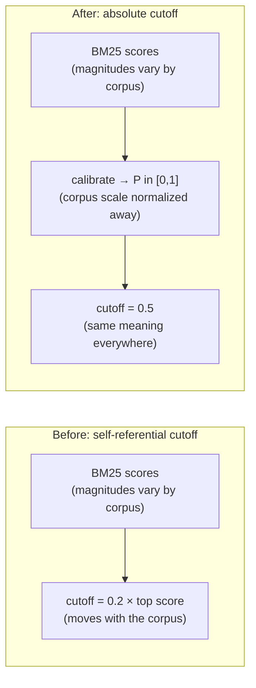
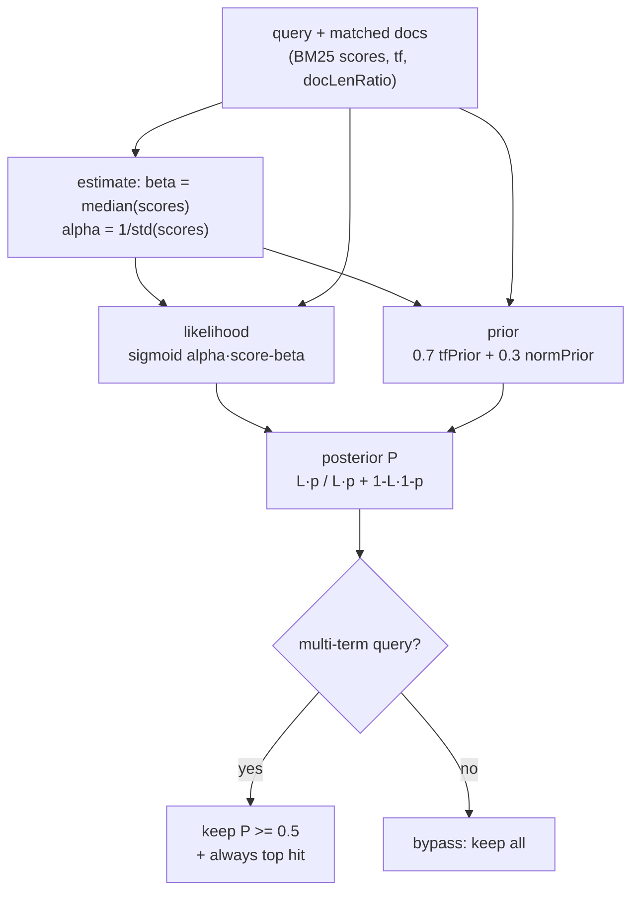
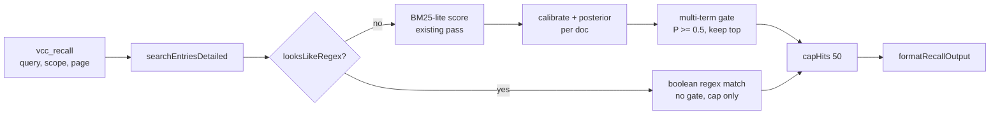

# Bayesian posterior gate for recall search

Tail filter for multi-term `vcc_recall` queries changed from a relative BM25
fraction to an absolute calibrated-probability cutoff. Ranking, single-term
queries, the regex path, and the hard cap are untouched.

## What changed

| Area | Before | After |
|---|---|---|
| Tail filter | `score >= 0.2 × top score` (`BM25_RELATIVE_FLOOR`, `applyRelativeFloor`) | `P(relevance) >= 0.5` (`BAYESIAN_PROBABILITY_FLOOR`, `applyProbabilityFloor`) |
| Tuning key | `SearchTuning.relativeFloor` | `SearchTuning.probabilityFloor` |
| New module | — | `core/bayesian-probability.ts`: vendored score→probability port (~90 lines, zero deps) |
| Hit shape | `snippet`, `matchCount` | adds optional `probability` (BM25 path only) |
| Unchanged | sort key (raw BM25 desc), single-term bypass, regex path, `SEARCH_RESULT_CAP 50`, snippets, `capHits` | — |

## Why: raw BM25 scores have no absolute meaning

BM25 scores are unbounded and corpus-dependent — the same query over a short
vs. long session produces different magnitudes. The old code said so itself:
*"a fixed score threshold would behave inconsistently across short vs. long
sessions."* The 0.2 relative floor patched this by anchoring the cutoff to the
top score, but that anchor is self-referential: the threshold moves with the
corpus, so 0.2 means something different on every session. This is exactly
Problem 1.1.2 of Jeong 2026a ("Bayesian BM25"). The fix is the paper's
score→probability transform — sigmoid likelihood × tf/length prior → Bayesian
posterior — which maps any BM25 score into a calibrated `P(relevance)` in
`[0,1]`. Only on calibrated probabilities does one absolute cutoff (0.5 =
"more likely relevant than not", modulo the prior) behave consistently.

## How it works

Per natural-language query, after the existing BM25-lite scoring pass:

1. **Estimate** the sigmoid midpoint/shift from the query's own nonzero scores:
   `beta = median`, `alpha = 1/std` (`std = 0 → 1`). Deterministic, one
   `O(n log n)` pass — the reference scorer's seeded pseudo-query sampling
   reduced to what a live query can actually afford.
2. **Transform** each doc: likelihood `L = sigmoid(alpha·(score − beta))`,
   composite prior `p = clamp(0.7·tfPrior + 0.3·normPrior, 0.1, 0.9)` from total
   term frequency and doc-length ratio, posterior `P = L·p / (L·p + (1−L)(1−p))`.
   One aggregate transform per doc — an approximation of per-term fusion, noted
   in code; sufficient for a noise gate, never used for ranking.
3. **Gate** multi-term queries only (≥2 distinct terms after stopword/case
   normalization): keep `P >= 0.5`, plus the top hit unconditionally.

> **Subtlety the code comments call out:** `posterior(0.5, p) = p`, so a top-hit
> likelihood ≥ 0.5 does **not** imply posterior ≥ 0.5. The unconditional
> keep-first rule — not the calibration — is the non-empty guarantee, and it
> holds at any threshold override (tested at 0.99).

## Deliberate non-changes

| Candidate | Verdict | Reason |
|---|---|---|
| Full `BayesianBM25Scorer` swap / npm `bayesian-bm25` dep | No | Repo is zero-dependency and the plugin ships `extensions/` only; the needed math is ~40 pure functions, and per-query sampling estimation is overkill |
| Multi-signal fusion (paper 2), vector calibration (paper 3) | No | No second signal, no embeddings — nothing to fuse; revisit only if a vector signal exists |
| Base-rate correction | No | Its estimators need relevance labels a live query cannot provide; stays null |
| Re-ranking by posterior | No | The prior varies per doc, so posterior order can differ from BM25 order; all rank assertions pin BM25 order |

## Benefits

1. **Stable cutoff.** 0.5 means the same thing on a 4-entry session and a
   400-entry one; the old 0.2 meant something different on each.
2. **Cross-session comparability.** Raw BM25 scores cannot be ranked across
   corpora; calibrated probabilities can — this is what the Phase 6
   (`scope:archive`) merge needs to combine hits from different sessions.
   (See `vcc-paper-alignment.md` Phase 6.)
3. **Ranking preserved.** Sort key is still raw BM25; single-term results are
   byte-identical with and without the gate (asserted in tests).
4. **Bounded blast radius.** The gate only trims the multi-term OR-tail
   (1-of-N-term weak matches); keep-first makes empty results impossible.
5. **Probabilities available** on every BM25 hit for future consumers
   (formatters, merge, debugging) at no extra scan cost — `tf` and length
   ratio come out of the existing scoring pass.

## Evidence

Scratch probe over synthetic corpora (run, observed, then removed):

| Corpus | Gate disabled | Default gate |
|---|---|---|
| Graded 5-doc cliff (2 strong, 3 one-term tail) | `[0,1,2,4,3]` — BM25 order | `[0,1]` — kept at `P` 0.97/0.80, tail at 0.28–0.30 |
| 60-entry (5 strong + 55 weak) | 60 hits | exactly `[0..4]`, min kept `P` 0.9956 |
| `"root cause auth"` (3-term; #1 matches 1 term) | `[3,1]` — OR layer intact | `[3]` — weak hit at `P` 0.19 |
| Single-term `"alpha"` on 60-entry | 60 hits | identical 60 hits |

Committed suite: `bayesian-probability.test.ts` (port fidelity against
hand-computed Eq. 20/22/25/26/27 values, estimator edges, score→probability
monotonicity) + gate tests (cliff, 0.99-threshold keep-first, determinism,
broad-corpus collapse, bypasses). Full gate at ship time: `tsc` 0 errors,
578 pass / 0 fail, `bun run smoke` all pass.

## Call path

## Tuning

- Production default is the constant; `SearchTuning.probabilityFloor` exists
  for tests and the offline bench only.
- `probabilityFloor: 0` disables the gate (baseline comparisons).
- Contingency (accepted risk, short exact-match entries score a lower length
  prior): if seeded recall ever regresses on short entries, lower the default
  to 0.4 — one line, documented at the constant. Do not retune the prior.
