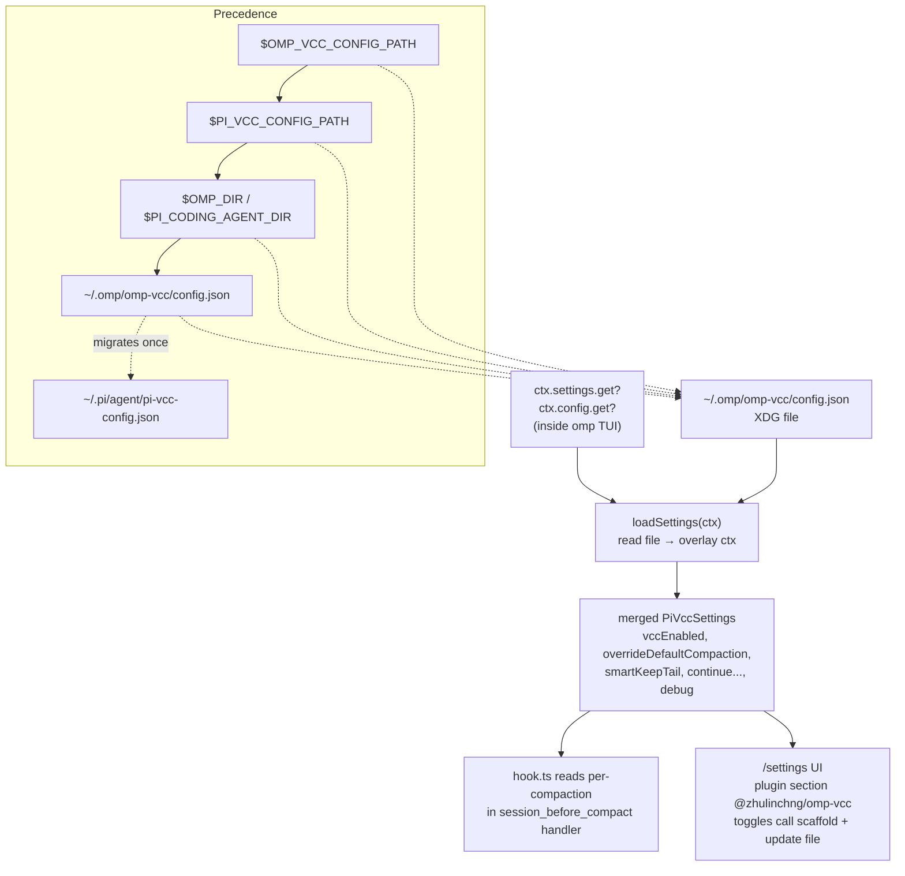
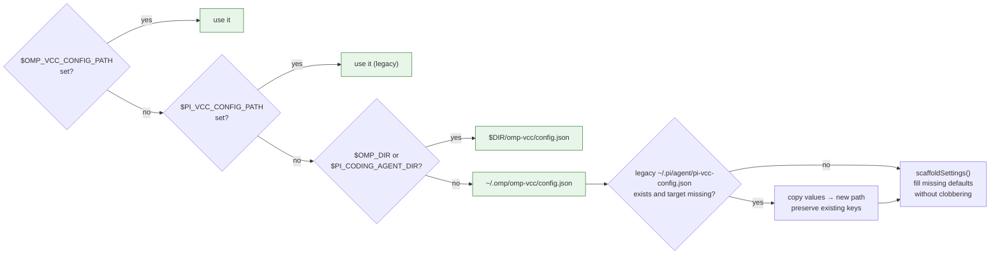
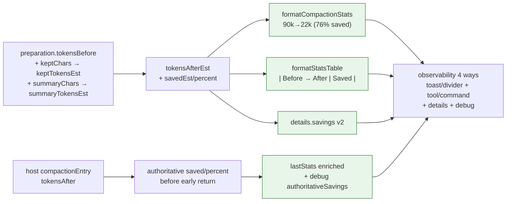
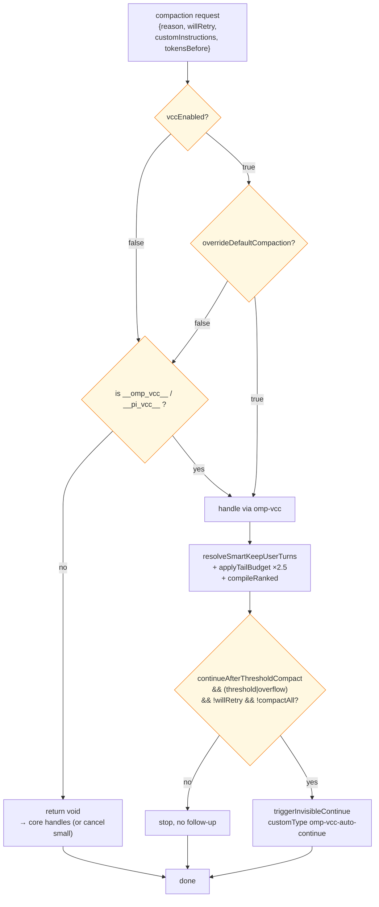
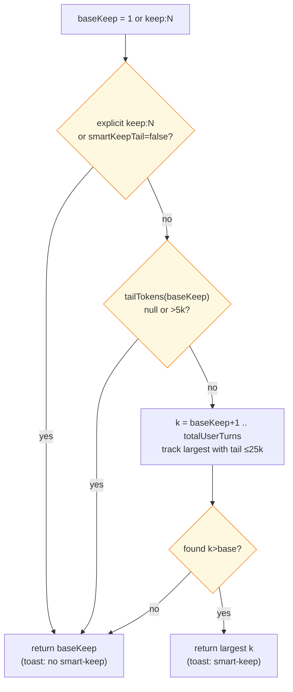
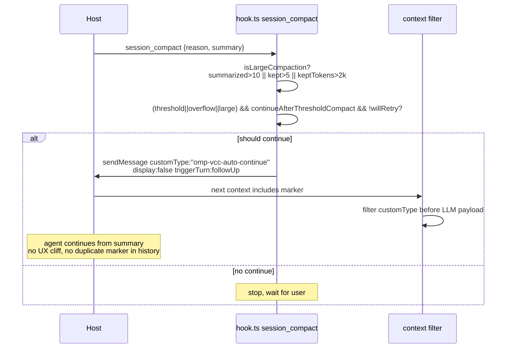
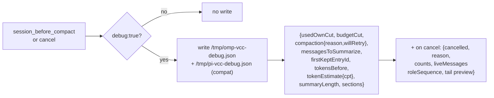
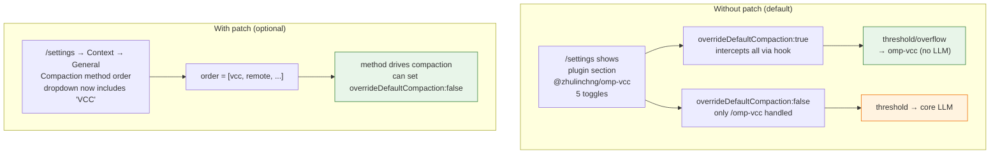

# Configuration — omp-vcc

## Plugin settings (manifest `omp.settings` / `pi.settings`)

Declared in `package.json` `omp.settings` and `pi.settings` (dual manifest via `loader.ts:125` `omp > pi`):

```json
{
  "omp": {
    "settings": {
      "vccEnabled": { "type": "boolean", "default": true, "description": "Enable VCC compaction interception (master switch)" },
      "overrideDefaultCompaction": { "type": "boolean", "default": true },
      "smartKeepTail": { "type": "boolean", "default": true },
      "continueAfterThresholdCompact": { "type": "boolean", "default": true },
      "debug": { "type": "boolean", "default": false }
    }
  }
}
```

These appear in `/settings` under the plugin section (not `Context → Compaction`) and via `omp config`:

```sh
omp config list | grep -i vcc
omp config set plugins."@zhulinchng/omp-vcc".overrideDefaultCompaction false
```

Runtime bridge: `loadSettings(ctx)` first overlays `ctx.settings?.get("plugins.@zhulinchng/omp-vcc.*")` on the file, then returns merged config. File is source of truth on restart; manifest `/settings` takes effect immediately without restart.



## File config `~/.omp/omp-vcc/config.json`

XDG-aware path (priority):

1. `$OMP_VCC_CONFIG_PATH` (explicit)
2. `$PI_VCC_CONFIG_PATH` (legacy pi-vcc)
3. `$OMP_DIR`/`$PI_CODING_AGENT_DIR` if set, else `~/.omp/omp-vcc/config.json`
4. Migrates legacy `~/.pi/agent/pi-vcc-config.json` on first `scaffoldSettings()` (copies values, preserves existing).



Defaults (same as `DEFAULT_SETTINGS` in `extensions/vcc-core/core/settings.ts`):

```json
{
  "vccEnabled": true,
  "overrideDefaultCompaction": true,
  "smartKeepTail": true,
  "continueAfterThresholdCompact": true,
  "debug": false
}
```

| Flag | Effect |
| --- | --- |
| `vccEnabled` | Master switch. `false` → extension still loads but `session_before_compact` returns `void` unless `__omp_vcc__`/`__pi_vcc__` marker present. |
| `overrideDefaultCompaction` | `true` (default): omp-vcc handles **all** compactions — `/compact`, threshold, overflow, `/omp-vcc`. `false`: only `/omp-vcc`/`/pi-vcc` handled, rest falls back to core LLM compaction. |
| `smartKeepTail` | `true`: when default `keep:1` tail ≤ `MIN_SMART_TAIL_TOKENS 5_000`, grow `keep` to largest N with tail ≤ `MAX_SMART_TAIL_TOKENS 25_000`. Explicit `keep:N` always respected. `false`: old behavior `keep:1`. |
| `continueAfterThresholdCompact` | `true`: after successful `threshold`/`overflow` compaction (and not `willRetry`), schedule invisible-continue (`customType:"omp-vcc-auto-continue"` display:false triggerTurn:followUp, filtered in `on('context')`) so agent continues without UX cliff. `false`: stop after compaction. |
| `debug` | `true`: write snapshot to `/tmp/omp-vcc-debug.json` (and legacy `/tmp/pi-vcc-debug.json`) on each `session_before_compact` and `session_compact` with `counts`, `liveMessages.roleSequence`, `tail` previews, `tokenEstimate`, `sections`, `savings {tokensBefore, summaryChars, summaryTokensEst, keptTokensEst, tokensAfterEst, tokensSavedEst, savedPercentEst}` and after `session_compact` also `authoritativeSavings {tokensBefore, tokensAfter, tokensSaved, savedPercent}`. |
Edit file directly or via `omp config`; `scaffoldSettings()` auto-creates missing keys without clobbering.

### Token-savings observability (always on)

Even with `debug:false`, every compaction computes and surfaces savings:

- **Toast** `session_compact` → `ctx.ui.notify(formatCompactionStats(stats))` where `formatCompactionStats` prefixes `90.0k→22.0k (76% saved, ~68.0k) · ` when `before>after>0 && percent>0`, else falls back to `kept 1/5 turns`. Handles `budgetCut` (`no_anchor`/`oversized_tail`) with same prefix, `999→500` vs `1.0k`, and `after>before` → `0`.
- **Divider** host renders `── compacted · 90K→22K · ctrl+o ──` from `CompactionEntry.tokensBefore/tokensAfter` (already persisted before plugin).
- **`vcc_stats` tool** (`approval: read`, `{history?:boolean}`) + **`/vcc-stats` / `/omp-vcc-stats` commands** + **`/omp-vcc --stats`** inline: `getCompactionHistory(pi)` (per-pi `WeakMap` + `perPiKeys` set, global fallback, 50-capped, copy-isolated) → `formatStatsTable` (`| # | Before → After | Saved | Kept | Summarized | When |`, `—` for `saved 0` or `timestamp null`, `budgetCut` suffix) and `formatLastStatsDetail` (`Before→After`, `Summary … tok … chars`, `Summarized … (smart-keep …)`, `Details: reason=… willRetry …`, `est after vs authoritative` note when they differ).
- **`CompactionEntry.details`** `PiVccCompactionDetails {compactor:"omp-vcc", version:2, savings {tokensBefore, summaryChars, summaryTokensEst, keptTokensEst, tokensAfterEst, tokensSavedEst, savedPercentEst}}` — persisted verbatim by host in JSONL, survives branch reuse; `version:1` readers ignore `savings`.
- **`/tmp/omp-vcc-debug.json`** `savings` always present when `debug:true`, plus `authoritativeSavings` after `session_compact` enriches `lastStats` with host `tokensAfter`.



History nuances: `setLastStats(pi, v)` assigns `timestamp=Date.now()` once, pushes to `perPi.statsHistory` and `globalHistory` each capped 50 (oldest evicted), `getCompactionHistory(pi)` returns copy, `clearCompactionHistoryForTests()` clears `globalHistory`, `lastStats`, and all `perPi` histories via `perPiKeys`. Edge `tokensBefore undefined → 0`, `saved 0 → —`, `percent 0 → no prefix`.




## CLI verification

```sh
cat ~/.omp/omp-vcc/config.json
# or legacy
cat ~/.pi/agent/pi-vcc-config.json

# manifest settings appear under plugin
omp plugin list --json | jq '.[] | select(.name|contains("omp-vcc")) | .settings'
omp config list | grep -E "vcc|compaction"
```

## Per-flag details

### `smartKeepTail` (5 k → 25 k)

Resolver `resolveSmartKeepUserTurns({branchEntries, requestedKeepUserTurns:null, explicit:false, smartKeepTail:true, charsPerToken})`:

- `explicit===true` or `smartKeepTail===false` → return `baseKeep` unchanged.
- `tailTokensForKeep(baseKeep)` → if `null` (compact-all/cancel) or `> minTokens 5k` → return base.
- Else iterate `k = baseKeep+1 .. totalUserTurns`, break when `tokens==null || > maxTokens 25k`, select largest feasible `k`.

Example: tail `keep:1` = 3 k → grows to `keep:3` with tail 22 k; if `keep:4` would be 28 k > max, stops at 3. Toast shows `smart-keep` tag via `formatCompactionStats`.



### `continueAfterThresholdCompact`

Invisible-continue pattern ported from `monotykamary/pi-vcc` branch `tom`:

```ts
pi.sendMessage({customType:"omp-vcc-auto-continue", content:[], display:false}, {triggerTurn:true, deliverAs:"followUp"})
// on('context') filter removes it by customType — model just continues from summary
```

Guarded by `loadSettings().continueAfterThresholdCompact` and `reason==="threshold"||"overflow" && !willRetry`. `overflow` retry owned by `pi-core` via `willRetry`.



### `debug`

When `true`, `dbg()` writes `/tmp/omp-vcc-debug.json` with:

```json
{
  "usedOwnCut": true,
  "budgetCut": "no_anchor",
  "compaction": {"reason":"threshold","willRetry":false},
  "messagesToSummarize": 42,
  "firstKeptEntryId": "abc",
  "tokensBefore": 120000,
  "tokenEstimate": {"mode":"calibrated","charsPerToken":3.2},
  "summaryLength": 5400,
  "sections": ["Session Goal","Files And Changes"]
}
```

On cancel, writes `cancelled:false/true`, `reason:"no_live_messages"`, `counts`, `liveMessages`, `lastCompaction` diagnostics.



## Optional native strategy patch (one-file core patch)

Pure plugin intercepts via `session_before_compact` hook; native `/settings` → Context → General → Compaction method dropdown entry requires closed-enum patch (decision Step 0):

`packages/coding-agent/src/session/compaction-methods.ts:11-49` closed enum `CompactionMethod="remote"|"snapcompact"|"handoff"|"soft"|"shake"` with `COMPACTION_METHOD_CHOICES` + `DEFAULT_COMPACTION_METHOD_ORDER` + `isCompactionMethod` (`Object.hasOwn`). Manifest `omp.settings` is plugin-scoped, not global `compaction.*`.



Patch diff (documented, not required for plugin to function):

```diff
# packages/coding-agent/src/session/compaction-methods.ts
 export const COMPACTION_METHOD_CHOICES: {value: CompactionMethod, label: string}[] = [
   {value:"remote", label:"Remote"},
+  {value:"vcc", label:"VCC (omp-vcc)", description:"Algorithmic VCC compaction - no LLM"},
   ...
 ]
 export const STRATEGY_BY_COMPACTION_METHOD: Record<CompactionMethod, "context-full"|...> = {
   remote: "context-full",
+  vcc: "context-full",
   ...
 }
 export const DEFAULT_COMPACTION_METHOD_ORDER: CompactionMethod[] = ["vcc","remote","snapcompact","handoff","shake","soft"]
 # or user order via /settings

# packages/coding-agent/src/config/settings-schema.ts — optional if you want vccEnabled etc as global
# add vccEnabled etc to global schema if desired, but plugin-scoped suffices
```

Without patch: plugin still intercepts when `overrideDefaultCompaction:true`. With patch: user can select `vcc` in `/settings` → Context → General → Compaction method order, disable `overrideDefaultCompaction` to let method order drive. Verify:

```sh
omp config list | grep compaction
# expect methodOrder includes vcc if patch applied
```

No core patch → `/settings` shows plugin settings under plugin section, not Context→Compaction. This is intentional per `references/manifest.md:44-72` plugin-scoped settings.
