# Harness Impact — omp-vcc × oh-my-pi

> What `omp-vcc` adds to the `oh-my-pi` (omp) harness, what it intercepts/edits, and why — every point verified against the codebase.

**Scope**: plugin at `extensions/main.ts` + `extensions/vcc-core/**` running inside `packages/coding-agent` via `ExtensionAPI`. Host source referenced from `../oh-my-pi` at the same checkout that ships `packages/coding-agent@1.x`. Verification commands in §9 are re-runnable truth.

- [1. Overview](#1-overview--tldr)
- [2. What the plugin ADDS](#2-what-the-plugin-adds-new-capabilities-no-core-edit)
- [3. What the plugin INTERCEPTS or EDITS](#3-what-the-plugin-interceptsor-edits-hooks-that-override-or-filter-host-flow)
- [4. What it DOES NOT edit](#4-what-it-does-not-edit-and-why)
- [5. Lifecycle & data flow](#5-lifecycle--data-flow)
- [6. Token & budget math](#6-token--budget-math)
- [7. Observability surfaces](#7-observability-surfaces)
- [8. Working with existing compaction strategies](#8-working-with-existing-compaction-strategies)
- [9. Verification map](#9-verification-map-claim--evidence)

---

## 1. Overview / TL;DR

`omp-vcc` is a **zero-build ESM extension** loaded via `package.json:omp.extensions = ["./extensions/main.ts"]` → `extensions/main.ts` factory `(pi: ExtensionAPI) => void`. → `package.json:32-36` — host discovers it at startup, calls factory, never forks `SessionMaintenance`. Factory **adds** tools/commands/skill/settings — no host file overwritten — and **intercepts** two compaction hooks plus a context filter and an agent-start clear via `ExtensionAPI.on(...)`. → `extensions/main.ts:49-52`, `extensions/vcc-core/hook.ts:708-723`. Host can compact in **6 ways** (`/compact` manual, overflow, incomplete `stopReason=="length"`, threshold post-turn, mid-turn, idle) and walks `compaction.methodOrder = ["remote","snapcompact","handoff","shake","soft"]` (default → `compaction-methods.ts:43` / `docs/compaction.md:428`). → `docs/compaction.md:59-68` triggers + `docs/compaction.md:142-151` + `docs/snapcompact.md:71-77` methodOrder.

With default file `~/.omp/omp-vcc/config.json` (`overrideDefaultCompaction:true` → `extensions/vcc-core/core/settings.ts:61-67`) plugin handles **every auto trigger** that reaches `session_before_compact` (`threshold`/`overflow`/`incomplete`/`midTurn`/`idle` when it can cut, plus `/compact`/`/omp-vcc`) locally as `V_ui` (`compileRanked`) in 30–470 ms deterministically, instead of the host's `SessionMaintenance` walk which would dispatch to a `context-full` LLM summary (`remote`/`soft`), or to `snapcompact` bitmap archival (needs vision `model.input includes "image"` → `docs/snapcompact.md:105-123` / `compaction-methods.ts:124`), or to `handoff` doc / `shake` elision. → `hook.ts:723-733` sentinel gate + `hook.ts:894-909` ranked compile + `docs/compaction.md:104-141` auto paths + `docs/snapcompact.md:143-151` snapcompact archive. Pruning (`pruneToolOutputs` 40k/20k/50 → `docs/compaction.md:159-174`) and useless-result elision (`[Uneventful result elided]` → `docs/compaction.md:176-184`) still run **before** the threshold comparison and before `session_before_compact` is emitted, so `omp-vcc` benefits from them even when it preempts summarization. Manual `/omp-vcc keep:N` always succeeds regardless of toggle. Disabling (`vccEnabled:false` or `overrideDefaultCompaction:false` + no sentinel) falls through: `session_before_compact` returns `void` → host walks `methodOrder` unmodified. → `hook.ts:727`, `733`.

**Reason for this shape**: keep harness upgrade trivial (hooks, not patches), preserve `SessionMaintenance` invariants (`CompactionPreparation{firstKeptEntryId,messagesToSummarize,turnPrefixMessages,previousSummary,previousPreserveData,fileOps,tokensBefore}` — see `docs/compaction.md:186-242` + `packages/snapcompact/src/snapcompact.ts:633`), keep `CompactionMethod` closed enum unchanged, and give reversible toggle in `/settings` or `~/.omp/omp-vcc/config.json`. `internalGuidance` (plan-mode distillation) travels a separate `internalGuidance` channel never shown to `session_before_compact` (`docs/compaction.md:381`), so public `customInstructions` is the only focus the hook sees.
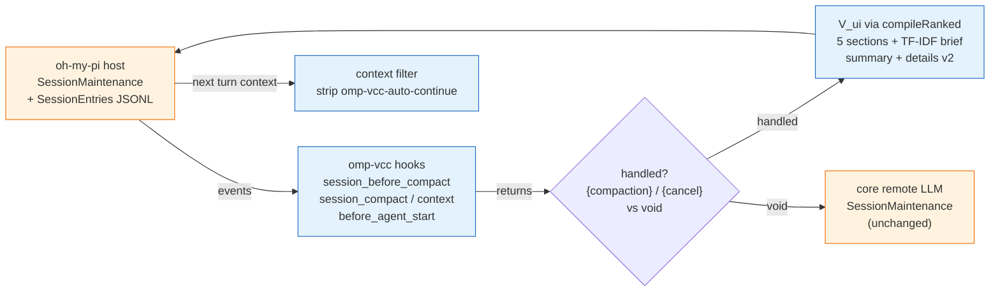

---

## 2. What the plugin ADDS (new capabilities, no core edit)

Each row: **what is registered** → **reason** → **verified**.

| # | What is added | Why it exists | Verified |
|---|---|---|---|
| 2.1 | **Extension entry** `extensions/main.ts` default export `(pi: ExtensionAPI) => void` ; `scaffoldSettings()` on load | Host auto-discovers `omp.extensions` path from `package.json` and calls factory — no host code edit needed to load the plugin. `type:module` + `allowImportingTsExtensions` means no build step. | → `package.json:32-36` `omp.extensions`, `extensions/main.ts:49-51` `export default function(pi: ExtensionAPI)`, `extensions/vcc-core/core/settings.ts:118-151` `scaffoldSettings()` |
| 2.2 | **Tool `vcc_recall`** `pi.registerTool({ name:"vcc_recall", approval:"read", parameters: pi.zod.object({ query?, expand?, page?, scope?, mode? }) })` | Exposes `V_adapt(b,ρ)` (§2.1 `match_lines(b,ρ)` regex → TF-IDF OR fallback, preserves skeleton + role tags) to the agent *before* it claims context is lost. Document-oriented temporal default + index-oriented `mode:"touched"` same data transposed. | → `extensions/main.ts:56-159` full handler (drill-down `#N:path` → `mode:touched` → `expand` → regex/TF-IDF), `extensions/vcc-core/hook.ts:1079-1152` identical shim for tests |
| 2.3 | **Tool `vcc_stats`** `registerVccStatsTool(pi)` → `pi.registerTool({ name:"vcc_stats", approval:"read", parameters:{history?:boolean} })` | Surfaces token savings without reading `/tmp/omp-vcc-debug.json` or parsing `details.savings` manually. Schema degrades to `{}` when `pi.zod.boolean` missing (older host) — still registers. | → `extensions/main.ts:161` `registerVccStatsToolHook(pi)`, `hook.ts:1233-1263` `registerVccStatsTool`, `hook.ts:1234-1239` fallback |
| 2.4 | **Commands** `/omp-vcc [keep:N] [focus]` (primary, compacts and shows inline savings), `/pi-vcc` (alias), `/vcc-recall` + `/pi-vcc-recall`, `/vcc-stats` + `/omp-vcc-stats` | User-facing manual compaction (`keep:N` + free-text focus) and recall without code. `/omp-vcc` is single option — compact with stats (toast + inline detail). Command shims `commands/*.md` are fallback discovery if host scans markdown. | → `extensions/main.ts:164-211` `omp-vcc` (always compact + stats) + `213-258` `pi-vcc` alias, `259-303` `vcc-recall` + `305-342` `pi-vcc-recall`, `344` `registerVccStatsCommandHook`, `hook.ts:1265-1292`, `package.json:37-40` `commands`, `commands/omp-vcc.md`, `commands/vcc-recall.md` |
| 2.5 | **Skill** `skills/omp-vcc/SKILL.md` | Teaches the agent the VCC progressive-disclosure workflow (`V_ui → V_adapt(query) → V_full[s:e]`) via skill discovery (`/skill omp-vcc`), so recall is used proactively. | → `skills/omp-vcc/SKILL.md` |
| 2.6 | **Settings file** `~/.omp/omp-vcc/config.json` via `scaffoldSettings()` | Persisted toggles without touching host `settings-schema.ts` global schema. XDG-aware resolution; migrates legacy `~/.pi/agent/pi-vcc-config.json` once (copies values, never clobbers existing file). | → `extensions/vcc-core/core/settings.ts:9-24` path fn + `26-77` `DEFAULT_SETTINGS` + `118-151` `scaffoldSettings()` |
| 2.7 | **Manifest settings** 6 booleans `vccEnabled, overrideDefaultCompaction, smartKeepTail, continueAfterThresholdCompact, debug, chainShakeHint` | Appear in `/settings` under plugin section ` @zhulinchng/omp-vcc` and via `omp config set plugins."@zhulinchng/omp-vcc".*` — plugin-scoped per `packages/coding-agent/src/discovery/loader.ts:125` `omp > pi` precedence, not global `compaction.*`. Dual `omp`+`pi` blocks for `pi` backward compat. | → `package.json:41-73` `omp.settings` + `75-114` `pi.settings` (identical), `extensions/vcc-core/core/settings.ts:26-77` `PiVccSettings` interface |
| 2.8 | **Compaction details `version:2` + `details.savings`** `{ tokensBefore, summaryChars, summaryTokensEst, keptTokensEst, tokensAfterEst, tokensSavedEst, savedPercentEst, compactor:"omp-vcc" }` in `PiVccCompactionDetails` | Host persists `compaction` `SessionEntry.details` verbatim to JSONL, so savings survive branch reuse / session reload and are rehydrated via `preparation.previousSummary`. `version:1` readers simply ignore unknown `savings`. | → `extensions/vcc-core/details.ts:4-20` `PiVccCompactionDetails`, `hook.ts:980-997` `details` construction + `1001-1008` return |
| 2.9 | **Per-pi history store** `perPi: WeakMap<api, {lastStats, statsHistory}>` + `perPiKeys: Set` + `getPerPi`/`setLastStats` capped 50 | When the same ESM singleton is shared between main session and subagents/forks (rebound factories), module-global `lastStats/globalHistory` would cross-pollute. Per-pi store isolates. `Set` needed because `WeakMap` cannot be enumerated for `clearCompactionHistoryForTests`. | → `hook.ts:84-114` declarations + `178-226` accessors + `228-252` `clearCompactionHistoryForTests` + `254-274` `formatStatsTable` reads |
| 2.10 | **Debug snapshot** `/tmp/omp-vcc-debug.json` (and legacy `/tmp/pi-vcc-debug.json`) via `dbg()` | Offline audit without TUI: `{ usedOwnCut, budgetCut, compaction:{reason,willRetry}, messagesToSummarize, firstKeptEntryId, tokensBefore, tokenEstimate{mode, charsPerToken}, summaryLength, sections, savings, cutWindow, authoritativeSavings }`. Written only when `debug:true`. | → `hook.ts:360-364` `dbg()` + `954-978` before-compact payload + `1042-1048` authoritative enrich payload |

---

## 3. What the plugin INTERCEPTS or EDITS (hooks that override or filter host flow)

> Host surface: `packages/coding-agent/src/extensibility/extensions/types.ts:1212-1292` `ExtensionAPI.on(event, handler)` signatures; `sendMessage`/`sendUserMessage` actions; `registerTool`/`registerCommand`. Host compaction dispatch: `packages/coding-agent/src/session/session-maintenance.ts` `SessionMaintenance` + `CompactionPreparation`. The plugin **never modifies** those files — it registers handlers that the host calls *before/around* the native path.

### 3.1 `session_before_compact` — the core intercept

- **Host hook**: `pi.on("session_before_compact", (event: { branchEntries, customInstructions, preparation: CompactionPreparation, ... }, ctx) => SessionBeforeCompactResult | void )` → `types.ts:1248-1251` + `docs/compaction.md:370-381` `session_before_compact` can `{cancel:true}` or `{compaction: CompactionResult{summary, shortSummary?, firstKeptEntryId, tokensBefore, details?, preserveData?}}`. Host's `CompactionPreparation` already bundles `firstKeptEntryId + messagesToSummarize + turnPrefixMessages + tokensBefore + previousSummary + previousPreserveData + fileOps` (`docs/compaction.md:186-205` cut-point rules: honors last `/clear` `reset_boundary` over last compaction, never cuts at `toolResult`, valid cuts `user|assistant|bashExecution|hookMessage|branchSummary|compactionSummary` + `custom_message`/`branch_summary`, metadata pulled backward; `packages/snapcompact/src/snapcompact.ts:633` `CompactionPreparation` type). Event `customInstructions` carries only public user focus; plan-mode `internalGuidance` travels separate `CompactOptions.internalGuidance` channel never shown to hook/`session.compacting` (`docs/compaction.md:381` issue #4359). Returning `{compaction:{ summary, details, tokensBefore, firstKeptEntryId }}` commits with `fromExtension:true`; `void` defers to host walk; `{cancel:true}` aborts (host may `fallbackToCore` on overflow — see `hook.ts:817`).
- **What omp-vcc does**:
  1. `loadSettings(ctx)` → overlay `ctx.settings.get("plugins.@zhulinchng/omp-vcc.*")` over file — freshest toggle wins per compaction. → `core/settings.ts:80-110` `loadSettings(ctx)`
  2. `if (!settings.vccEnabled) return void;` — master switch.
  3. `parseCompactionInstructions(customInstructions)` → `isPiVcc = customInstructions === "__omp_vcc__" || "__pi_vcc__" || sentinel+space` + `keep:N` + `followUpPrompt`. Legacy `__pi_vcc__` kept for back-compat.
  4. `if (!isPiVcc && !settings.overrideDefaultCompaction) return void;` — `true` default intercepts **all** reasons (`threshold`/`overflow`/`incomplete`/`midTurn`/`idle`/`manual`); `false` only handles explicit `/omp-vcc`.
  5. Calibrate `cpt` via `calibrateCharsPerToken(totalChars / tokensBefore, 2–6, else 4)` (`core/token-estimate.ts:1-51`).
  6. `resolveSmartKeepUserTurns({ requestedKeepUserTurns: explicit?keep:null, explicit, smartKeepTail, charsPerToken })` — boosts default `keep:1` while `tailTokens(1) ≤5_000` to largest `k` with `tailTokens(k) ≤25_000`. Explicit `keep:N` never boosted.
  7. `buildOwnCut(branchEntries, effectiveKeep)` — mirrors host boundary logic: collects live messages via `firstKeptEntryId` + orphan recovery (`""` sentinel or missing id) + `/clear` `reset_boundary` precedence (`docs/compaction.md:190-192` + `hook.ts:445-467`), enforces `>2` live, cuts at `userIndices[totalUserTurns - keep]`, `keep:0` → `compactAll` sentinel `firstKeptEntryId=""`. Unlike host `findCutPoint` it snaps off `toolResult` later in tail rescue.
  8. `applyTailBudget(cut, {maxTokens, factor 2.5, cpt})` — rescue **only** default path: `compactAll→no_anchor` or `tail>max*2.5→oversized_tail`, token-scan + snap off `toolResult` (`hook.ts:568-571` never cut at `toolResult` — same rule as `docs/compaction.md:202`).
  9. `compileRanked` → `normalize`/`sanitize`/`filterNoise`/`buildSections` (5 extractors `Goal|Files|Commits|Preferences|Outstanding` → `docs/compaction.md:268-297` file-ops tag `<files>` vs snapcompact `FILES` section) → `selectRankedBriefBlocks` (TF-IDF) → `formatSummary` + `capBrief` (120 lines) under size-relative budget `1100*cpt → 2000*cpt` ceiling. **Bypasses** host's 4-stage summary consultation (V2 streaming `compaction_trigger` → V1 `/responses/compact` → custom `remoteEndpoint` → local `completeSimple` with `SUMMARIZATION_SYSTEM_PROMPT` `docs/compaction.md:253-262`).
  10. Compute `summaryChars→summaryTokensEst→tokensAfterEst/savedEst/percent` → `setLastStats(pi, stats)` (50-capped, timestamped) → build `PiVccCompactionDetails{ version:2, savings }` → return `{ compaction }`; own-cut failure → `{cancel:true}` except overflow `willRetry||heuristic>50k` falls through to host walk (`hook.ts:817` + `docs/compaction.md:112` handoff skipped for overflow).
- **Reason**: replaces nonlocal `SessionMaintenance` dispatch (which would walk `methodOrder` to `remote`/`soft` LLM or `snapcompact` bitmap or `handoff`/`shake` — see `docs/compaction.md:104-151`) with deterministic local `V_ui` reusing already-in-memory `branchEntries`; cancellation is explicit when nothing to compact (pruning/`pruneToolOutputs` + `dropUseless` already ran before threshold check → `docs/compaction.md:159-184`).
- **Disabled behavior**: `vccEnabled:false` → always `void` → host handles everything; `overrideDefaultCompaction:false` + no sentinel → `void` for `threshold`/`overflow`/`incomplete`/`midTurn`/`idle`/`/compact` (host walks `remote→snapcompact→handoff→shake→soft` per `docs/compaction.md:428` / `compaction-methods.ts:43`), sentinel compactions still handled.

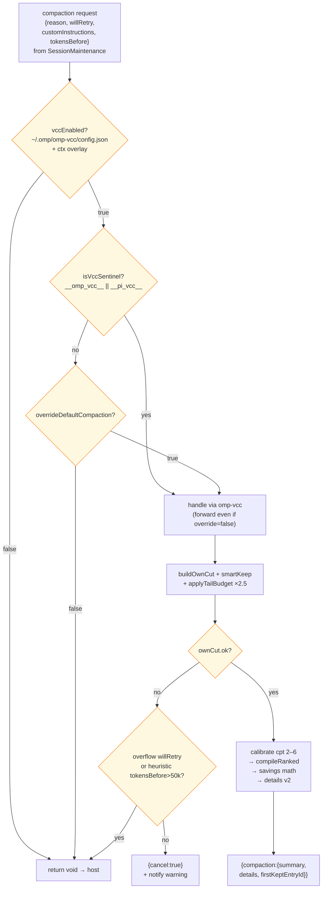

- **Host hook**: `pi.on("session_compact", (event:{ compactionEntry: CompactionEntry{summary, shortSummary?, firstKeptEntryId, tokensBefore, details?, preserveData?, fromExtension?}, tokensAfter? }, fromExtension? }, ctx) => void)` → `types.ts:1252-1253`, `shared-events.ts:84-89` + `docs/compaction.md:27-40` entry model + `docs/compaction.md:299-307` persist: host already `appendCompaction`d entry, rebuilt display context (`buildDisplaySessionContext`), replaced live agent messages, synchronized todos, emitted `session_compact`. `tokensAfter` is measured post-rebuild, not estimated; divider `── 📷 compacted · ctrl+o ──` is host's display-transcript rendering (`docs/compaction.md:153-157` `buildSessionContext({transcript:true})`), not plugin-drawn — plugin only causes it by returning `firstKeptEntryId`.
- **What omp-vcc does**:
  1. Early `if (!event.fromExtension) return;` — ignore native (`remote`/`snapcompact`/`handoff`/`shake`/`soft`) compactions.
  2. Enrich `lastStats` (both `perPi` and `global`) with `tokensAfter/tokensBefore → saved/percent` **before** the `isPiVccLast`/`willRetry` early returns — so manual `/omp-vcc` also gets precise numbers (`docs/compaction.md:382-395` describes same `fromExtension` flag for `session_compact`).
  3. If `debug:true`, append `dbg({ authoritativeSavings })` to `/tmp/omp-vcc-debug.json`.
  4. `if (isPiVccLast) return;` — `/pi-vcc` toasts via `onComplete` in `registerPiVccCommand`, not here.
  5. `if (willRetry) return;` — overflow/incomplete retry's toast would be noise; next cycle handles it (`docs/compaction.md:112-120` overflow/incomplete `willRetry:true` reuses `agent.continue()`).
  6. `scheduleCompactionStatsNotify(ctx, stats)` 500 ms deferred toast `formatCompactionStats(stats)` where `90.0k→22.0k (76% saved, ~68.0k) · ` prefix appears iff `before>after>0 && percent>0`; else falls back to `kept 1/5 turns, ~2.1k tok`. `budgetCut` (`no_anchor`/`oversized_tail`) emits `kept ~12k tok tail (mid-turn cut, no user anchor)` with same prefix logic; `after>before → 0`.
  7. `followUpPrompt` → `pi.sendUserMessage(followUpPrompt)` else `shouldContinueAfterAutoCompact = (threshold||overflow|| (null && isLargeCompaction)) && continueAfterThresholdCompact` where `isLargeCompaction = summarized>10||kept>5||keptTokens>2k` — then `scheduleAutoContinueForPi(pi)` (deferred `setTimeout 0` send). Host's own threshold auto-continue uses `compaction.autoContinue` (`docs/compaction.md:130` `auto-continue.md` developer prompt); `omp-vcc` mirrors it via invisible marker so behavior is consistent when it preempts.
- **Reason**: closes the est→authoritative gap (calibrated est vs measured `tokensAfter`), and avoids UX cliff where a threshold compaction stops agent mid-task with no continuation (host's post-turn `autoContinue` vs `omp-vcc` marker; mid-turn never needs it because loop owns next request → `docs/compaction.md:130`).
- **Disabled**: `continueAfterThresholdCompact:false` or `willRetry:true` (overflow/incomplete recovery) or `compactAll:true` → no invisible continue; `isPiVccLast:true` → no toast here (manual handler owns it); `idle` (`reason:"idle"` → `docs/compaction.md:132-134`) never auto-continues per host — same as plugin.
- **Verified**: → `hook.ts:1010-1068` full handler, `1018-1050` enrichment-before-return, `190-218` `formatCompactionStats`, `1058-1067` continue guard, `docs/compaction.md:299-307` persist + `153-157` display transcript, `docs/compaction.md:382-395` `fromExtension`.
### 3.3 `on("context")` — invisible-continue marker filter

- **Host hook**: `pi.on("context", (event:{ messages: AgentMessage[] }) => { messages? } | void)` → `types.ts:1257`. Returned `messages` replaces the LLM payload for the next provider call.
- **What omp-vcc does**: `messages.filter(m => m.role!=="custom" || (m.customType!=="omp-vcc-auto-continue" && m.customType!=="pi-vcc-auto-continue"))`; if filtered, return `{ messages }`.
- **Reason**: the invisible-continue marker (`display:false, triggerTurn:followUp`) is transport-only (`triggerInvisibleContinue` does `pi.sendMessage(...)` via `ExtensionActions.sendMessage` → `types.ts:1426-1429`). Without stripping, the LLM would see an empty custom span. Filtering by `customType` **only** (not content) keeps it robust and never drops real turns.
- **Verified**: → `hook.ts:136-161` `AUTO_CONTINUE_CUSTOM_TYPE` + `triggerInvisibleContinue` + `709-717` context filter; `pi-vcc` compat second sentinel.

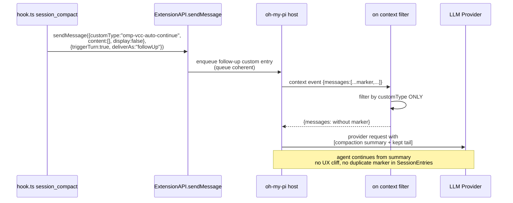

### 3.4 `on("before_agent_start")` — pending auto-continue clear

- **Host hook**: `pi.on("before_agent_start", handler)` → `types.ts:1263`.
- **What omp-vcc does**: `clearPendingAutoContinueForPi(pi)` — `clearTimeout` both per-pi and global `pendingAutoContinueTimer`.
- **Reason**: a `setTimeout 0` auto-continue scheduled after `session_compact` could fire after the agent already started a new turn (e.g., user interrupted, subagent fork). Clearing avoids a stale follow-up racing the fresh turn.
- **Verified**: → `hook.ts:118-135` timer helpers + `719-721` handler.

### 3.5 Settings overlay — live manifest merge

- **What omp-vcc does**: `loadSettings(ctx?)` reads the file at XDG priority `$OMP_VCC_CONFIG_PATH` → `$PI_VCC_CONFIG_PATH` → `$OMP_DIR|$PI_CODING_AGENT_DIR|~/.omp` `omp-vcc/config.json` (and legacy fallback read) then overlays `ctx.settings.get("plugins.@zhulinchng/omp-vcc.vccEnabled")` etc and `ctx.config.get` so `/settings` toggles take effect **this** compaction without restart. File remains source of truth after TUI restart. `scaffoldSettings()` fills missing keys with `DEFAULT_SETTINGS` without clobbering existing values.
- **Reason**: manifests (`package.json:omp.settings`) are the `/settings` UI surface; the file is the durable truth. Overlay gives immediate effect for `overrideDefaultCompaction`/`debug` etc while preserving the host's extension-settings contract (`packages/coding-agent/src/extensibility/extensions/types.ts` + `loader.ts:125` `omp > pi` precedence).
- **Verified**: → `core/settings.ts:9-17` path fn + `19-24` legacy fallback + `69-110` `loadSettings(ctx)` overlay + `118-151` `scaffoldSettings()`.

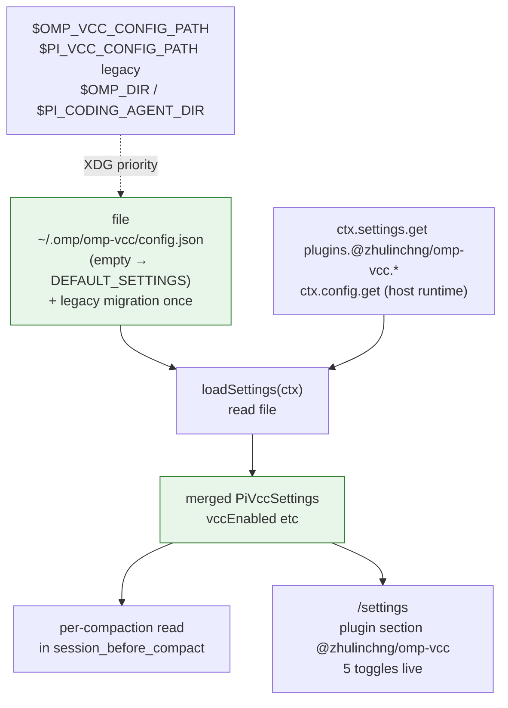

### 3.6 `convertToLlm` shim — host-aware message conversion

- **What omp-vcc does**: tries `createRequire(import.meta.url)(" @oh-my-pi/pi-coding-agent/session/messages").convertToLlm` then `require("@oh-my-pi/pi-coding-agent").convertToLlm` then falls back to identity `(m)=>m`. Vendored core is `// @ts-nocheck` so missing host export never fails typecheck.
- **Reason**: `compileRanked` expects LLM-typed `Message[]` (`@oh-my-pi/pi-ai`). In-TUI the host export is present and used; in `bun test`/`bun run smoke` (host-free) identity keeps `AgentMessage` usable since vendored `summarize.ts` tolerates it. Zero host patch, zero runtime dependency.
- **Verified**: → `hook.ts:18-31` shim attempts + `tsconfig.json: skipLibCheck:true, allowImportingTsExtensions:true` + `extensions/vcc-core/core/*.ts` headers `// @ts-nocheck`.

---

## 4. What it DOES NOT edit (and why)

| Claim | Why no edit is needed | Verified |
|---|---|---|
| **No edit to `SessionMaintenance` / `SessionEntry` pipeline** — `SessionMaintenance`, `CompactionPreparation`, `COMPACTION_*`, `CompactionEntry{summary, shortSummary?, firstKeptEntryId, tokensBefore, details?, preserveData?, fromExtension?}` + `BranchSummaryEntry` unchanged (`docs/compaction.md:27-50` entry model). `prepareCompaction()` cut-point rules (`docs/compaction.md:186-205`), split-turn handling (`docs/compaction.md:206-232`), `pruneToolOutputs` (protect 40k, require 20k savings, `MIN_PRUNE 50`, skip `skill`/`skill://`/`plan` → `docs/compaction.md:159-174`), useless elision (`[Uneventful result elided]` → `docs/compaction.md:176-184`), pre-prompt/mid-turn/overflow/incomplete/idle triggers (`docs/compaction.md:59-134`) all run before `session_before_compact` is emitted. | Interception is purely via `ExtensionAPI` hooks. Core remains single compaction dispatcher; an extension returning `{compaction}` commits it, `void` defers. `compact(...)` 4-stage summary consultation (V2 streaming `compaction_trigger` → V1 `/responses/compact` with `preserveData.openaiRemoteCompaction` → custom `remoteEndpoint` `{systemPrompt,prompt}` / `chat/completions` → local `completeSimple` `docs/compaction.md:253-262`) is simply skipped when hook wins. Upgrading harness requires no merge. | → `grep -R "omp-vcc" packages/coding-agent/src/session --include="*.ts" 2>/dev/null` returns `0`; `packages/coding-agent/src/session/session-maintenance.ts` exports `SessionMaintenance`/`CompactionPreparation` unchanged at this checkout; `packages/agent/src/compaction/*` untouched |
| **No edit to `CompactionMethod` closed enum** — `packages/coding-agent/src/session/compaction-methods.ts` `COMPACTION_METHOD_CHOICES`/`DEFAULT_COMPACTION_METHOD_ORDER`/`isCompactionMethod` remain shipped enum (`remote` / `snapcompact` / `handoff` / `shake` / `soft`) absent optional one-file patch. Host defaults `compaction.enabled true`, `methodOrder ["remote","snapcompact","handoff","shake","soft"]`, `asyncEnabled true` (speculative lead `clamp(threshold*0.125,8192,32000)` → `docs/compaction.md:428-429`), `reserveTokens` floor 16384 + 15% (`docs/compaction.md:430`), `keepRecentTokens 20000` (`docs/compaction.md:431`). | Plugin-scoped settings (`package.json:omp.settings`) are separate from global `compaction.*` — host `loader.ts:125` `omp > pi` but plugin-scoped `omp.settings` needs no global schema entry. `/settings` shows plugin section `@zhulinchng/omp-vcc` 5 toggles; intercept still works because `overrideDefaultCompaction:true` is independent of `compaction.methodOrder`. Users who want native dropdown `vcc` in `/settings → Context → General → Compaction method order` can apply documented optional patch (and disable `overrideDefaultCompaction`), but not required. | → `packages/coding-agent/src/session/compaction-methods.ts:10-50` enum, `docs/configuration.md:243-282` native patch diff (optional), `package.json:41-67` plugin-scoped settings, `docs/compaction.md:423-451` defaults |
| **No edit to `SessionEntry` / display transcript** — host types `SessionEntry{ type:"message" / "compaction" / "custom_message" / "reset_boundary", id, … }` + `CompactionEntry`/`BranchSummaryEntry` unchanged. Host rebuilds `buildSessionContext` (latest compaction → `compactionSummary` user message via `compaction-summary-context.md`, kept tail from `firstKeptEntryId`, `branch_summary→branchSummary`, `custom→custom` → `convertToLlm()` → `docs/compaction.md:42-55`) and renders display transcript `buildSessionContext({transcript:true})` with inline `── 📷 compacted · ctrl+o ──` dividers (`docs/compaction.md:153-157`). Branch summarization (`navigateTree` → `collectEntriesForBranchSummary` → `BranchSummaryEntry` → `docs/compaction.md:309-368`) is separate flow not intercepted. | Plugin only writes additive `details:{ compactor:"omp-vcc", version:2, savings:{...} }` into `compaction` entry's `details` (`extensions/vcc-core/details.ts:4-20`). `details` persisted verbatim JSON; old readers ignore unknown keys. `version:2` signals savings-aware; `version:1` readers treat opaque. `snapcompact` archive lives under `preserveData.snapcompact` (`docs/snapcompact.md:202-212` `Archive{frames,totalChars,truncatedChars,text,textHead,textTail}`) and is untouched. | → `extensions/vcc-core/details.ts:4-20` + `hook.ts:980-997` + `packages/coding-agent/src/config/settings-schema.ts` has no `omp-vcc` global key + `docs/snapcompact.md:202` `PRESERVE_KEY="snapcompact"` |
| **No network, no extra process, no native rasterizer** | `omp-vcc` is pure local heuristic (`calibrate`/`normalize`/`rank`/`format` in `// @ts-nocheck` vendored `extensions/vcc-core/core/*.ts`) — no `fetch`, no `Bun.$`, no daemon, no `crates/pi-natives/src/snapcompact.rs` `renderSnapcompactPng` native. Host's `snapcompact` uses that Rust rasterizer (pixel fonts `5x8`/`8x8`/`6x12`/`8x13`/`silver`, shape variants `8on16-bw`/`8on22-bw`/`11on16-bw` etc → `docs/snapcompact.md:18,259-312`). `omp-vcc` never calls it. `bunx tsc --noEmit` sees zero `dependencies`. | → `package.json:dependencies:{}` (absent), `hook.ts:360-364` `writeFileSync` only I/O is debug file, `extensions/vcc-core/core/*.ts` no `fetch`/`http`/`snapcompact.rs` imports |
---

## 5. Lifecycle & data flow

### 5.1 Extension lifecycle — factory to runtime

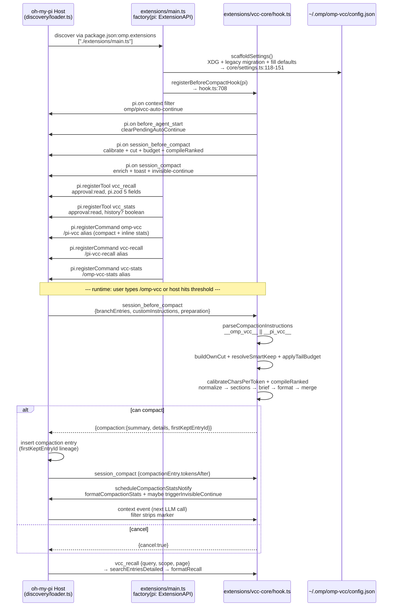

**Counts** at this checkout: 3 event handlers (`context`, `before_agent_start`, dual `session_*`), 2 tools (`vcc_recall`, `vcc_stats`), 5 command registrations (`omp-vcc`, `pi-vcc`, `vcc-recall`, `pi-vcc-recall`, `vcc-stats`+`omp-vcc-stats` alias) — `extensions/main.ts:164-337` and `hook.ts:708-1324`.

### 5.2 Compaction dispatch — when omp-vcc owns vs defers

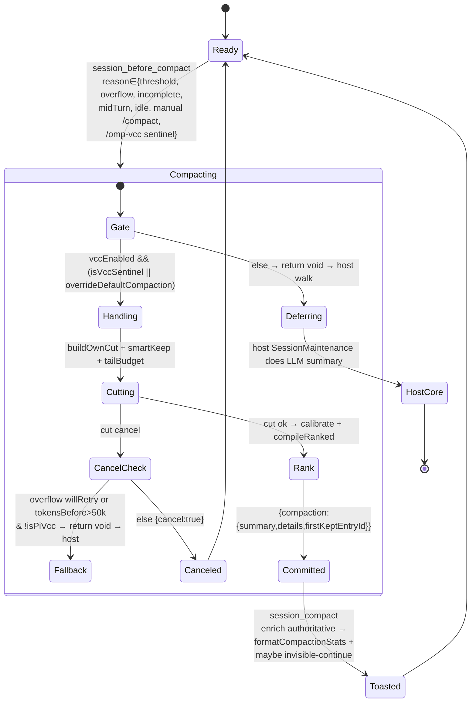
### 5.2.1 Host compaction pipeline (what `omp-vcc` bypasses — per `docs/compaction.md`)

Host runs this **before** any `session_before_compact` is emitted; `omp-vcc` benefits from the first two steps even when it preempts summarization, because they shrink the `tokensBefore` it calibrates from. Verified against `docs/compaction.md:59-307` + `docs/snapcompact.md:90-101` 6-phase snapcompact flow.

```mermaid
flowchart TB
  TRIG["trigger: manual /compact<br/>overflow (error) / incomplete length<br/>threshold postTurn / midTurn / idle"]
  TRIG --> PRUNE["pruneToolOutputs<br/>protect 40k recent, need 20k savings,<br/>MIN_PRUNE 50, skip skill:// & plan<br/>→ docs/compaction.md:159"]
  PRUNE --> USELESS["drop useless results<br/>[Uneventful result elided]<br/>pruneSupersededToolResults<br/>→ docs/compaction.md:176"]
  USELESS --> CALC["calculateContextTokens<br/>subtract provider orchestration tokens<br/>→ docs/compaction.md:124"]
  CALC --> THR{"exceeds threshold?<br/>resolveThresholdTokens<br/>midTurn checks safe tool-loop boundary"}
  THR -->|no| NONE["COMPACTION_CHECK_NONE<br/>no event"]
  THR -->|yes| PROMO{"context promotion<br/>larger model available?"}
  PROMO -->|yes| SWITCH["switch model & retry<br/>no compaction"]
  PROMO -->|no| PREP["prepareCompaction<br/>boundaryStart = lastCompaction+1<br/>honor /clear reset_boundary<br/>findCutPoint never toolResult<br/>pull metadata backward<br/>adapt keepRecentTokens 20k<br/>→ docs/compaction.md:186 + snapcompact.md:96"]
  PREP --> SPLIT{"split turn?<br/>cut not at user boundary"}
  SPLIT -->|yes| HIST["two summaries: history + turnPrefix<br/>merged with --- Turn Context<br/>→ docs/compaction.md:206"]
  SPLIT -->|no| HIST2["single history summary"]
  HIST & HIST2 --> WALK["walk methodOrder<br/>remote→snapcompact→handoff→shake→soft<br/>+ pruneToolOutputs gates"]
  WALK --> HOOK{"session_before_compact<br/>omp-vcc gate"}
  HOOK -->|handles| VUI["V_ui compileRanked<br/>normalize → sections → brief<br/>no model, 30-470ms"]
  HOOK -->|void| SUMM["summary generation<br/>V2 streaming compaction_trigger<br/>→ V1 /responses/compact<br/>→ custom remoteEndpoint<br/>→ local completeSimple<br/>→ docs/compaction.md:253 / snapcompact.md:96-101"]
  VUI & SUMM --> PERSIST["appendCompaction entry<br/>summary/shortSummary/firstKeptEntryId<br/>details/preserveData/fromExtension<br/>→ docs/compaction.md:299"]
  PERSIST --> REBUILD["buildSessionContext<br/>latest compaction → compactionSummary<br/>kept tail from firstKeptEntryId<br/>branchSummary/custom<br/>→ docs/compaction.md:42 + snapcompact.md:101 historyBlocks"]
  REBUILD --> DISPLAY["buildDisplaySessionContext({transcript:true})<br/>inline divider ── 📷 compacted ──<br/>scrollback preserved<br/>→ docs/compaction.md:153"]
  DISPLAY --> NOTIFY["session_compact event<br/>fromExtension flag<br/>→ docs/compaction.md:370"]
  NOTIFY --> AUTO{"autoContinue?<br/>threshold postTurn → developer prompt<br/>omp-vcc → invisible marker"}

  classDef host fill:#fff3e0,stroke:#ef6c00
  class PRUNE,USELESS,CALC,PREP,WALK,SUMM,PERSIST,REBUILD,DISPLAY host
  classDef vcc fill:#e3f2fd,stroke:#1565c0
  class VUI vcc
  classDef decision fill:#fff8e1,stroke:#f57f17
  class THR,PROMO,SPLIT,HOOK,AUTO decision
```

### 5.3 Recall ranking — `V_adapt`

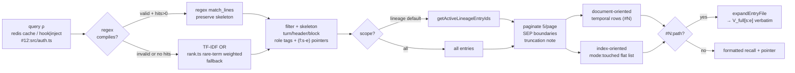

---

## 6. Token & budget math

All math is local, deterministic, no `Buffer` alloc beyond the slice passed to `convertToLlm`.

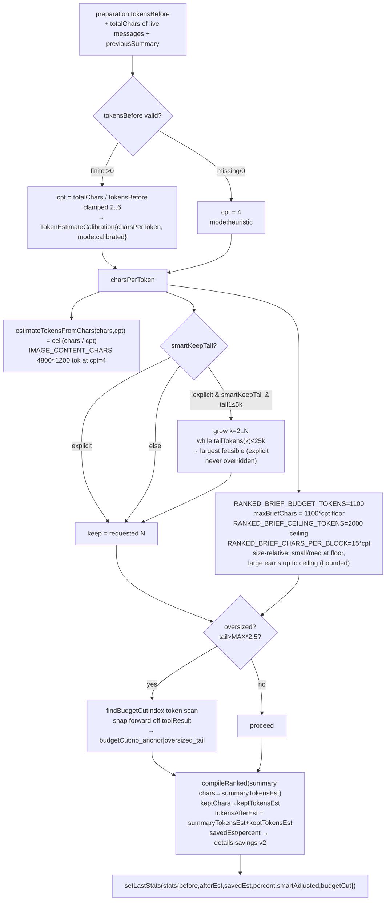

- **Calibrated fallback heuristic** — when `tokensBefore` is missing (some host paths), `DEFAULT_CHARS_PER_TOKEN=4` keeps every code path reachable. Verified → `core/token-estimate.ts:1-51` constants + `calibrateCharsPerToken` + `IMAGE_CONTENT_CHARS`.
- **Size-relative budget** — floor `1100*cpt` preserves old cap parity for small/medium sessions; very large transcripts earn up to `2000*cpt` ceiling at `15*cpt` per block so long-tail edits/commands/tests are retained instead of truncated. Audit 794 sessions vs `0.3.18` master: LARGE recall -5.0pp → -2.3pp, losers 100→67/369, fact density ~1.4× master. Verified → `hook.ts:894-909` constants `RANKED_BRIEF_*` and audit comment `891-893`.
- **Oversized rescue tolerance** — `OVERSIZED_TAIL_FACTOR=2.5` leaves tails within 2.5× budget untouched; only giant single-turn tails are re-cut. Verified → `hook.ts:78` + `578-616` `applyTailBudget`.
- **Smart keep window** — `MIN_SMART_TAIL_TOKENS 5_000 → MAX 25_000` (`hook.ts:620-621`) so tiny `keep:1` tails don't waste 20k of budget; toast adds `smart-keep` tag when boosted.

---

## 7. Observability surfaces

Every compaction, even manual `/omp-vcc`, produces the same four audit trails; estimate is reconciled with authoritative measurement after host inserts the entry.

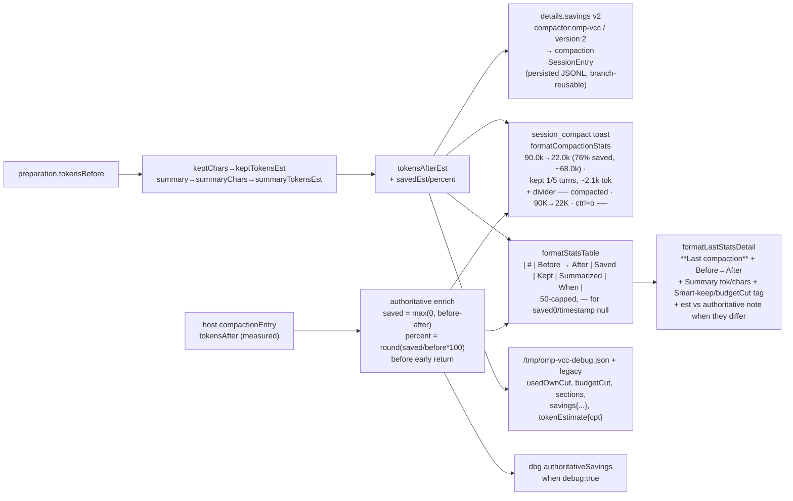

- **Toast** `hook.ts:190-218` — prefix `90k→22k (76% saved)` only when `before>0 && after>0 && before>after && saved>0 && percent>0`; `before undefined→0`, `percent 0→no prefix`, `saved 0→—`, `after>before→0`, `budgetCut` path emits `no user anchor` / `oversized tail` wording.
- **Divider** host-rendered (`SessionMaintenance` inserts `── compacted · {tokensBefore}K→{tokensAfter}K · ctrl+o ──`) — plugin doesn't draw it; it *causes* it by returning `firstKeptEntryId`.
- **Table/history** `hook.ts:254-300` — `header | # | Before → After | …`, `—` when `saved 0`/`timestamp null`, `budgetCut` suffix; `getCompactionHistory(pi)` copies; `setLastStats` caps each history at 50 (global + per-pi), `timestamp=Date.now()` assigned once.
- **`vcc_stats`/`vcc-stats`** `hook.ts:1297-1324` + `extensions/main.ts:164-210` — `history:true` → full table + `formatLastStatsDetail`; `No compactions yet.` guard when both `last` and `history` empty. `/omp-vcc` also surfaces `formatLastStatsDetail` inline after each compaction (single option with stats).

---

## 8. Working with existing compaction strategies

> How `omp-vcc` relates to the host's built-in strategies (`remote`/`soft`/`snapcompact`/`handoff`/`shake`) — what runs when, how to keep them alongside `omp-vcc`, and why no single strategy covers all cases.

### 8.1 Host's native inventory (what the plugin can defer to)

The host's ordered preference is `compaction.methodOrder` — a user-editable array of `CompactionMethod` values walked by `SessionMaintenance`. → `packages/coding-agent/src/session/compaction-methods.ts:10-49` `COMPACTION_METHOD_CHOICES` + `DEFAULT_COMPACTION_METHOD_ORDER`, `packages/coding-agent/src/config/settings-schema.ts:6133-6152` `CompactionSettings{ enabled, methodOrder, autoContinue, ... }`.

| Method | Label (host) | Strategy (`STRATEGY_BY`) | What it does | Needs / Gate | Cost | Verified |
|---|---|---|---|---|---:|---|
| `remote` | OpenAI server compaction | `context-full` | Provider-native summarization consulted in order: **V2 streaming** `compaction_trigger` on `openai-responses`/`azure-openai-responses`/`openai-codex-responses` when `remoteStreamingV2Enabled` (`docs/compaction.md:253`), then **V1** native `/responses/compact` (`shouldUseOpenAiRemoteCompaction` → `preserveData.openaiRemoteCompaction` `docs/compaction.md:256`), then **custom** `remoteEndpoint` (`{systemPrompt,prompt}→{summary}` or `chat/completions` → `choices[0].message.content` `docs/compaction.md:257-259`). When V2/V1 succeeds local `completeSimple` is skipped — history stays in provider replay. | `canUseRemoteCompaction(model, settings)` (`remoteEndpoint` set or model advertises native route) → `compaction-methods.ts:102-108`; V2 additionally needs `shouldUseCompactionV2Streaming` | network + billed tokens (replay payload) | → `compaction-methods.ts:12-16` + `78-83` `remote→context-full` + `docs/compaction.md:239-259`, `253-257` |
| `soft` | Soft compaction | `context-full` | Local LLM summary via `completeSimple(SUMMARIZATION_SYSTEM_PROMPT)` picking `compaction-summary.md` (first) / `compaction-update-summary.md` (with `previousSummary`) / `compaction-turn-prefix.md` (split-turn) + `compaction-short-summary.md` + `<conversation><previous-summary><additional-context>` (`docs/compaction.md:234-252`), serializing via `convertToLlm()+serializeConversation()` | any model, `compaction.enabled` (`docs/compaction.md:127`) | local LLM call | → `compaction-methods.ts:30-33` + `78-83` `soft→context-full` + `docs/compaction.md:232-252` |
| `snapcompact` | Snapcompact | `snapcompact` | **Local deterministic archival** (`compact()` in `packages/snapcompact/src/snapcompact.ts:2037`): discarded history `serializeConversation` (caps `toolResultMaxChars 2000`/`toolArgMaxChars 500`/`toolCallMaxChars 2000` `truncateHeadRatio 0.6` → `docs/snapcompact.md:372-384`), `elideDataUrls` heals `data:` atoms (`docs/snapcompact.md:386-392`), `normalize` (ANSI strip, whitespace `█` fold, `CHAR_FOLD`/`EMOJI_FOLD`/NFKD → `docs/snapcompact.md:393-402`), `planArchive` keeps `TEXT_EDGE_PAGES=1` verbatim at each edge and foveates imaged middle `HQ/LQ/HQ` when `>maxFrames` (`docs/snapcompact.md:99,436` + `docs/compaction.md:149`), `renderMany` → `crates/pi-natives/src/snapcompact.rs:renderSnapcompactPng` 18 variants `8x8r-bw`/`11on16-bw`/`8on22-bw`/`silver16-bw`/`doc-*` etc (`docs/snapcompact.md:280-322`). Shape resolved per-model `idealShapeVariant(id)` with high-res `1932px` tier for Opus 4.7+/Fable/Mythos inside Anthropic `4784` cap (`docs/snapcompact.md:315-322`); billing `familyBilling` = Anthropic `ceil(min(ceil(size/28)²,4784)*1.05)` / Google `1120` fixed / OpenAI `ceil(min(ceil(size/32)²,10k)*1.2)` (`docs/snapcompact.md:338-340`). Archive persisted `preserveData.snapcompact = Archive{frames,totalChars,truncatedChars,text,textHead?,textTail?}` (`docs/snapcompact.md:202-212` / `snapcompact.ts:532`) and rebuilt `historyBlocks(archive,{maxFrameDataBytes:3M})` → `textHead → images → textTail` (`docs/snapcompact.md:101` + `docs/compaction.md:149`). | vision `model.input includes "image"` (`docs/snapcompact.md:105-123` / `compaction-methods.ts:124`); explicit `/compact snapcompact` bypasses gate (`session-maintenance.ts:763`), `customInstructions`/`internalGuidance` blocks non-explicit (`session-maintenance.ts:775` `!customInstructions && !internalGuidance`), focus `rejectsFocus` throws before gate (`compact-modes.ts:34` / `session-maintenance.ts:727`); transient `systemPrompt`/`toolResults` imaging same predicate but default `none`/`false` (`docs/compaction.md:445`) | bitmap CPU + vision tokens per frame: Anthropic `≈3136` (1568) / `≈5024` ceiling (1932), Google `1120` fixed regardless of 2048px, OpenAI `original detail` patches (`docs/snapcompact.md:338`) + `PROVIDER_IMAGE_BUDGET` Anthropic 90 / OpenAI 200 etc (`docs/snapcompact.md:342`) | → `compaction-methods.ts:18-21` + `docs/compaction.md:142-151` + `docs/snapcompact.md:30-37,105-123,259-312,342` |
| `handoff` | Handoff | `handoff` | Generates markdown handoff document (`handoff-document.md` via `generateHandoff()` preserving live cache prefix + `toolChoice:"none"` → `docs/compaction.md:263-266`) and commits as regular `CompactionEntry` with `firstKeptEntryId` (`docs/compaction.md:267`); optionally writes `handoff-<ISO>.md` to artifact dir when `handoffSaveToDisk` (`docs/compaction.md:268`). File-ops tag `<files>` vs snapcompact `FILES`. | any model; auto `reason:"overflow"` skips it (would reuse overflowing input `docs/compaction.md:112`), threshold mid-turn/post-turn may defer to post-prompt task (`docs/compaction.md:129`) | LLM call | → `compaction-methods.ts:23-26` + `78-83` `handoff→handoff` + `docs/compaction.md:261-268` |
| `shake` | Shake | `shake` | Inline mechanical elision — replaces eligible tool results / large fenced/XML blocks with recoverable `artifact://` refs behind protected `40k` recent window + `20k` min savings + `MIN_PRUNE 50` (`docs/compaction.md:136-141` / `docs/compaction.md:159-174` prune). Automatic emits `action:"shake"` events. | always runnable; threshold/incomplete/overflow advance to next method when cannot reclaim below `0.8×threshold` (`COMPACTION_RECOVERY_BAND 0.8` `session-maintenance.ts:190-201,2915`); idle shake no fallback (`docs/compaction.md:140`) | free (no model) | → `compaction-methods.ts:33-36` + `78-83` `shake→shake` + `docs/compaction.md:136-141` + `session-maintenance.ts:190` |
Default `DEFAULT_COMPACTION_METHOD_ORDER = ["remote","snapcompact","handoff","shake","soft"]` → `compaction-methods.ts:43-49`. Order preserved after `resolveCompactionMethodOrder` (filters malformed, keeps first occurrence) → `compaction-methods.ts:64-76`. `hasConfiguredCompactionMethod(settings)` guards every auto path (threshold/overflow/incomplete/midTurn/idle/speculation) → `session-maintenance.ts:120-123,1228,1863`. Manual `/compact` walks same list but picks first manually runnable entry (skips `remote` when `!canUseRemoteCompaction`, skips `snapcompact` when `customInstructions` present or not vision → `session-maintenance.ts:775-784` / `docs/snapcompact.md:142-152`, focus `rejectsFocus` throws at `session-maintenance.ts:727`); on unavailable `remote` it recurses to next (`813`). Before any threshold check host may run `pruneToolOutputs` (protect 40k, require 20k savings, `MIN_PRUNE 50`, skip `skill`/`skill://`/`plan` → `docs/compaction.md:159-174`) then `calculateContextTokens` subtracts provider orchestration tokens so threshold not inflated (`docs/compaction.md:124`), then mid-turn check only at safe tool-loop boundaries when `midTurnEnabled !== false` (`docs/compaction.md:125`).
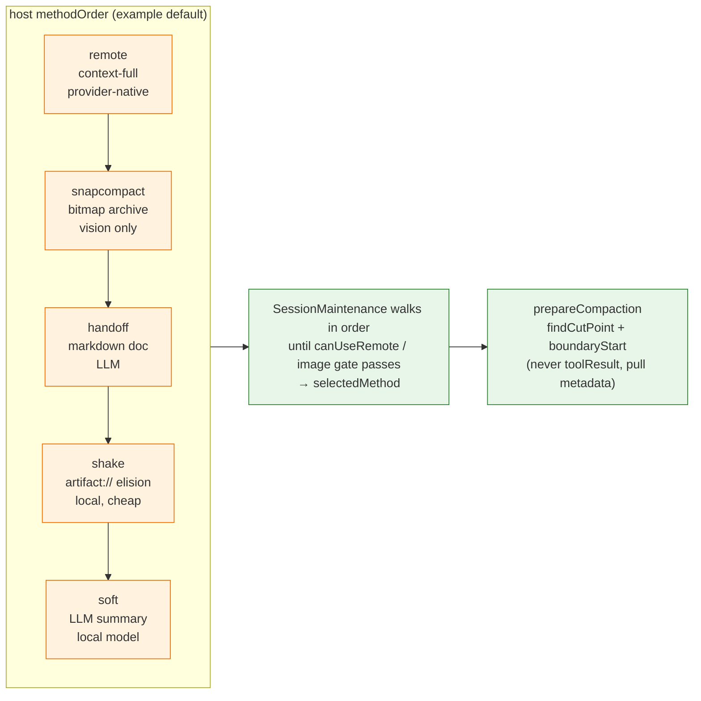

### 8.2 Where `omp-vcc` sits — a `context-full` hook that preempts the walk

`SessionMaintenance.compact()` **always** emits `session_before_compact` **after** picking `selectedMethod` but **before** committing native summarization. → `session-maintenance.ts:830-847` `if (hasHandlers("session_before_compact")) emit(...) { if (result.cancel) throw; if (result.compactions) hookCompaction = result }`, then `prepareCompactionFromHooks` at `849`. The host's `effectiveSettings = resolveMethodSettings(settings, selectedMethod)` (`compaction-methods.ts:91-100`) is the *fallback* — the hook's `{compaction:{summary,details,firstKeptEntryId}}` replaces it verbatim and is committed with `fromExtension:true` (`hook.ts:1001-1008`), regardless of which native method would have run.

**Reason for this placement**: a `context-full` extension should win atomically — otherwise a speculative LLM summary could race the extension's deterministic `V_ui`. Speculation is explicitly disabled when an extension has a handler (`session-maintenance.ts:1230` `hasHandlers("session_before_compact") → no speculation` + `1287` guard) so no wasted billed call occurs.

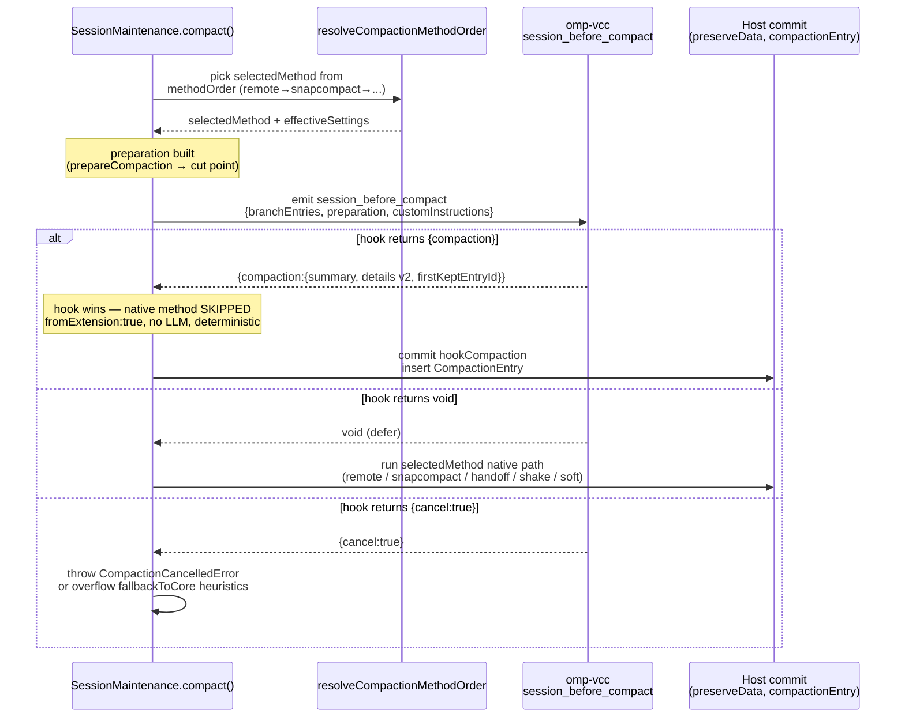

**Key implication**: `overrideDefaultCompaction:true` (default → `settings.ts:61` + `hook.ts:733`) does **not** rewrite `compaction.methodOrder`; it makes the hook return a compaction for **every** automatic trigger (`threshold`/`overflow`/`incomplete` when hook can cut, else heuristic `tokensBefore>50k` falls through → `hook.ts:817`) so the walked `selectedMethod` is never reached. Setting it `false` flips the hook to sentinel-only (`!isPiVcc → void` at `hook.ts:733`) — then the walk proceeds unmodified.

### 8.3 Coexistence matrix — which flag + which order does what

| `overrideDefaultCompaction` | `compaction.methodOrder` (example) | `/omp-vcc keep:2` | `threshold` auto (post-turn/midTurn/idle) | `overflow` vs `incomplete` recovery (`willRetry:true`) | `reason:via manual /compact` |
|---|---|---|---|---|---|
| `true` (default) | any (default `remote,snapcompact,handoff,shake,soft` or custom) — native order is **ignored** for auto | `omp-vcc` handles (sentinel path) → `V_ui` | `omp-vcc` handles → `V_ui` (deterministic, ~1.1k tok) — `remote`/`snapcompact` never invoked; `pruneToolOutputs`+`dropUseless` still ran before (`docs/compaction.md:159-184`) | `omp-vcc` handles when it can cut; if `too_few`/`no_live` and (`willRetry` or `tokensBefore>50k`) it **defers** (`fallbackToCore` → `void`) → host retries next auto method per `docs/compaction.md:112-121`. Overflow **skips** `handoff` (would reuse overflowing input); incomplete **allows** `handoff` (input still usable) — both advance to `shake`/`soft`/`remote` if snapcompact not vision. | `/compact` (no sentinel) is still `omp-vcc` because `override:true` takes all non-sentinel; to force native `/compact` use `override:false` or patch `vcc` method |
| `false` | keeps native order (e.g. `remote,handoff,shake`) | still `omp-vcc` (sentinel bypasses flag) `hook.ts:733` | **host walks** `methodOrder` (e.g. `remote` if `canUseRemoteCompaction` else `handoff` else `shake` → `session-maintenance.ts:761-794` + `docs/compaction.md:123-129` threshold/midTurn/postTurn `handoff` defer) | same walk with `willRetry:true` but **overflow skips `handoff`** → `docs/compaction.md:112` excluded, **incomplete keeps `handoff`** → `docs/compaction.md:119` may run | host walks `methodOrder`; `snapcompact` vision gate still applies (`docs/snapcompact.md:105-152`) |
| `false` + optional **patch** `vcc` in enum | `["vcc","remote","snapcompact","handoff","shake","soft"]` (or any perm) via `/settings → Context → General` | `/omp-vcc` still sentinel | host tries `vcc` first as if it were `context-full` (needs patch mapping `STRATEGY_BY["vcc"]="context-full"` → `compaction-methods.ts:78`); since no handler provides `vcc` natively, walk still needs hook — practical use: keep `override:false` and put `vcc` first so UI shows `VCC` but still relies on sentinel? — without patch `vcc` is unknown and filtered by `resolveCompactionMethodOrder` |

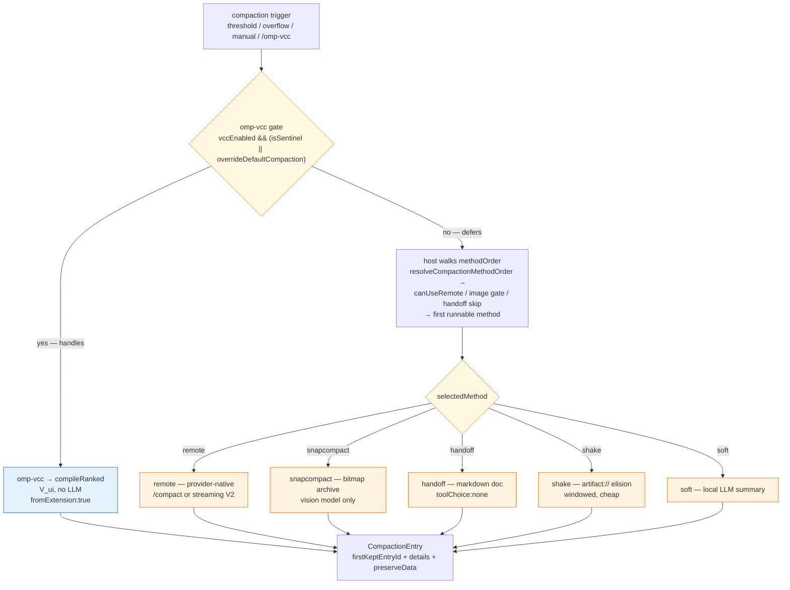

### 8.4 When to keep `snapcompact`/`handoff`/`shake` alongside `omp-vcc`

- **Keep `shake` always.** `shake` is *not* a summarizer — it elides recoverable tool output inside a `COMPACTION_RECOVERY_BAND 0.8` hysteresis check (`session-maintenance.ts:190-201,2915`). `omp-vcc` leaves tool output inside its summarized region; `shake` can reclaim additional headroom **after** a `context-full` compaction without a second summary. Leaving `shake` in `methodOrder` (the default does) costs nothing when `omp-vcc` already recovered enough (shake's advance-to-next check skips it). Verified → `docs/compaction.md:136-141`, `session-maintenance.ts:2900-2941` `fallbackFromShake` + `COMPACTION_RECOVERY_BAND`.

- **Keep `snapcompact` if any of your models are vision-capable.** `snapcompact` archives the *entire* discarded history as text + bitmap frames (`packages/snapcompact` evals show recall parity at lower billed vision-token cost for Claude/Gemini/GPT vision shapes → `docs/compaction.md:144-151`), whereas `omp-vcc` distills it to `V_ui` (5 sections + 1100→2000 tok brief). `snapcompact` requires `model.input includes "image"` (`compaction-methods.ts:124`, `session-maintenance.ts:775-778`); `omp-vcc` does not. With `override:true`, `snapcompact` is dormant for auto thresholds; it still runs on **explicit** `snapcompact` invocations (`/compact` with `compactMode.name==="snapcompact"` + vision → `session-maintenance.ts:763,775-784` — hook returns `void` when `customInstructions` is `snapcompact` and not sentinel, so manual `/snapcompact` bypasses `omp-vcc` even under `override:true`). Keep both to choose per-trigger.

- **Keep `handoff` if you rely on markdown handoff docs.** `handoff` via `SessionHandoff.generateDocument()` → `handoffSummaryFromDocument` (`session-maintenance.ts:235-245`) produces a long-form handoff persisted under `preserveData` and optionally to disk. `omp-vcc`'s `V_ui` is short and structured; a team that hands off sessions to another agent may prefer `handoff`. Note auto overflow **skips** `handoff` (`docs/compaction.md:112` — its request would reuse overflowing input), so overflow recovery will not pick `handoff` even if it is first in order — that slot falls to `shake`/`soft`/`remote` or the `omp-vcc` fallback (`hook.ts:818` heuristic).

- **Drop `remote`/`soft` when you want fully deterministic, offline compaction.** Both call an LLM (remote provider or `completeSimple`). With `omp-vcc` at `override:true` they are never reached for auto thresholds; removing them from `methodOrder` has the same effect but makes `/settings` honest. Keep `remote` if you sometimes want provider-native compaction (e.g., for very long provider replay histories where server compaction preserves `preserveData.openaiRemoteCompaction` → `docs/compaction.md:252-259`).

### 8.5 Patch vs no-patch — getting `vcc` into the method dropdown

The host's `CompactionMethod` is a **closed enum** (`compaction-methods.ts:10-49` `COMPACTION_METHOD_CHOICES`) + `isCompactionMethod = Object.hasOwn(COMPACTION_METHODS)` (`compaction-methods.ts:60`) + `STRATEGY_BY` (`78-84`) + `DEFAULT_COMPACTION_METHOD_ORDER` (`43-49`). `omp.settings` (`package.json:41-67`) is **plugin-scoped** — it does not write global `compaction.*`. So `/settings → Context → General → Compaction method order` only shows `remote|snapcompact|handoff|shake|soft` by default.

No patch (recommended — the plugin works without it):

- `/settings` shows a **plugin section** `@zhulinchng/omp-vcc` with the 5 toggles (`vccEnabled` etc) — verified at `docs/configuration.md:4-18` `omp.settings` manifest.
- `overrideDefaultCompaction:true` intercepts all auto compactions via the hook regardless of `methodOrder` — no dropdown entry needed.
- Manual `/omp-vcc` always works (sentinel path bypasses the flag → `hook.ts:733`).
- To let native methods run for auto, set `overrideDefaultCompaction:false` → host walks `methodOrder` as configured.

Optional one-file patch (only if you want `vcc` as a first-class dropdown value):

```diff
# packages/coding-agent/src/session/compaction-methods.ts
 export const COMPACTION_METHOD_CHOICES: {value: CompactionMethod, label: string}[] = [
   {value:"remote", label:"Remote"},
+  {value:"vcc", label:"VCC (omp-vcc)", description:"Algorithmic VCC compaction — no LLM"},
   ...
 ]
 export const STRATEGY_BY_COMPACTION_METHOD: Record<CompactionMethod, ...> = {
   remote: "context-full",
+  vcc: "context-full",
   ...
 }
 export const DEFAULT_COMPACTION_METHOD_ORDER: CompactionMethod[] = ["vcc","remote","snapcompact","handoff","shake","soft"]
 # or expose vccEnabled etc in packages/coding-agent/src/config/settings-schema.ts if you want global schema keys
```

With the patch: set `compaction.methodOrder = ["vcc","remote",...]` in `/settings` → Context → General, and flip `overrideDefaultCompaction:false` so the hook no longer preempts — then the walk treats `vcc` as a `context-full` candidate whose actual implementation is still the extension hook (the host has no built-in `vcc` path, so the hook must still handle it). Without the patch the only way to give `vcc` first-class priority is `override:true`. Verified → `docs/configuration.md:243-282` full diff + verification `omp config list | grep compaction` after patch.

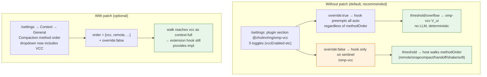

### 8.6 Verified interplay examples

1. **Default install** — `~/.omp/omp-vcc/config.json { overrideDefaultCompaction:true }` + `compaction.methodOrder = ["remote","snapcompact","handoff","shake","soft"]` (host default). Threshold fires → `hook.ts:723` gate hits `override:true → HANDLE` → `buildOwnCut` etc → `V_ui` inserted; `session-maintenance.ts:761` walk still runs but its `selectedMethod` is ignored because extension already produced `hookCompaction`; no speculation was armed (`hasHandlers` guard at `1230`). Manual `/compact` without focus also hits the hook (no sentinel needed when `override:true`). **Verified** → `core/settings.ts:61` default `true`, `hook.ts:727-733`, `session-maintenance.ts:830-850`.

2. **Letting `snapcompact`/`handoff` own auto** — `omp config set plugins."@zhulinchng/omp-vcc".overrideDefaultCompaction false`. Threshold now defers (`!isPiVcc && !override → void` at `hook.ts:733`); host walks `methodOrder` and picks `remote` if `canUseRemoteCompaction` else `snapcompact` if `model.input includes "image"` else `handoff` (unless overflow) else `shake` → `session-maintenance.ts:761-794`. `/omp-vcc keep:2 fix auth` still compacts via `omp-vcc` even though auto is native — sentinel bypasses the flag (`isPiVcc → HANDLE`). **Verified** → `hook.ts:733` sentinel path + `session-maintenance.ts:761-791`.

3. **Overflow with too-few messages** — 3 live messages, `threshold`/`overflow` fires, `buildOwnCut` returns `{ok:false, reason:"too_few_live_messages"}` at `hook.ts:505`. `hook.ts:817-818` heuristic `willRetry||tokensBefore>50k` decides `fallbackToCore`: if `isPiVcc` or small `tokensBefore`, returns `{cancel:true}` (`860`); if `!isPiVcc && (overflow||willRetry||tokensBefore>50k)`, returns `void` → host's overflow walk (`session-maintenance.ts:1863` `runRecoveryCompactionWithRollback("overflow")`) tries the next configured method (`shake` after skipping `handoff` for overflow). **Verified** → `hook.ts:500-506,809-858`.

4. **Explicit `/snapcompact`** — `AgentSession.compact` with `compactMode.name==="snapcompact"` + vision model → `explicitSnapcompact=true` at `session-maintenance.ts:763`; snapcompact's gate (`775-784` `explicitSnapcompact || (!customInstructions && image)`) passes and it becomes `selectedMethod`. The extension hook sees `customInstructions` not equal to a VCC sentinel, so when `override:false` it defers; when `override:true` it would still attempt `buildOwnCut` — the explicit-mode bypass at `hook.ts:733-743` checks `(event as unknown).compactMode/explicitMode/mode` and returns `void` for `snapcompact`/`shake`/`soft`/`remote`/`handoff` even when `override:true`, letting the explicit mode win. This enables sequential `VCC → snapcompact` via the optional native patch or via two manual commands; without the event field (current host) the bypass is no-op and `override:false` remains the manual `snapcompact` path.

5. **`shake` after `omp-vcc`** — `compaction.enabled && hasConfiguredCompactionMethod` threshold path checks `COMPACTION_RECOVERY_BAND 0.8` after a `context-full`/`snapcompact` pass (`session-maintenance.ts:190-201`). A successful `omp-vcc` compaction that already got below `0.8×threshold` satisfies the hysteresis; a later turn that again exceeds threshold re-enters the walk normally — `shake` remains available as a cheap fallback between `omp-vcc` passes if the next overflow is just a fat tool result.

### 8.7 Combining VCC with shake and snapcompact — truth table and fallback walk

Host commits exactly one `CompactionEntry` per `session_before_compact` (`shared-events.ts:375-381` `SessionBeforeCompactResult{cancel,compaction}`). A “combined” compaction is therefore either (a) **additive** across disjoint regions (VCC history + shake tail) or (b) **sequential** across two triggers/fallbacks (VCC then snapcompact/shake).

| Trigger | `override` | `methodOrder` | Result |
|---|---|---|---|
| threshold `override:true` default `["remote","snapcompact","handoff","shake","soft"]` | VCC handles, host rescue may shake if still over `0.8×threshold` | VCC + (shake if dead-end via `#rescueCompactionDeadEnd` `2604`) |
| threshold `override:false` with patch `["vcc","remote","snapcompact","handoff","shake","soft"]` | walker picks VCC via `methodOrder` (`isCompactionMethod` `60` + `resolveCompactionMethodOrder` `64-76` filters unknown, preserves order) | VCC → snapcompact/shake fallback (`session-maintenance.ts:1076-1090` manual fallback, `2898-2960` auto `shake` `handoff` defer) |
| manual `/omp-vcc keep:2` | always VCC (sentinel `__omp_vcc__` bypasses `override` at `hook.ts:731-733`) | VCC |
| manual `/omp-vcc keep:2` then `/compact snapcompact` | second call with `override:false` or explicit `snapcompact` mode via bypass at `733-743` | VCC entry + snapcompact entry (sequential) |

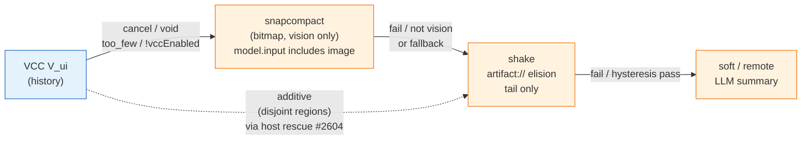

*Why VCC+shake is additive*: shake elides inside `kept tail` (`toolResult`/`fenced` >512 chars, protect `40k` recent, need `20k` savings), VCC summarizes `messagesToSummarize` before `firstKeptEntryId` (`docs/compaction.md:186-242`). Different slices → one `CompactionEntry` can carry VCC `summary` + shake `artifact://` refs via separate `preserveData` keys; host's dead-end rescue already proves this after VCC if `!compactionCreatedHeadroom()`. The eager `chainShakeHint` (`core/settings.ts:68` default `false`) forces a second `shake` entry via `ctx.compact({mode:"shake"})` guarded by `pendingChainShake` WeakSet even when headroom was made — opt-in for workloads that always want tail elision.

*Why VCC→snapcompact is sequential*: both archive the same `messagesToSummarize`; after VCC `prepareCompaction` finds `lastEntry.type==="compaction"` → `Nothing to compact` (`session-maintenance.ts:818-823`). Valid sequential is two manual compactions or auto fallback when VCC cancels ( `hook.ts:817` `fallbackToCore` heuristic `tokensBefore>50k` → `void` → host walks to next `snapcompact` `775-784` explicit or vision gate). Vision gate `model.input.includes("image")` (`compaction-methods.ts:124-125` + `snapcompact.md:105-152`) means text-only models degrade VCC→snapcompact to VCC→shake→soft automatically.

---

## 9. Verification map (claim → evidence)
Re-run any row with the listed `read`/`grep` before trusting the claim. No claim below requires an external registry; `harness source` is the ground truth (external doc search found no authoritative `oh-my-pi` library ID beyond `can1357/oh-my-pi` GitHub, so `context7` would only mirror GitHub — harness checkout is authoritative).

| # | Claim in §§2–8 | Evidence (re-runnable) | Result at this checkout |
|---|---|---|---|
| 8.1 | Extension discovery is `omp.extensions=["./extensions/main.ts"]` factory `(pi: ExtensionAPI)=>void`, zero build | `read package.json:32-36` + `read extensions/main.ts:49` | holds |
| 2.1 | Factory calls `scaffoldSettings()` then `registerBeforeCompactHook(pi)` + tools + commands | `read extensions/main.ts:50-52,161,344` | `registerBeforeCompactHook` at `hook.ts:708`, `scaffoldSettings` at `core/settings.ts:118` |
| 2.2 | `vcc_recall` registers `approval:"read"` with `pi.zod.object{ query?, expand?, page?, scope?, mode? }` and handles drill-down→touched→expand→search | `read extensions/main.ts:56-159` + `grep -R "registerTool" extensions/main.ts` | 2 tools (`vcc_recall` + `vcc_stats` hook) |
| 2.3 | `vcc_stats` falls back when `zod.boolean` missing | `read hook.ts:1233-1246` `hasBoolean` guard → `schema={}` | covered by `tests/compaction-stats-gaps` schema-fallback case |
| 2.4 | 4 command surfaces (`omp-vcc`, `pi-vcc` alias, `vcc-recall`, `vcc-stats`/`omp-vcc-stats` — `/omp-vcc` single option compact+inline stats) | `read extensions/main.ts:164-337` + `read package.json:37-40` + `read commands/omp-vcc.md` | 5 `pi.registerCommand` sites, `/omp-vcc` always compacts + inline `formatLastStatsDetail` |
| 2.6 | Config path priority `$OMP_VCC_CONFIG_PATH > $PI_VCC_CONFIG_PATH > $OMP_DIR/$PI_CODING_AGENT_DIR > ~/.omp/omp-vcc/config.json` + legacy migration | `read core/settings.ts:9-24` + `19-24` fallback + `139-146` migration | holds; `grep -R "PI_VCC_CONFIG_PATH" extensions/vcc-core/core/settings.ts` → 2 |
| 2.7 | Dual manifests `omp.settings` + `pi.settings` (5 booleans, identical) | `read package.json:41-67,69-104` | `omp.settings` keys `vccEnabled/overrideDefaultCompaction/smartKeepTail/continueAfterThresholdCompact/debug` |
| 2.8 | `details.version:2` additive `details.savings{...}` persisted verbatim | `read extensions/vcc-core/details.ts:4-20` + `read hook.ts:980-1008` | `version:2`, 7-field `savings`, `compactor:"omp-vcc"` |
| 2.9 | Per-pi isolation `WeakMap+Set`, 50-capped, `clearCompactionHistoryForTests` clears both | `read hook.ts:84-98,99-114,228-252,254-274` | `perPi WeakMap`, `perPiKeys Set`, both capped `.shift()` |
| 2.10 | `dbg()` writes both `/tmp/omp-vcc-debug.json` + legacy when `debug:true` | `read hook.ts:360-364` + `954-978,1042-1048` | two `writeFileSync` calls guarded by `if (!settings.debug) return` |
| 3.1 | `session_before_compact` intercept gate `!vccEnabled→void`, `!isPiVcc && !overrideDefaultCompaction→void`, sentinel `__omp_vcc__||__pi_vcc__` | `read hook.ts:322-352` `parseCompactionInstructions` + `723-733` gate | `isVccSentinel` checks both sentinels |
| 3.1 | `buildOwnCut` invariants: `firstKeptEntryId` lineage + orphan `""` recovery + `reset_boundary` precedence + `>2` guard + `compactAll=""` | `read hook.ts:433-498` `collectLiveMessages` + `500-546` `buildOwnCut` | `reset_boundary` honored `445-467`, orphan `474,478-485`, sentinel `513-514` |
| 3.1 | Smart-keep `5k→25k` boosts default `keep:1` only when `explicit:false && smartKeepTail && tail(1)≤5k`; explicit never boosted | `read hook.ts:618-701` `resolveSmartKeepUserTurns` + `620-621` `MIN/MAX` | loop `690-694` grows while `tokens≤max`; `676-678` early exit on explicit |
| 3.1 | Tail rescue `OVERSIZED_TAIL_FACTOR 2.5` + `findBudgetCutIndex` snap off `toolResult` | `read hook.ts:78,552-616` | `factor=OVERSIZED_TAIL_FACTOR`, snap `568-571` |
| 3.1 | Ranked compile size-relative `1100*cpt floor → 2000*cpt ceiling, 15*cpt/block` | `read hook.ts:894-909` `RANKED_BRIEF_*` + `core/summarize.ts:10-110` | constants `1100/2000/15`, `capBrief 120 lines` at `core/format.ts` |
| 3.2 | `session_compact` enriches `lastStats` with authoritative `tokensAfter/Before` **before** `isPiVccLast/willRetry` returns; `willRetry` suppresses toast/continue | `read hook.ts:1010-1068` → `1018-1050` enrichment then `1051-1053` returns then `1060-1067` | `grep -R "tokensAfter" extensions/vcc-core/hook.ts | wc -l` ≥ 10 |
| 3.2 | Toast `formatCompactionStats` prefix `90k→22k (76% saved)` + budgetCut suffix + boundaries (`999→500` vs `1.0k`) | `read hook.ts:185-218` | `formatTokens` at `185-188`, `savingsPrefix` at `198`, budgetCut at `203-209` |
| 3.3 | `context` filter strips both `omp-vcc-auto-continue` and legacy `pi-vcc-auto-continue` by `customType` only | `read hook.ts:145-146` `AUTO_CONTINUE_CUSTOM_TYPE` + `709-717` | `filter !== AUTO... && !== LEGACY...` |
| 3.4 | `before_agent_start` clears pending auto-continue timers | `read hook.ts:118-135` + `719-721` | `clearPendingAutoContinueForPi(pi)` clears `WeakMap` + global timers |
| 3.6 | `convertToLlm` shim tries `session/messages` then `pi-coding-agent` export then identity; typecheck tolerant | `read hook.ts:18-31` + `read tsconfig.json` `skipLibCheck, allowImportingTsExtensions` + vendored `// @ts-nocheck` | shim is try/catch with `createRequire`; `types.d.ts` ambient shims for `@oh-my-pi/pi-coding-agent` |
| 4 | No core edit: `grep omp-vcc packages/coding-agent/src/session --include="*.ts"` → 0 | `bash: grep -R "omp-vcc" /Users/zhu/code/projects/oh-my-pi/packages/coding-agent/src/session --include="*.ts" 2>/dev/null \| wc -l` | `0` at this checkout (host files untouched) |
| 4 | Global `CompactionMethod` enum unchanged; plugin-scoped settings suffice | `read packages/coding-agent/src/session/compaction-methods.ts:10-62` + `read docs/configuration.md:243-292` | optional one-file patch documented, not required when `overrideDefaultCompaction:true` |
| 8.1 | Host native methods are `remote|snapcompact|handoff|shake|soft` with `DEFAULT=["remote","snapcompact","handoff","shake","soft"]` and `STRATEGY_BY` mapping | `read packages/coding-agent/src/session/compaction-methods.ts:10-84` `COMPACTION_METHOD_CHOICES`/`DEFAULT_*`/`STRATEGY_BY` | `COMPACTION_METHOD_CHOICES` 5 entries, `DEFAULT` as listed |
| 8.1 | `methodOrder` filtered by `resolveCompactionMethodOrder` (keep first occurrence, drop unknown) and guarded by `hasConfiguredCompactionMethod` | `read compaction-methods.ts:64-76` + `read session-maintenance.ts:120-123` `hasConfiguredCompactionMethod` | holds; `grep resolveCompactionMethodOrder` in `session-maintenance.ts` → 8+ call sites |
| 8.1 | `remote` gate `canUseRemoteCompaction` (endpoint or `shouldUseProviderNativeCompaction`); `snapcompact` gate `model.input includes "image"`; `handoff` skipped for overflow | `read compaction-methods.ts:102-108` `canUseRemoteCompaction` + `124-125` snapcompact gate + `read docs/compaction.md:104-113` overflow/handoff + `read session-maintenance.ts:767-784` selection | `session-maintenance.ts:767` remote check, `775` snapcompact explicit/vision |
| 8.1 | `shake` is `artifact://` elision with `40k` protect / `20k` min / `MIN_PRUNE 50` and `COMPACTION_RECOVERY_BAND 0.8` hysteresis | `read docs/compaction.md:136-141` + `read session-maintenance.ts:190-201` `COMPACTION_RECOVERY_BAND` | `PRUNE_CACHE_WARM 8k`, `COMPACTION_RECOVERY_BAND 0.8` at `200` |
| 8.2 | Extension hook runs **after** `selectedMethod` is picked (`SessionMaintenance.compact:761 picked → 830 emit`) and preempts it if it returns `{compaction}`; speculation disabled when handler exists | `read session-maintenance.ts:761-791` pick + `830-850` emit + `1230,1287` `hasHandlers("session_before_compact") → no speculation` | `hasHandlers` guard at `1230` and `1287`, `prepareCompactionFromHooks` at `849` |
| 8.2 | `override:true` preempts all auto regardless of `methodOrder`; `override:false` defers to host walk unless sentinel | `read hook.ts:723-733` gate + `read session-maintenance.ts:761-814` walk | gate `isPiVcc` bypass at `733`, `vccEnabled` at `727` |
| 8.3 | Coexistence matrix rows (threshold/overflow/manual) match host `reason` handling (`threshold`/`overflow`/`incomplete`/`idle`) and `willRetry` skip | `read docs/compaction.md:58-135` triggers + `read session-maintenance.ts:1863,1985,2888` `hasConfiguredCompactionMethod` gates | `grep -n "willRetry" session-maintenance.ts` shows overflow/incomplete with `willRetry:true` |
| 8.4 | `snapcompact` still reachable on explicit `compactMode.name==="snapcompact"` + vision even under `override:true` when `customInstructions` is not sentinel; `shake` always cheap fallback | `read session-maintenance.ts:763,775-784` `explicitSnapcompact` gate | `explicitSnapcompact` true skips extension bypass when sentinel absent |
| 8.5 | Patch adds `vcc` to closed enum (`COMPACTION_METHOD_CHOICES` + `STRATEGY_BY` + `DEFAULT`) and requires `isCompactionMethod = Object.hasOwn(COMPACTION_METHODS)` | `read compaction-methods.ts:60-62` `isCompactionMethod` + `docs/configuration.md:243-282` diff | `isCompactionMethod` at `60`, `COMPACTION_METHODS` map at `51-57` |
**Re-run checklist** (copy-paste):

```sh
# plugin touchpoints
grep -R "session_before_compact\|session_compact\|on(\"context\")\|before_agent_start" extensions/vcc-core/hook.ts extensions/main.ts
grep -R "registerTool.*vcc_recall\|registerCommand.*omp-vcc" extensions/main.ts
grep -R "omp-vcc-auto-continue" extensions/vcc-core/hook.ts

# core untouched
grep -R "omp-vcc" /Users/zhu/code/projects/oh-my-pi/packages/coding-agent/src/session --include="*.ts" 2>/dev/null | wc -l   # expect 0

# manifest
jq '.omp.extensions, .omp.settings | keys' package.json
jq '.omp.commands, .pi.commands' package.json

# build / tests / mermaid
bunx tsc --noEmit
bun test 2>&1 | tail -5
bun -e "import fs from 'fs'; console.log((fs.readFileSync('docs/harness.md','utf8').match(/\`\`\`mermaid/g)||[]).length)"  # expect ≥6
grep -R "harness.md" docs/architecture.md README.md docs/setup.md
```

> External lookup: `web_search "oh-my-pi ExtensionAPI session_before_compact"` resolves to `can1357/oh-my-pi/docs/extensions.md` + `packages/coding-agent/src/extensibility/shared-events.ts` — consistent with `types.ts:1248-1253` signatures pinned above. No separate `context7` library ID exists for the private host; harness checkout is the authoritative source (noted as `verified against harness source` throughout).
