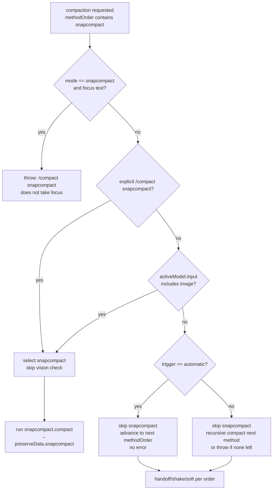
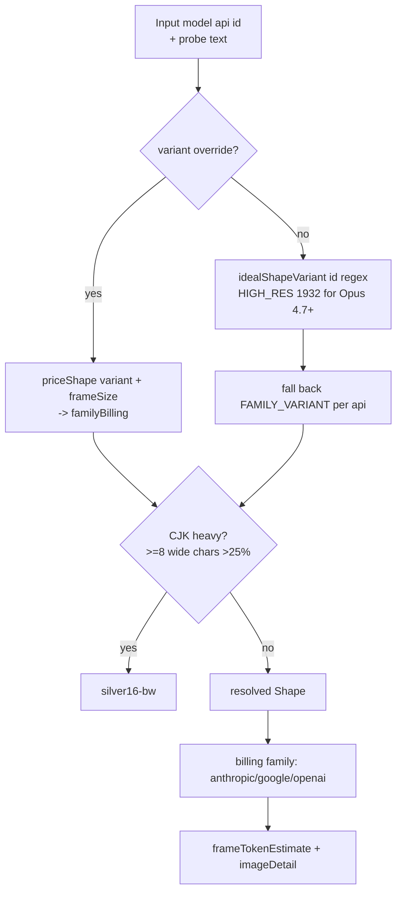
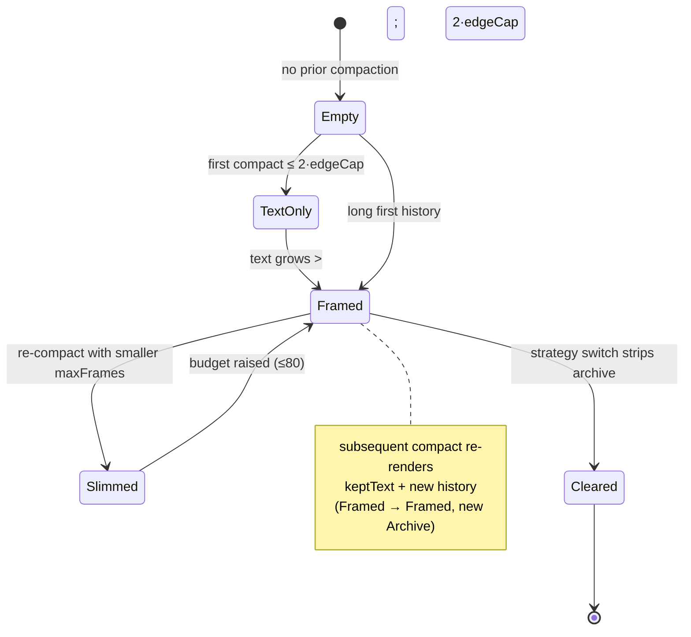
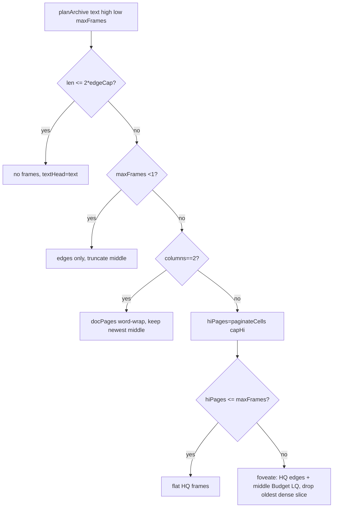
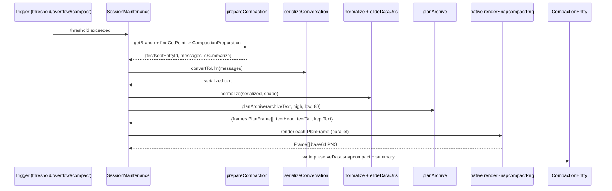
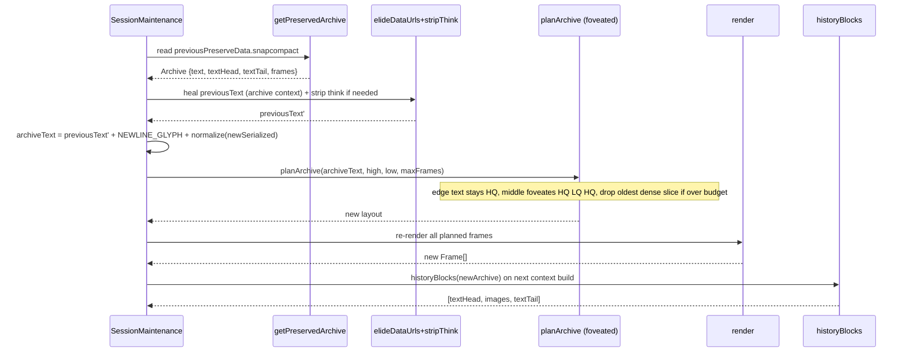
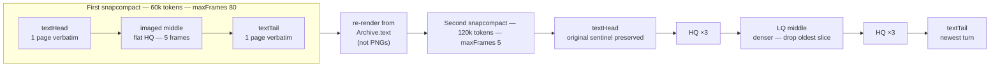

# Snapcompact — Bitmap-Frame Context Compression

> Snapcompact replaces an LLM summarizer call with a local, deterministic archival pass: discarded history is serialized to compact text and rasterized into provider-aware PNG frames that vision models read back directly.
> It runs whenever `compaction.methodOrder` selects it and the active model can carry images, persisting a bounded text-plus-frames archive that is reconstructed on every context rebuild.

> Verified against [`packages/snapcompact/src/snapcompact.ts`](https://github.com/can1357/oh-my-pi/blob/main/packages/snapcompact/src/snapcompact.ts) and [`crates/pi-natives/src/snapcompact.rs`](https://github.com/can1357/oh-my-pi/blob/main/crates/pi-natives/src/snapcompact.rs) (2026-09-02) @ `18781d8295`. Every constant, variant name, cap, and gate below quotes a live literal; drift since that cut is an intentional doc bug.

See also: [Compaction architecture](./omp-compaction.md) (method order & triggers) · [`@oh-my-pi/snapcompact` README](https://github.com/can1357/oh-my-pi/blob/main/packages/snapcompact/README.md) (public API) · [`crates/pi-natives/src/snapcompact.rs`](https://github.com/can1357/oh-my-pi/blob/main/crates/pi-natives/src/snapcompact.rs) (rasterizer) — all pinned to `18781d8295`

- [Overview](#overview)
- [When it runs (method order gate)](#when-it-runs-method-order-gate)
- [How it works & vision detection](#how-it-works--vision-detection)
- [Concepts & data contracts](#concepts--data-contracts)
- [Shape system (provider-aware geometry × billing)](#shape-system-provider-aware-geometry--billing)
- [Pipeline — serialize → normalize → paginate → render → archive](#pipeline--serialize--normalize--paginate--render--archive)
- [Native rendering layer (Rust)](#native-rendering-layer-rust)
- [Archive persistence & preserveData](#archive-persistence--preservedata)
- [Context rebuild — historyBlocks](#context-rebuild--historyblocks)
- [Foveation & budgets (frame count vs byte budget)](#foveation--budgets-frame-count-vs-byte-budget)
- [First compaction — end-to-end](#first-compaction--end-to-end)
- [Subsequent compaction — re-render, healing, truncation](#subsequent-compaction--re-render-healing-truncation)
- [Configuration reference](#configuration-reference)
- [Failure modes & guards](#failure-modes--guards)
- [References](#references)

---

## Overview

Snapcompact is the bitmap-frame compaction strategy under `compaction.methodOrder` — exposed as `snapcompact` in `packages/coding-agent/src/session/compaction-methods.ts:18` and implemented as `compact()` in `packages/snapcompact/src/snapcompact.ts:2037`. Instead of asking a model to summarize the turns being discarded, the TypeScript caller serializes those turns, normalizes the text for the selected pixel font, paginates it, and hands each page to the native rasterizer (`renderSnapcompactPng` in `crates/pi-natives/src/snapcompact.rs`). The rasterizer returns base64 PNGs. The summary entry itself is a short, static "read HISTORY" guide plus a file-operation list; the history lives in the image frames.

Invariant properties:

- **Local and deterministic.** No model call, no API key, no network. The only latency is native PNG encoding (`task::blocking` in the NAPI binding). That is why snapcompact is the overflow-safe method — `docs/compaction.md:150` notes it has no LLM dependency.
- **Vision-model only.** Every frame is billed as an image. If the current model cannot carry images, snapcompact is skipped (see [How it works & vision detection](#how-it-works--vision-detection)).
- **Bounded and re-renderable.** The archive stores both the frames and a bounded source text (`Archive.text` plus `textHead`/`textTail`). Later compactions re-render from that source text, not by stacking old PNGs (`packages/snapcompact/src/snapcompact.ts:2088` and `docs/compaction.md:149`).
- **Provider-aware geometry.** The same source text paginates to different `cols`/`rows` per reader family so the billed-token cost tracks the provider that will read it (`packages/snapcompact/src/snapcompact.ts:238`, `SHAPES` table at `259:277`).

Overall data flow:

```mermaid
flowchart LR
  A[Trigger\nthreshold/overflow\nmanual /compact] --> B[prepareCompaction\nfindCutPoint\nkeepRecentTokens]
  B --> C[convertToLlm\nconvertMessageToLlm]
  C --> D[serializeConversation\ncaps 2000/500/2000]
  D --> E[elideDataUrls\nheal archive]
  E --> F[normalize\nfont-aware fold]
  F --> G[planArchive\nedge text + imaged middle]
  G --> H[renderMany\nnative PNG]
  H --> I[CompactionEntry\npreserveData.snapcompact]
  I --> J[historyBlocks\non next rebuild]

%% Source: packages/snapcompact/src/snapcompact.ts:2037 compact, docs/compaction.md:59
```



---

## When it runs (method order gate)

Compaction can fire in six ways (enumerated in `docs/compaction.md:59-68`):

| # | Trigger | Flag in code |
|---|---------|--------------|
| 1 | Manual `/compact [instructions]` | `AgentSession.compact()` (`session-maintenance.ts:714`) |
| 2 | Automatic overflow recovery | same-model assistant error detected as context overflow |
| 3 | Automatic incomplete-output recovery | same-model assistant `stopReason === "length"` |
| 4 | Automatic threshold maintenance | post-turn `calculateContextTokens` exceeds `resolveThresholdTokens` |
| 5 | Mid-turn threshold maintenance | tool-loop turn crosses threshold before next provider request (`compaction.midTurnEnabled`) |
| 6 | Idle maintenance | `runIdleCompaction()` with `reason: "idle"` |

Whether any of those actually runs snapcompact is decided by the **ordered preference** `compaction.methodOrder`. Choices and default in `packages/coding-agent/src/session/compaction-methods.ts`:

```ts
// packages/coding-agent/src/session/compaction-methods.ts:11,43
COMPACTION_METHOD_CHOICES = ["remote","snapcompact","handoff","shake","soft"]
DEFAULT_COMPACTION_METHOD_ORDER = ["remote","snapcompact","handoff","shake","soft"]
```

The host walks the list via `resolveCompactionMethodOrder()` (`compaction-methods.ts:68`) in order, picking the first method whose gate passes. `remote` checks `canUseRemoteCompaction(model, settings)`; `snapcompact` checks the vision gate below; `handoff`/`soft`/`shake` have their own prompts and fallbacks (see `docs/compaction.md:104-135`). Automatic maintenance (`session-maintenance.ts:1780+` / `2900+`) and manual `/compact` share the same walker, but manual mode throws if nothing matches:

```ts
// session-maintenance.ts:792
throw new Error("No configured compaction method can run manually.");
```

Automatic mode never throws — if every configured method is skipped the idle/threshold check simply returns `COMPACTION_CHECK_NONE` and no compaction fires.

---

## How it works & vision detection

### 6-phase end-to-end flow (traceable to functions)

Each numbered phase maps to a function you can open and read. Together they are `snapcompact.compact()` (`snapcompact.ts:2037-2185`) stitched to the host's orchestration (`session-maintenance.ts:762`, `session-context.ts:372`).

1. **Select & prepare.** `prepareCompaction(pathEntries, effectiveSettings, activeModel, tokenizer)` in `@oh-my-pi/pi-agent-core` finds the cut point `firstKeptEntryId` via `findCutPoint` with an adaptive window anchored by `keepRecentTokens = 20_000` and bundles `messagesToSummarize + turnPrefixMessages + previousSummary + previousPreserveData + fileOps`. The live transcript's `keepRecentTokens` default is 20k and adapts when the head would land inside a turn.
2. **Serialize.** `serializeConversation(convertToLlm(messages), SerializeOptions)` in `snapcompact.ts:933` emits a single flat string of `¶user:` / `¶ai:` / `¶think:` / `¶call:name(args)//intent` scopes with per-value and per-call caps: `toolResultMaxChars 2_000`, `toolArgMaxChars 500`, `toolCallMaxChars 2_000` at `truncateHeadRatio 0.6` (`snapcompact.ts:736-786`). Consecutive same-role blocks merge without repeating the prefix. Tool results are wrapped in `DIM_ON`/`DIM_OFF` (`\u000e`/`\u000f`) so they render in dim gray ink.
3. **Heal & normalize.** `elideDataUrls(text, context)` in `snapcompact.ts:863` collapses inline `data:…;base64,…` atoms (including their Markdown wrapper ``) to `[data URL omitted: <mime>, N base64 chars]` and `normalize(text, { shape })` in `snapcompact.ts:1345` strips ANSI, collapses whitespace, folds `CHAR_FOLD` / `EMOJI_FOLD` / NFKD decompositions to ASCII, preserves glyphs the selected font or Silver fallback can render, and drops decorative emoji instead of burning a `?` cell.
4. **Layout.** `planArchive(text, high, low, maxFrames)` in `snapcompact.ts:1915` keeps `TEXT_EDGE_PAGES = 1` page verbatim at each chronological edge and paginates the imaged middle between them. When the middle overflows `maxFrames`, it foveates to `HQ/LQ/HQ` (high-quality edges, denser low-quality center). Both edges stay plain text; only the middle becomes frames.
5. **Render.** `renderMany` in `snapcompact.ts:1654` fans the planned page strings through `render(page, shape)` → `renderSnapcompactPng(text, nativeRenderOptions)` in `crates/pi-natives/src/snapcompact.rs:1164`. Each page returns `{ data: base64 PNG, cols, rows, chars, font, variant, lineRepeat, columns?, detail? }`. Frame height hugs the rows actually printed; blank rows are never billed.
6. **Persist & rebuild.** The caller writes `CompactionEntry { summary, shortSummary, firstKeptEntryId, tokensBefore, preserveData: { [PRESERVE_KEY]: Archive } }` with `PRESERVE_KEY = "snapcompact"` (`snapcompact.ts:532`). On every later `buildSessionContext` (`session-context.ts:424-433`), `historyBlocks(archive, { maxFrameDataBytes: 3_000_000 })` in `snapcompact.ts:1832` re-inflates the persisted archive into ordered prompt blocks `textHead → gap notice? → images → textTail` for the provider.

Citations: `snapcompact.ts:2037-2185` for phases 2-5 orchestration, `session-maintenance.ts:815` for cut-point, `session-context.ts:372-427` for phase 6.

### Vision-capability detection — `model.input.includes("image")`

The snapcompact gate does not match on provider name or model id substring. It reads a **data field** on the active model object:

```ts
// packages/coding-agent/src/session/session-maintenance.ts:775-784 (manual //compact walker)
if (method === "snapcompact") {
  if (
    explicitSnapcompact ||
    (!customInstructions && !options?.internalGuidance && activeModel.input.includes("image"))
  ) {
    selectedMethod = method; // run snapcompact
  } else {
    continue; // skip snapcompact, try next methodOrder entry
  }
}
// packages/coding-agent/src/session/compaction-methods.ts:119-126 (speculative / auto probe)
candidate === "snapcompact" ? model?.input?.includes("image") === true : /* other method */
```

- `Model` comes from `@oh-my-pi/pi-catalog` via `ModelRegistry.getAvailable()` and `@oh-my-pi/pi-ai` shape `Model { id, provider, input: string[], contextWindow, … }`. `input` is an array like `["text"]` or `["text","image"]`; snapcompact checks `includes("image")` exactly. No `id.includes("claude")` string matching — this is enforced by the project's Model/Provider Policy rule (`AGENTS.md` — all model-conditional policy lives in KDL, and this gate deliberately reads catalog data rather than hard-coding a model list).
- `explicitSnapcompact` is `compactMode?.name === "snapcompact"` (`session-maintenance.ts:763`), i.e. the user typed `/compact snapcompact`. That path **bypasses** the vision check so an explicit request can force the attempt. Every other manual `/compact` and every automatic trigger respects the vision check.
- The check reads the *current* active model at compaction time (`this.#model` / `settings`). A mid-session `model` switch changes eligibility immediately; the render-probe text for shape also re-resolves per compaction via `renderabilityProbeText(previousPreserveData, previousSummary)` (`snapcompact.ts:1758`).
- Catalog provenance: `model.input` is populated from `packages/catalog/src/models.json` (generated by `generate-models.ts` from provider descriptors), not hard-coded in TypeScript. A provider that reports its vision capability incorrectly would need a KDL correction, not a TS special case.

| Example model id | `model.input` | snapcompact runs? |
|-----------------|---------------|-------------------|
| `claude-opus-4-6` | `["text","image"]` | yes |
| `gpt-4o` | `["text","image"]` | yes |
| `gemini-2.5-pro` | `["text","image","audio"]` | yes (includes `"image"`) |
| `text-only-model` | `["text"]` | no — skipped |
| unset / `null` model | — | no — `canUse` returns false |

The canonical prose for this rule in the companion doc is `docs/compaction.md:150`: *"It requires a vision-capable current model (`model.input` includes `"image"`); otherwise automatic maintenance skips it and advances to the next configured method. Manual `/compact` honors the method order unless custom instructions are given (those imply a directed LLM summary)."*

Decision diagram for the gate:



### What happens when the model does NOT support images

Three distinct outcomes — not one vague "fallback". Each maps to a read anchor a reviewer can open side-by-side.

**Automatic maintenance (threshold / overflow / incomplete / idle) — silent skip, no error.**

The walker over `resolveCompactionMethodOrder(compactionSettings.methodOrder)` simply executes `continue` past `snapcompact` (`session-maintenance.ts:784`) and evaluates the next entry. No exception is thrown; telemetry records the method that actually ran in `auto_compaction_start/end` (`session-maintenance.ts:1780+`). If every configured method is skipped (e.g. `methodOrder: ["snapcompact"]` on a text-only model), the helper returns `COMPACTION_CHECK_NONE` and no compaction fires. An overflow pass with `methodOrder: ["snapcompact","soft"]` and a non-vision active model therefore runs `soft` (the `handoff` step is already skipped on overflow because its request would reuse the overflowing input — `docs/compaction.md:112`).

**Manual `/compact` without focus instructions — same skip, unless explicitly forced.**

Without explicit mode the same `continue` path applies and the recursive `return await this.compact(customInstructions, options, selectedMethodIndex + 1, compactionAbortController)` at `session-maintenance.ts:1089` (and the provider-remote analogue at `813`) advances to `handoff` → `shake` → `soft`. If nothing remains, `No configured compaction method can run manually` is thrown (`792`). With explicit `/compact snapcompact` and a non-vision model, `explicitSnapcompact === true` causes the walker to select snapcompact anyway. The downstream request will then either hit the byte-budget guard in `historyBlocks` or the provider's own "image not supported" 400; either path surfaces as a snapcompact failure and falls through to the next method per the catch at `session-maintenance.ts:1075-1090` that emits `warning: "<method> compaction failed; trying the next preferred method"` and retries with `selectedMethodIndex + 1`. The user sees a warning, not a silent miss.

**Custom instructions / focus text — eager throw before the vision check.**

`session-maintenance.ts:727-735` rejects up front:

```ts
if (compactMode?.rejectsFocus && (customInstructions || options?.internalGuidance)) {
  throw new Error(`/compact ${compactMode.name} does not take focus instructions.`);
}
```

`snapcompact.rejectsFocus === true` in `packages/coding-agent/src/session/compact-modes.ts:34-55` (`COMPACT_MODES`). A directed `/compact snapcompact with focus text` therefore never reaches the vision gate — it fails fast so the caller does not silently lose instructions to an image archive that cannot carry them. Note also that `customInstructions` blocks the non-explicit auto-selection of snapcompact in the first place: the `!customInstructions && !options?.internalGuidance` conjunct in the vision gate means any manual `/compact` with focus text skips snapcompact even without the `rejectsFocus` throw path, falling through to the LLM-based `handoff`/`soft` summary that can follow instructions.

**Transient snapcompact (system-prompt / tool-result imaging) — separate gate, same predicate.**

Outside the compaction archive, the same vision predicate guards the lightweight bitmap paths that image individual system-prompt chunks (`compaction.snapcompact.systemPrompt`, `session-maintenance.ts:1930+`) and oversized tool results (`compaction.snapcompact.toolResults`, `packages/coding-agent/src/session/snapcompact-inline.ts` → `SnapcompactInlineTransformer`). Both default off (`"none"` / `false` per `settings-schema.ts` and `docs/compaction.md:421-447`, `packages/snapcompact/README.md` table) and, when enabled, still check `model.input.includes("image")` plus the per-request `providerImageBudget` count cap before rendering. When the model is non-vision they become no-ops and tool results ship as verbatim text. The advisor subsystem has no stable `preserveData.snapcompact` slot (`session-advisors.ts:1651-1655` comment), so advisor sessions always use the LLM summary even when the primary session's `methodOrder` prefers snapcompact.

Quick truth table for manual `/compact`:

| Command | Active `input` | Explicit snapcompact? | Instructions? | Result |
|---------|----------------|-----------------------|---------------|--------|
| `/compact` | `["text","image"]` | no | none | snapcompact runs if it is first eligible in `methodOrder` |
| `/compact` | `["text"]` | no | none | skip snapcompact → next method, or throw if none |
| `/compact snapcompact` | `["text"]` | yes | none | snapcompact runs (vision check bypassed) |
| `/compact snapcompact` | any | yes | present | throw `does not take focus` |
| `/compact focus text` | `["text","image"]` | no | present | skip snapcompact (customInstructions gate) → LLM summary method |

---

## Concepts & data contracts

All types below live in `packages/snapcompact/src/snapcompact.ts:532-651` unless noted.

**`Archive`** (`snapcompact.ts:563`) — persisted under `CompactionEntry.preserveData[PRESERVE_KEY]` with `PRESERVE_KEY = "snapcompact"` (`532`). It is the only durable artifact of a compaction pass.

| Field | Type | Meaning |
|-------|------|---------|
| `frames` | `Frame[]` | Rendered frames oldest→newest for the imaged middle. May be empty when the whole archive fit in text. |
| `totalChars` | `number` | Characters readable across all frames plus text regions (the `shortSummary` denominator). |
| `truncatedChars` | `number` | Characters dropped so far to respect `maxFrames` / foveation (accumulates across compactions). |
| `text` | `string?` | Full kept source (oldest→newest), bounded to the rendered budget. Single source re-rendered each compaction. Omitted only on legacy-only archives. |
| `textHead` | `string?` | Oldest verbatim text region kept around the imaged middle (one HQ-page). |
| `textTail` | `string?` | Newest verbatim text region kept around the imaged middle. |

**`Frame`** (`snapcompact.ts:540`) — one developed snapcompact frame:

| Field | Type | Origin |
|-------|------|--------|
| `data` | `string` | base64 PNG from `renderSnapcompactPng` |
| `mimeType` | `string` | always `"image/png"` |
| `cols` | `number` | characters per row (per-column width on doc frames) |
| `rows` | `number` | text rows in the grid (unique lines, not repeated copies) |
| `chars` | `number` | characters actually printed onto this frame |
| `font` | `Shape["font"]?` | absent on pre-shape-table legacy frames (`5x8` implicit) |
| `variant` | `Shape["variant"]?` | `sent` / `bw` |
| `lineRepeat` | `number?` | e.g. `2` on `8x8r` |
| `columns` | `number?` | `2` on doc frames |
| `stopwordDim` | `boolean?` | true when stopwords printed in dim ink |
| `detail` | `ImageContent["detail"]?` | e.g. `"original"` for OpenAI |

**Compaction entry points** (`snapcompact.ts:628-651`):

```ts
interface CompactionPreparation<TMessage = Message> {
  firstKeptEntryId: string;          // UUID of first entry to keep (cut point)
  messagesToSummarize: TMessage[];   // turns being archived and discarded
  turnPrefixMessages: TMessage[];    // split-turn prefix archived with them
  tokensBefore: number;              // token count entering compaction
  previousSummary?: string;          // fallback head when no prior archive
  previousPreserveData?: Record<string, unknown>;
  fileOps: FileOperations;           // { read, written, edited } Sets
}
interface CompactionResult {
  summary: string;                   // "Resume…" guide + FILES tree
  shortSummary?: string;             // `Archived N chars onto M frames …`
  firstKeptEntryId: string;
  tokensBefore: number;
  details?: { readFiles: string[]; modifiedFiles: string[] };
  preserveData?: Record<string, unknown>; // { snapcompact: Archive, … }
}
```

**Constants that size the world** (`snapcompact.ts:453-532`):

| Constant | Value | Verified at | Notes |
|----------|-------|-------------|-------|
| `FRAME_SIZE` | `2576` | `455` | Legacy 5x8 edge; new shapes carry their own `frameSize` |
| `MAX_FRAMES_DEFAULT` | `80` | `464` | Upper bound on archive frames; holds ~400k tokens on high-res 1932px frames |
| `HQ_EDGE_FRAMES` | `3` | `469` | HQ frames at each chronological edge of a foveated middle |
| `FRAME_TOKEN_ESTIMATE` | `5024` | `475` | Conservative per-frame budget: `ceil(4784 * 1.05)` for Anthropic's visual-token cap |
| `FRAME_DATA_BYTES_ESTIMATE` | `170_000` | `481` | Measured high-res frame ~159 KB; margin to 170 KB |
| `FRAME_DATA_BYTES_BUDGET` | `3_000_000` | `488` | Per-request base64 payload cap; providers 5xx above this |
| `DEFAULT_PROVIDER_IMAGE_BUDGET` | `5` | `520` | Floor for unknown providers (Groq ~5) |
| `TOOL_RESULT_MAX_CHARS` | `2000` | `737` | Per-tool-result cap |
| `TOOL_ARG_MAX_CHARS` | `500` | `741` | Per-argument-value cap |
| `TOOL_CALL_MAX_CHARS` | `2000` | `744` | Whole-argument-list cap per call |
| `TRUNCATE_HEAD_RATIO` | `0.6` | `748` | Head share of each truncation budget |
| `DIM_ON` / `DIM_OFF` | `\u000e` / `\u000f` | `752` | Zero-width dim-gray ink toggles for tool output |
| `NEWLINE_GLYPH` | `█` (`\u2588`) | `1145` | Full-block cell that renders newline structure at one-cell cost |
| `TEXT_EDGE_PAGES` | `1` | `920` | Verbatim pages at each edge (`textHead`/`textTail`) |
| `DOC_GUTTER` | `3` | `1415` | Char cells between doc columns |

---

## Shape system (provider-aware geometry × billing)

### Variants (geometry)

Eighteen eval-validated variants in `SHAPE_VARIANTS` (`snapcompact.ts:107-192`). Each is a pure geometry record; billing is attached later by `priceShape`.

| Variant | Font | cellWidth×cellHeight | variant | lineRepeat | columns | frameSize | Notes |
|---------|------|----------------------|---------|------------|---------|-----------|-------|
| `8x8r-bw` | `8x8` | 8×8 | `bw` | 2 | — | 1568 | unscii square, line printed twice (redundancy) |
| `8x8r-sent` | `8x8` | 8×8 | `sent` | 2 | — | 1568 | same + sentence hues |
| `8x8u-bw` | `8x8` | 8×8 | `bw` | 1 | — | 1568 | square, single copy |
| `8x8u-sent` | `8x8` | 8×8 | `sent` | 1 | — | 1568 | square + hues |
| `6x6u-bw` | `8x8` | 6×6 | `bw` | 1 | — | 1568 | unscii squeezed to 6×6 (densest readable) |
| `6x6u-sent` | `8x8` | 6×6 | `sent` | 1 | — | 1568 | same + hues |
| `5x8-bw` | `5x8` | 5×8 | `bw` | 1 | — | 2576 | X.org legacy |
| `5x8-sent` | `5x8` | 5×8 | `sent` | 1 | — | 2576 | legacy + hues |
| `6x12-dim` | `6x12` | 6×12 | `bw` | 1 | — | 1568 | X.org 6×12, stopwords dimmed |
| `8x13-bw` | `8x13` | 8×13 | `bw` | 1 | — | 1568 | X.org misc |
| `8on16-bw` | `8x13` | 8×16 | `bw` | 1 | — | 1568 | glyphs at natural size on 16px pitch (no stretch) |
| `8on22-bw` | `8x13` | 8×22 | `bw` | 1 | — | 1568 | natural size on 22px pitch (extra leading) |
| `11on16-bw` | `8x13` | 11×16 | `bw` | 1 | — | 1568 | 8×13 glyphs on 11px advance (extra tracking) |
| `silver16-bw` | `silver` | 16×16 | `bw` | 1 | — | 1568 | TrueType Silver grid (CJK / non-Latin) |
| `doc-8on16-bw` | `8x13` | 8×16 | `bw` | 1 | 2 | 1568 | two newspaper columns @ 1568 |
| `doc-8on16-sent` | `8x13` | 8×16 | `sent` | 1 | 2 | 1568 | doc + hues |
| `doc-8on16-sent-dim` | `8x13` | 8×16 | `sent` | 1 | 2 | 1568 | doc + hues + dim |

`SHAPE_VARIANT_NAMES` (`snapcompact.ts:198`) exposes the keys in declaration order for the settings enum. `isShapeVariantName()` (`201`) is the config guard.

### Shapes per billing family

`SHAPES` (`snapcompact.ts:259-277`) maps four families to their **eval-winning** geometry:

| Family key | Shape | Why this geometry won |
|------------|-------|----------------------|
| `anthropic` | `11on16-bw` @1568 | Tool-result bench on opus-4.8: f1 .806 vs .755 plain `8on16-bw`, .351 on prior `6x12-dim`; letter-spacing lifts the 8×13 cell above the OCR 16px/char floor |
| `google` | `8on22-bw` @1568 (Gemini 3.x idle path) — live per-model override is `8on22-bw @2048` (see below) | Gemini-3.5-flash bench: f1 .934 vs .807 `8on16-bw`, .287 `doc-8on16-sent-dim`; leading reduces row crowding so line numbers stay legible |
| `openai` | `8on22-bw` @1568 | Same 22px leading win on gpt-5.5/gpt-5.4-mini |
| `legacy` | `5x8-sent` @2576 | Pre-shape-table sessions |

`FAMILY_VARIANT` (`snapcompact.ts:308`) and the dense companion `FAMILY_VARIANT_LOW` (`319`) record these defaults; `FAMILY_SHAPE` (`326`) materializes them with billing. A caller may override with `shape: "auto" | ShapeVariantName` per `compaction.snapcompact.shape` (`settings-schema.ts:1040+`).

### Model-id-aware resolution (and the 1932px high-res tier)

`resolveShape(model, variant)` (`snapcompact.ts:404`) picks the geometry in this order:

1. Explicit `variant !== "auto"` wins → `priceShape(SHAPE_VARIANTS[variant], billingFamily(api))`.
2. Otherwise try `idealShapeVariant(model.id)` (`snapcompact.ts:366`). That helper first checks the Anthropic high-res tier: Opus ≥ 4.7 and every Fable/Mythos line (via `classifyModel` / `parseRevision` / `compareRevision` from `@oh-my-pi/pi-catalog`) returns `HIGH_RES_ANTHROPIC_VARIANT = { variant: "11on16-bw", frameSize: 1932 }` (`345`). 1932 is the largest square that clears Anthropic's 4,784 visual-token cap: `(1932/28)² = 69² = 4761 ≤ 4784`, and stays below the stricter ≤2000px limit for requests with >20 images.
3. Then try `MODEL_VARIANTS` regexes (`346`): `claude.*(fable|mythos) → 1932`, `claude → 11on16-bw`, `gemini → 8on22-bw@2048`, `gpt|codex → 8on22-bw`, `kimi → 8on22-bw`, `glm → 8on16-bw`.
4. Fall back to `FAMILY_VARIANT[billingFamily(api)]` (`308`). Billing (token estimate, `detail` hint) always follows the wire API family (`familyBilling` at `238`), computed for the resolved `frameSize`.

So a Claude routed through Vertex or OpenRouter keeps its Claude shape, priced for the gateway actually carrying the request. This is the user-visible row in the README's shape table (`README.md:18`): unknown providers map to the Anthropic shape.

### CJK / Silver fallback

`resolveShapeForText(text, model, variant)` (`snapcompact.ts:437`) upgrades the `resolveShape` guess based on the actual text:

- If `scanRenderability(text, { shape }).isSafe` is false (>5% of graphic characters would hit `?` — `scanRenderability` at `1353` uses the same `normalizeWithStats`/`snapcompactSupportedChars` path) and Silver can render it safely, Silver is chosen.
- If no font can render safely, the original shape is kept (so the reader sees `?` rather than a blank).
- Separately, when the primary shape is not already Silver and `isCjkHeavyText(text)` is true — at least `CJK_HEAVY_MIN_WIDE_CHARS = 8` wide code points and at least `CJK_HEAVY_WIDE_RATIO = 0.25` of graphics (`414-428`) — the probe also tries Silver; Silver wins when it is safe. This mirrors `crates/pi-natives/src/snapcompact.rs:is_wide` (`isWideCodePoint` at `snapcompact.ts:1421`).

### Billing (what a frame costs)

`familyBilling(family, frameSize)` (`snapcompact.ts:238`) is the single source of per-frame billed tokens:

- **Anthropic / unknown (pixel-area):** `ceil(min(ceil(frameSize/28)², 4784) * 1.05)`. 4784 is Anthropic's downscale cap; 1.05 is a safety margin measured at 1568 → 3136. The type-wide `FRAME_TOKEN_ESTIMATE = 5024` (`475`) is the conservative ceiling across shapes (1932px high-res frame): `ceil(4784 * 1.05)` — used by overflow guards so a high-res archive is never undercounted.
- **Google (per-image fixed):** `1120` regardless of pixels. Gemini 3.x bills a fixed `media_resolution` budget per image, so 2048px frames carry more characters for the same bill. `frameTokenEstimate` is still stored per frame for token accounting but the provider ignores the area.
- **OpenAI (patch):** `ceil(min(ceil(frameSize/32)², 10_000) * 1.2)` with `detail: "original"`. 10k is the `detail:"original"` budget, 2,500 would be `detail:"high"`; `original` is always sent so 1568px (→ 2881 patches) is area-optimal.

`PROVIDER_IMAGE_BUDGETS` (`snapcompact.ts:507`) and `providerImageBudget(provider)` (`523`) plus the floor `DEFAULT_PROVIDER_IMAGE_BUDGET = 5` (`520`) cap per-request image count; `providerFrameBudget` is `min(providerImageBudget, MAX_FRAMES_DEFAULT)` (`528`). Values: Anthropic/Bedrock/OpenRouter 90, OpenAI/Codex/Google/Vertex 200, Umans 10, otherwise 5.

Shape-resolution flow:



---

## Pipeline — serialize → normalize → paginate → render → archive

Each stage is synchronous except the final native `renderSnapcompactPng` call.

### 1. Serialize — `serializeConversation` (`snapcompact.ts:933`)

Converts the `Message[]` already mapped through `convertToLlm()` (`messages.ts:convertMessageToLlm`) into a single flat archive string so a truncated, whitespace-collapsed text stream stays readable without JSON globbing.

- **Scopes.** Every message contributes a prefix: `¶user:` (user), `¶ai:` (assistant text), `¶think:` (assistant reasoning — emitted only when `includeThinking !== false`, `snapcompact.ts:769`, to avoid tripping Claude's `reasoning_extraction` classifier on replay, `933-970`), `¶call:name(args)//intent` (tool call — `//intent` is the free-form turn-intent trailer extracted from the model's reasoning via `pi-wire:INTENT_FIELD`). Following lines without a prefix inherit the current scope. Consecutive same-kind blocks omit the repeated prefix and join with a newline.
- **Tool call / result pairing.** The serializer walks an assistant message's content parts, pairing each `toolCall` with its later `toolResult` in `turnPrefixMessages` order if needed. Result text lives inside `<out>…</out>` under the `¶call:` header. Tool-call argument values are JSON-serialized per-value then head-tail truncated; the whole argument list is truncated again so a 10k-line write body cannot flood the archive. Caps (all configurable via `SerializeOptions`):

  | Option | Default | Constant |
  |--------|---------|---------|
  | `toolResultMaxChars` | `2000` | `TOOL_RESULT_MAX_CHARS` |
  | `toolArgMaxChars` | `500` | `TOOL_ARG_MAX_CHARS` |
  | `toolCallMaxChars` | `2000` | `TOOL_CALL_MAX_CHARS` |
  | `truncateHeadRatio` | `0.6` | `TRUNCATE_HEAD_RATIO` |
  | `dimToolResults` | `true` | — |
  | `includeThinking` | `true` | — |

  `truncateForSummary(text, maxChars, headRatio)` (`snapcompact.ts:778`) keeps `round(maxChars * headRatio)` of head and the rest of tail with a middle marker ` […Nelided…] `. Every truncation is head+tail so command errors and test failures at tail remain visible.
- **Data-URL elision before truncation.** `elideDataUrls(text)` (`863`) runs *before* per-value caps so a 2 MB `data:image/png;base64,…` atom is already collapsed to `[data URL omitted: image/png, N base64 chars]` (MIME plus any unquoted `;param=value` preserved as written) before truncation could slice inside the payload. Without this, a structure-blind slice leaves a dangling `data:…;base64,ab…` fragment that OpenAI-dialect providers reject as invalid image input on every later request — permanently wedging the session.

### 2. Data-URL healing — `elideDataUrls` (`snapcompact.ts:863`)

The atom regex `DATA_URL_ATOM` (`803`) matches `data:<type/subtype>[;param=token]*;base64,<payload>[)]` case-insensitively, with one embedded ` […Nelided…]` marker permitted inside the payload so a prior truncation landing exactly on `;base64,` still matches. The healed output also recovers `` Markdown wrappers (`adjacentMarkdownOpenerStart` at `833`). Two contexts:

- `DataUrlContext = "source"` — text has never been sliced. Only a payload that is canonical base64, carries an elision marker, or is at least `DAMAGED_PAYLOAD_MIN_CHARS = 40` chars of non-canonical base64 is treated as a real atom; short prose like `data:image/png;base64,abc` stays untouched.
- `DataUrlContext = "archive"` — text may have been cut by `planArchive`'s structure-blind `slice(edgeCap, …)` at any offset, even 0-39 chars past `;base64,`. Every recognized prefix is suspect and is always collapsed. This is the path used for `previousText` before it joins the new history (`snapcompact.ts:2059`).

### 3. Normalize — `normalize` (`snapcompact.ts:1345`) and `normalizeWithStats` (`1282`)

The shared path that the serializer, the CJK probe, and the renderer all route through. Input characters flow through `normalizedInputChars` (`1250`), then the per-character fold loop:

- ANSI escape sequences stripped (`Bun.stripANSI` when `\u001b` present).
- Collapsible runs `{ whitespace ∪ Cf }+` (`COLLAPSIBLE = /[\s\p{Cf}]+/gu`, `1150`) collapse: a run containing a line break (`LINE_BREAK = /[\n\r\u2028\u2029]/`) becomes a single `NEWLINE_GLYPH = "█"` (`\u2588`, `1145` — the native renderer fills its entire cell with pitch-black ink regardless of sentence dimming so line structure survives whitespace collapsing at one-cell cost); a run containing genuine whitespace (not just pure `Cf`) becomes one space; a run of pure format chars (BOM, directional marks) vanishes.
- Edge runs `{ space ∪ █ }` trimmed (`EDGE_RUNS = /^[ \u2588]+|[ \u2588]+$/g`, `1156`).
- Shortcuts: `DIM_ON`/`DIM_OFF` preserved verbatim; ASCII/Latin-1 (`0x20-0x7e` and `0xa0-0xff`) preserved; known punctuation folds via `CHAR_FOLD` (`1089`: smart quotes → `'`/`"`, en/em-dash → `-`, `…` → `...`, bullets, arrows, box drawing `U+2500-257F` → `|`/`-`/`+`, etc.); semantic emoji via `EMOJI_FOLD` (`1169`: `✅`→`[OK]`, `❌`→`[FAIL]`, …); isolated emoji pictographs (`\p{Extended_Pictographic}`) dropped instead of burning a `?` cell; NFKD compatibility decomposition via `foldToAscii` (`1222`: fullwidth, super/subscripts, ligatures, circled/math-styled alphanumerics, Roman numerals, vulgar fractions → ASCII/Latin-1 plus residual `CHAR_FOLD`); undrawable but non-control/non-combining points become `?`; control/combining/lone-surrogate (`UNRENDERABLE = /[\p{Cc}\p{Mn}\p{Me}\p{Cs}]/u`, `1161`) dropped.

`scanRenderability(text, options)` (`1353`) reuses the same path and reports `{ isSafe, unrenderableRatio }` with `isSafe ≡ unrenderableRatio ≤ 0.05` (`1359`). The 5% threshold is what the Silver fallback probe uses.

### 4. Paginate — `geometry` / `paginateCells` / `docPages` / `wrap` (`snapcompact.ts:1412-1562`)

`geometry(shape, size)` (`1568`) computes the frame grid from the same numbers the Rust rasterizer uses:

```ts
gridCols = floor(size / cellWidth)
rows     = floor(size / cellHeight / lineRepeat)
capacity = columns === 2 ? 2 * cols * rows : gridCols * rows
// doc gutter: cols = floor((gridCols - DOC_GUTTER) / 2), capacity = 2 * cols * rows
```

`usesWideCells(shape)` (`1452`) returns `shape.font !== "silver"`; Silver already sizes each cell for a full-width glyph. `isWideCodePoint(cp)` (`1421`) mirrors `crates/pi-natives/src/snapcompact.rs:is_wide` (ranges `1100-115f`, `2e80-30ff`, `3400-9fff`, `a000-d7a3`, `f900-fe4f`, `ff00-ffe6`, `20000-3fffd`, …). `charCells(ch, wide)` is 0 for dim toggles, 2 for wide points in narrow shapes, 1 otherwise (`1444`). `cellLength(text, wide)` (`1457`) and `sliceCells(text, width, wide)` (`1464`) count/slice by cells.

Two pagination strategies:

- **Grid (row-major).** `paginateCells(text, capacity, cols, wide)` (`1483`) walks the string, inserting a one-cell pad before a wide glyph that would straddle the right edge (mirrors `snapcompact.rs:place_cell`). Each page is a contiguous substring starting at cell 0; overflow advances to the next page. A single char wider than the whole capacity still claims its page (native clips it).
- **Doc (two newspaper columns).** `wrap(text, width, wide)` (`1512`) is a greedy word-wrap with no mid-word breaks; hard-splits only width+ words — verbatim port of `research/exp14_bestgpt.py:wrap()`. Then `docPages(normalized, geo, wide)` (`1554`) wraps once at `geo.cols` and slices into pages of `2 * rows` lines each, `\n`-joined. So a doc frame is always two columns of wrapped lines. `DOC_GUTTER = 3` cells between columns.

`renderedChars(text, shape, geo)` (`1593`) counts visible characters that will actually land on a frame for `chars` accounting — doc shapes cap at `geo.capacity`, grid shapes count wide-cell pad correctly.

### 5. Render — `render` / `renderMany` / `frames` (`snapcompact.ts:1618-1696`)

`render(text, shape, size)` (`1618`) computes `geometry`, counts `chars`, then calls `renderSnapcompactPng(text, { size, font, cellWidth, cellHeight, stretch, variant, lineRepeat, columns })`. `pageFinisher(shape)` (`1629`) reopens a dim span that was cut at the previous page boundary (by comparing `lastIndexOf(DIM_ON)` vs `lastIndexOf(DIM_OFF)`) and, when `shape.stopwordDim` is true, applies `dimStopwords(text)` (`1390`) to wrap function words from `STOPWORDS` (`1369`: `the`, `a`, `an`, `and`, … `same`, `so` — verbatim from `research/bdf.py:_STOPWORDS`) in `DIM_ON`/`DIM_OFF` so they print in dim ink after pagination (markers are zero-width so capacity math never sees them).

`renderMany(text, options)` (`1654`) builds the ordered `pageTexts` array first (cheap synchronous `docPages`/`paginateCells`), then `Promise.all(pageTexts.map(page => render(page, shape, frameSize)))` fans the native encodes concurrently. Empty/whitespace-only input yields no frames. The returned `ImageContent[]` is `type:"image", data: base64PNG, mimeType:"image/png"` plus `detail` when `shape.imageDetail` is present.

`frames(text, options)` (`1689`) predicts the frame count without rendering (doc path via `wrap`, grid path via `paginateCells`).

Palette indices used by all the above are in the Rust binder (`crates/pi-natives/src/snapcompact.rs:60-79`): `0` white bg, `1-6` six sentence hues, `7` black `bw`, `8` pale repeat band, `9` dim gray for tool-output spans. Controls are `DIM_ON = 0x0e`, `DIM_OFF = 0x0f`, `FULL_BLOCK = 0x2588`.

### 6. Archive layout — `planArchive` preview

The paginated pages become `PlanFrame[]` via `planFrames(pages, shape)` (`1904`), then `planArchive` (see next section) decides how many edges stay verbatim text vs how many pages become frames and at which quality tier. `compact()` (`2102-2128`) threads open dim state through `textHead → frames → textTail` so a dim span interrupted by a frame boundary reopens on the next piece.

---

## Native rendering layer (Rust)

`crates/pi-natives/src/snapcompact.rs:1-86` is the file-level header doc for the hot `text → PNG bytes` path. Re-shaped here as a table:

| Control | Meaning | Source |
|---------|---------|--------|
| `variant` | `sent` cycles ink through six hues at sentence boundaries (HLS `l=0.22 s=0.95 h∈{0,.08,.3,.5,.62,.78}` → `PALETTE[1..6]`); `bw` uses `INK_BLACK = 7` (plain black). `sent` is best for Gemini/GPT readers, `bw` is best for Anthropic. | `snapcompact.rs:14` + `snapcompact.ts:99` |
| `lineRepeat` | Prints every text line N times; copies after the first sit on a pale highlight band (`BG_REPEAT = 8`, `#FFF7C2`). Redundancy coding: two looks per glyph at half density (`8x8r`). | `snapcompact.rs:17` + `PALETTE[64]` |
| `cellWidth / cellHeight` | Target cell geometry. When it differs from the font's natural cell, glyphs rasterize natively and the canvas is Lanczos3-resampled to the target (anisotropic stretch, e.g. `6x6u` is `8×8` unscii squeezed to 6×6, anti-aliased RGB). | `snapcompact.rs:20` |
| `stretch` | `false` disables resampling: glyphs print at natural size on the requested cell box while staying indexed (`8on16`/`8on22`/`11on16`). `true`/unset keeps the auto stretch rule. | `snapcompact.rs:25` |
| `columns` | `2` flows pre-wrapped `\n`-separated lines down two newspaper columns (the `doc` shapes). Word wrap/pagination happen in the TS caller. | `snapcompact.rs:27` |
| `dim spans` | `U+000E`/`U+000F` toggle dim gray ink (`INK_DIM = 9`, `#808080`) on/off without occupying a cell. TypeScript wraps archived tool output in them. | `snapcompact.rs:30` |
| `line breaks` | `U+2588` FULL BLOCK fills its entire cell with pitch-black ink ignoring variant/dim; TypeScript folds newline runs to it so line structure survives at one-cell cost. | `snapcompact.rs:33` |

**Fonts** (`crates/pi-natives/src/snapcompact.rs:88-95`):

| Native name | Family | Source file | Cell | Used by |
|-------------|--------|-------------|------|---------|
| `5x8` | X.org BDF | `fonts/5x8.bdf` | 5×8 | legacy |
| `8x8` | unscii-8 hex | `fonts/unscii-8.hex` | 8×8 | square shapes, squeezed `6x6u` |
| `6x12` | X.org BDF | `fonts/6x12.bdf` | 6×12 | `6x12-dim` |
| `8x13` | X.org BDF | `fonts/8x13.bdf` | 8×13 | `8x13-bw`, `8on16`, `8on22`, `11on16` |
| `silver` | Silver TrueType (embedded) | `fonts/Silver.ttf` @16px | 16×16 | CJK / non-Latin fallback |

`MAX_FRAME_SIZE = 16384` (`58`) is the allocation guard against absurd `size`.

**Async boundary.**

| Export | Mode | Signature | Notes |
|--------|------|-----------|-------|
| `render_snapcompact_png(optionsJson, text) -> Promise<string>` | async (`task::blocking`) | `size, font, cellWidth, cellHeight, stretch?, variant, lineRepeat, columns?` in, base64 PNG string out | Producing a PNG may block the libuv thread; scheduled via `task::blocking` (`natives-binding-contract.md:36`). |
| `snapcompact_supported_chars(fontName, text) -> string` | sync | glyph subset that the font can render | Used by `normalizeWithStats` to decide what falls back to Silver vs `?` (see `renderableUnicodeChars` at `snapcompact.ts:1239`). |

---

## Archive persistence & preserveData

### Building the source text (`compact()` in `snapcompact.ts:2037`)

Given `CompactionPreparation { messagesToSummarize, turnPrefixMessages, previousSummary, previousPreserveData, fileOps }`:

1. Serialize fresh turns: `serialized = serializeConversation(convertToLlm(messagesToSummarize+turnPrefixMessages), options)`.
2. Reconstitute prior source:
   ```ts
   // snapcompact.ts:2049
   previousTextRaw = previousArchive?.text
     ?? [previousArchive?.textHead, previousArchive?.textTail].filter(Boolean).join(NEWLINE_GLYPH)
   ```
   Legacy archives with only `textHead`/`textTail` are supported. Then heal and optionally scrub:
   ```ts
   // snapcompact.ts:2059-2062
   previousTextHealed = elideDataUrls(previousTextRaw, "archive")   // suspect at any offset
   previousText = options.includeThinking === false && previousTextHealed.length > 0
     ? stripThinkingSections(previousTextHealed)   // drop ¶think: sections at boundaries
     : previousTextHealed
   ```
   `stripThinkingSections` (`2011`) splits on `NEWLINE_GLYPH` then on `\n\n(?=¶(?:user|think|ai|call):)` — only sections whose prefix is exactly `¶think:` at a boundary are dropped, so a `/tmp/` path containing the substring does not match. This heals archives written before `includeThinking` existed: when `includeThinking === false`, reasoning replayed to Claude trips `reasoning_extraction` (issue #6093) and re-compaction scrubs it out of the persisted source.
3. Handle the one-case text-summary fallback: when there is no prior snapcompact text but there is a prior LLM `previousSummary`, set `includedPreviousSummary = true` and later synthesize a synthetic head:
   ```ts
   // snapcompact.ts:2078
   head = `[Summary of earlier history] ${normalize(previousSummary, {shape})}`
   archiveText = head + (archiveText ? ` [Recent conversation] ${archiveText}` : "")
   // If previousText existed instead:
   archiveText = previousText + (archiveText ? NEWLINE_GLYPH + archiveText : "")
   ```
   This never runs when a prior `Archive.text` already carried continuity.
4. Resolve shapes:
   ```ts
   shapeProbeText = renderabilityProbeText(serialized, previousPreserveData, previousSummary) // 1758
   baseShape = options.shape ?? resolveShapeForText(shapeProbeText, model)  // ensures probe includes old text
   frameSize = options.frameSize ?? baseShape.frameSize
   high = clone with frameSize; low = denseCompanion(high, model.api)
   geo = geometry(high)
   ```
5. Final healing: `archiveText = elideDataUrls(archiveText)` in `"source"` context (`2096`) so data URLs in fresh user/assistant text (which have never been sliced) are still collapsed before `planArchive` can bisect them.

### Laying out and persisting

```ts
// snapcompact.ts:2098,2126,2167
layout = planArchive(archiveText, high, low, maxFrames)
  // where maxFrames = max(1, min(options.maxFrames ?? 80, 80))  -- 2074, caller can only lower
textHead = layout.textHead
textTail = layout.textTail.length > 0 ? (dimOpen ? DIM_ON : "") + layout.textTail : ""
textChars = textHead.length + textTail.length
frames = await Promise.all(layout.frames.map(p => render(p.text, p.shape)))
totalChars = sum(frame.chars) + textChars
truncatedChars += layout.truncatedChars
```

Persisted archive (`snapcompact.ts:2160-2174`, `preserveData` contract at `session-entries.ts:define preserveData`) after stripping provider-native compaction history (`stripOpenAiRemoteCompactionPreserveData`, `snapcompact.ts:1072` — a snapcompact pass replaces any prior OpenAI remote-compaction replacement history):

```ts
persistedText = layout.keptText.length>0 && textTail.length>0
  ? layout.keptText.slice(0, -textTail.length) + textTail
  : layout.keptText
archive = { frames, totalChars, truncatedChars,
            ...(persistedText ? { text: persistedText } : {}),
            ...(textHead ? { textHead } : {}),
            ...(textTail ? { textTail } : {}) }

preserveData = { ...stripOpenAiRemoteCompactionPreserveData(previousPreserveData), [PRESERVE_KEY]: archive }
```

`stripPreservedArchive(preserveData)` (`1740`) drops the `snapcompact` key entirely when strategy switches away — `session-context.ts:424` reattaches only the active compaction's preserve-data, so a stale archive left after `compaction.strategy` switched from `snapcompact` to `context-full` would otherwise leak image frames into the LLM context and inflate billed tokens (fixed per `CHANGELOG ~428`, `src/agent/CHANGELOG.md`).

### Blob-store externalization (why `base64` is safe to persist)

Frame base64 strings are large and would be corrupted by generic string truncation (`TRUNCATION_NOTICE` would append `…[truncated]` inside the base64). `packages/coding-agent/src/session/session-persistence.ts:15` documents the carve-out:

> Parent key under which snapcompact persists its base64 PNG frame archive (`preserveData.snapcompact.frames[]`). Frame objects are image payloads, so their base64 must externalize to the blob store rather than fall through to generic string truncation … which corrupts the base64 the provider decodes on resume.

`shouldExternalizeImagePayload` (persist path) and `resolvePersistedBlobRefs` (load path, `session-loader.ts:392-398`) share the same `PRESERVE_KEY` sentinel so they never drift. An already-corrupted archive healing path also exists: if base64 decode would fail (`#9901`), resume falls back to `archiveSourceText(archive)` (the bounded text) rather than failing every subsequent request with HTTP 400.

Lifecycle (subsequent compacts re-render from text, not frames):



### Summary text (`packages/snapcompact/src/prompts/snapcompact-summary.md`)

`snapcompactSummaryPrompt` is a Handlebars template rendered in `snapcompact.ts:2145` with:

```handlebars
Resume prior conversation. Earlier turns archived under HISTORY below, oldest→newest.
Archived transcript scopes:
- `¶user:`, `¶think:`, `¶ai:`, `¶call:`: user, assistant reasoning, assistant reply, tool call.
...
Reading HISTORY:
- Plain text: verbatim transcript; rely on it exactly.
{{#if frameCount}} - Some middle sections: images … {{#if docColumns}}two side-by-side columns{{else}}one grid{{/if}}
  {{#if sentenceInk}} - Ink: six colors, one per sentence.{{/if}}
  {{#if stopwordDimmed}} - Function words: dim gray…{{/if}}
  {{#if lineRepeated}} - Each line printed twice…{{/if}}
{{/if}}{{#if includedPreviousSummary}} - HISTORY opens with a condensed digest…{{/if}}
{{#if truncatedChars}} - About {{truncatedChars}} characters of older middle history dropped…{{/if}}
{{#if files}}FILES
===================
{{files}}
{{/if}}HISTORY
===================
```

`files` is rendered via `packages/snapcompact/src/prompts/file-operations.md` + `formatFileOperations()` (`714`) as a single grouped, prefix-folded `<files>` directory tree (same shape as the find tool) with ` (Read)` / ` (Write)` / ` (RW)` markers per file, capped at `FILE_OPERATION_SUMMARY_LIMIT = 20` (`689`, `708`). Read-modify-write files show ` (RW)`. `upsertFileOperations` (`719`) strips any legacy `<read-files>`/`<modified-files>` tags so summaries self-heal across the tag rename. `computeFileLists(fileOps)` (`676`) derives the sorted `readFiles` / `modifiedFiles` ignoring URL-scheme paths (`isUrlSchemePath` at `670`).

When `frames.length === 0 && textHead.length === 0 && textTail.length === 0 && files.length === 0`, the summary collapses to the literal string `No prior history.` (`snapcompact.ts:2143`).

---

## Context rebuild — historyBlocks

`buildSessionContext(pathEntries, options)` in `packages/coding-agent/src/session/session-context.ts` reconstructs the LLM input on every turn. Its compaction attachment at `session-context.ts:424-437` (agent context) and `370-397` (display transcript) is:

```ts
// session-context.ts:424 + snapcompact.ts:1702,1832
snapcompactArchive = snapcompact.getPreservedArchive(compaction.preserveData)
blocks = snapcompactHistoryBlocksForContext(snapcompactArchive, options)
// where snapcompactHistoryBlockOptions is (session-context.ts:58):
//   transcript -> undefined (no byte budget; frames still attached for component reporting)
//   isCrashRiskLegacySnapcompactArchive -> { maxFrameDataBytes: 0 }  → hide frames
//   otherwise -> { maxFrameDataBytes: FRAME_DATA_BYTES_BUDGET }     → 3_000_000
```

`historyBlocks(archive, { maxFrameDataBytes })` (`snapcompact.ts:1832`) returns **ordered, oldest→newest** `(TextContent | ImageContent)[]`:

1. `textHead` block (if any) — `archivedText → plain text` via `toPlainText` (`924`: drop `DIM_ON`/`DIM_OFF`, expand `NEWLINE_GLYPH` → `\n`) and `elideDataUrls(…, "archive")`. If images will follow it carries the suffix `\n-------------- imaged middle below\n`; if images were omitted but frames exist it carries `\n<omitted notice>\n`; otherwise no suffix.
2. Gap notice (only when the byte budget dropped the oldest frames): `omittedFrameNotice(omittedFrames, omittedBytes)` (`1811`) which is exactly:
   ```
   -------------- snapcompact image middle omitted
   N archived image frame(s) (N.N MB base64) exceeded the per-request snapcompact payload budget. …
   --------------
   ```
   When the kept set still has images the notice is emitted *between* the head and the images so the reconstructed blocks stay chronological (the budget keeps the newest tail frames, `imagesWithinBudget` walks newest-first at `snapcompact.ts:1795`).
3. `...images` — `images(archive)` (`1820`) maps frames → `ImageContent { type:"image", data, mimeType, detail? }` or the budget-filtered subset `imagesWithinBudget(archive, maxFrameDataBytes)` (`1783`) which iterates newest→oldest, keeps frames until `usedBytes + frame.data.length > maxFrameDataBytes`, then reverses to restore order.
4. `textTail` block (if any) — prefixed with `-------------- imaged middle above\n` when images present (so the reader knows which side is which), or `\n-------------- middle history omitted above\n` when `truncatedChars > 0` or frames were omitted. The tail is merged into the last `TextContent` block when one exists to avoid a redundant text boundary.

`createCompactionSummaryMessage(summary, tokensBefore, timestamp, { blocks, warning, method, tokensAfter })` wraps the `summary` string with those `blocks` appended after the `HISTORY` marker. `buildSessionContext` then emits the compaction message first (LLM sees compacted context before the kept messages from `firstKeptEntryId` onward), unless `options.transcript === true`.

**Transcript mode.**

When `options.transcript === true` (the TUI scrollback), `session-context.ts:370-397` iterates every path entry in chronological order. Each `type:"compaction"` renders inline as a slim divider — in the TUI `── 📷 compacted · ctrl+o ──` — at the point it fired (`docs/compaction.md:153`). The frames remain attached to the inactive compaction entry so the component can report them, but only the *active* compaction's `blocks` are counted in LLM token budgeting. This is why the transcript keeps its scrollback while the LLM context resets at the compaction boundary.

**Token accounting.**

`packages/agent/src/tokenizer.ts:294` bills each attached frame at `snapcompact.FRAME_TOKEN_ESTIMATE` (`5024`) plus its `maxFrameDataBytes` overhead, not at per-shape area — intentionally conservative so a high-res archive never under-bills the overflow guard.

---

## Foveation & budgets (frame count vs byte budget)

Two orthogonal caps — they govern different stages and are not interchangeable.

| Cap | Where it enforces | Default | Impetus |
|-----|-------------------|---------|---------|
| `maxFrames` (frame-count budget) | `planArchive` when *creating* a compaction | `MAX_FRAMES_DEFAULT = 80` (`snapcompact.ts:464`), caller may only lower: `Math.max(1, Math.min(options.maxFrames ?? 80, 80))` at `2074` | Limits image count and billed tokens entering the session; sized per `docs/compaction.md:149` to hold ~400k tokens of high-res 1932px frames while staying under the ~100-image wire cap |
| `FRAME_DATA_BYTES_BUDGET` (byte budget) | `historyBlocks({ maxFrameDataBytes })` on every context *rebuild* | `3_000_000` (`488`) at `FRAME_DATA_BYTES_ESTIMATE = 170_000` per frame → `maxFramesForDataBudget ≈ 17` (`491`) | Prevents oversized JSON bodies that providers accept but fail mid-stream with opaque 5xx; independent of visual-token budgeting — a 1M-token window could afford 70 images on paper but not an 11 MB body every turn |

### `planArchive` decision tree (`snapcompact.ts:1915`)

`capHi = geometry(high).capacity`, `edgeCap = TEXT_EDGE_PAGES * capHi` (`1 * capHi`), `imageText = text.slice(edgeCap, text.length - edgeCap)` (the middle that may become frames), `textHead = text.slice(0, edgeCap)`, `textTail = text.slice(last edgeCap)`.



Walk-through in source order (`1915:1999`):

- `text.length ≤ 2*edgeCap` → no frames. `textHead = text`, `keptText = text`, `truncatedChars = 0`. A short history never allocates an image.
- `maxFrames < 1` → edges only. `textHead` / `textTail` are `edgeCap` each, `keptText = textHead + textTail`, `truncatedChars = text.length - 2*edgeCap`. Middle discarded — used only to reject imaging.
- **Doc path** (`high.columns === 2`, `1942`): `pages = docPages(imageText, geometry(high), usesWideCells(high))`. If `pages.length > maxFrames`, keep page 0 (oldest page) plus newest `maxFrames-1` pages (`dropped = pages.slice(1, pages.length - (maxFrames-1))`, `truncatedChars` is the sum of dropped page lengths; `kept = [page0, …newest]`), then `flat = kept.map(page=>page.replaceAll("\n"," ")).join(" ")` so the persisted `keptText` is a space-joined bag for the doc's line model. No foveation within doc — one tier, keep session head + newest middle, drop oldest middle.
- **Grid HQ-fit** (`1963`): `hiPages = paginateCells(imageText, capHi, cols, usesWideCells(high))`. If `hiPages.length ≤ maxFrames`, flat `HQ` frames: `frames = planFrames(hiPages, high)`, `keptText = textHead + imageText + textTail`.
- **Grid foveate** (`1974`): `capLo = geometry(low).capacity`, `imageEdgeFrames = min(HQ_EDGE_FRAMES=3, floor((maxFrames-1)/2))`. Split: `headPages = hiPages.slice(0, imageEdgeFrames)`, `tailPages = hiPages.slice(-imageEdgeFrames)`, `middleSource = imageText.slice(imageHead.length, text.length - imageTail.length - 2*edgeCap)`. Then `middlePages = paginateCells(middleSource, capLo, cols, usesWideCells(low))`. `middleBudget = maxFrames - 2*imageEdgeFrames`. If `middlePages.length > middleBudget`, drop the oldest dense slice: `dropped = middlePages.slice(0, len-middleBudget).join("")`, `truncatedChars = dropped.length`, `middleText = middleSource.slice(dropped.length)`, `middlePages = tail slice`. Return `frames = [ …planFrames(headPages, high), …planFrames(middlePages, low), …planFrames(tailPages, high) ]` with `keptText = textHead + imageHead + middleText + imageTail + textTail`.

So the imaged middle itself foveates `HQ/LQ/HQ` while both chronological edges stay verbatim HQ text. The oldest slice of the least-important (densest) middle is the one dropped, and `truncatedChars` records how much was omitted so the summary can disclose it.

`denseCompanion(high, api)` (`1879`) is `high` unchanged for doc layouts, Silver, or when no denser variant exists; otherwise `FAMILY_VARIANT_LOW = "8on16-bw"` at `high.frameSize` (so a 1932px high-res session's LQ middle is still 1932px, identical per-frame bill, just a tighter 8px cell for ~40% more chars per frame).

`maxFrameDataBytes` enforcement on rebuild is post-hoc and **preserves timeliness**: `imagesWithinBudget` (`1783`) keeps newest→oldest, ensuring that after a large archive the visible tail frames survive while the oldest images are the ones that disappear behind the gap notice.

**Re-compact at lower `maxFrames` shrinks the archive.** `packages/snapcompact/test/snapcompact.test.ts:983-1009` demonstrates a 100 MB flat-archive rendered at 80 frames then re-compacted with `maxFrames: 5` — it evicts the oldest dense slice and `truncatedChars > 0` persists as an in-archive disclosure.

---

## First compaction — end-to-end

A session with no prior `preserveData.snapcompact` and a history short enough to illustrate both the text-only and framed modes.

### Setup (from `packages/snapcompact/test/snapcompact.test.ts:867-933`)

```ts
// packages/snapcompact/test/snapcompact.test.ts:867-887 + 916-933 (runnable with bun test)
import * as snapcompact from "@oh-my-pi/snapcompact";
import type { Message } from "@oh-my-pi/pi-ai";

const prep: snapcompact.CompactionPreparation = {
  firstKeptEntryId: "entry_42",
  tokensBefore: 180_000,
  messagesToSummarize: [
    { role: "user", content: "Implement auth refresh …", timestamp: 0 } as Message,
    { role: "assistant", content: [{ type: "text", text: "Done." }], timestamp: 1 } as Message,
    { role: "user", content: "Fix the token leak in src/auth.ts", timestamp: 2 } as Message,
  ],
  turnPrefixMessages: [] as Message[],
  fileOps: Object.assign(snapcompact.createFileOps(), {
    read: new Set(["src/auth.ts"]),
    edited: new Set(["src/login.ts"]),
  }),
};

const result = await snapcompact.compact(prep, {
  model: { api: "anthropic-messages", id: "claude-opus-4-6" },
  // serial caps optional: toolResultMaxChars 2000, toolArgMaxChars 500, truncateHeadRatio 0.6
});
```

### What `compact()` did

1. `convertToLlm(messages)` mapped them to LLM shapes, then `serializeConversation` produced scopes like:
   ```
   ¶user:Implement auth refresh …
   ¶ai:Done.
   ¶user:Fix the token leak in src/auth.ts
   ```
   (real serialization includes `<out>` tool output in `DIM_ON`/`DIM_OFF` dim ink and `//intent` trailers).

2. `renderabilityProbeText(serialized)` probed `serialized` against `resolveShape("anthropic-messages", "claude-opus-4-6")` → `11on16-bw` at `1932px` for Opus ≥4.7 (`snapcompact.ts:345-384`), confirmed `scanRenderability` safe.

3. `archiveText = normalize(serialized, { shape: high })` folded ANSI/whitespace/dashes, collapsed newline runs to `█`.

4. `planArchive(archiveText, high, low, 80)` tested `archiveText.length ≤ 2*edgeCap`.

   - On the short variant (under ~2 HQ-pages, `test 867-887`): `frames.length === 0`. `textHead = archiveText`, `textTail = ""`, `keptText = archiveText`, `truncatedChars = 0`. The archive is text-only. `historyBlocks(archive)` returns a single `TextContent` block (the head, no images).
   - On the longer variant with ~5 pages of content (`test 916-933` with `maxFrames: 5`): `hiPages.length = 5 ≤ 5`, so flat `HQ` frames: `frames` is 5 `PlanFrame`s all at `11on16-bw` (each `…shape.font === "11on16-bw"`), `textHead` and `textTail` are one HQ-page each, `keptText = textHead + imageText + textTail`, `cols` equal across frames (`hiCols`).

5. The five pages (or zero pages on the short branch) were rendered via `renderSnapcompactPng` concurrently. Frame count matched `frames(text, { shape: high })` (`snapcompact.ts:1689`).

6. Summary assembled from `prompts/snapcompact-summary.md`:
   ```
   Resume prior conversation. Earlier turns archived under HISTORY below, oldest→newest. Read HISTORY fully; …
   Archived transcript scopes: …
   Reading HISTORY:
   - Plain text: verbatim transcript; rely on it exactly.
   - Some middle sections: images … one grid 120 characters wide, up to 70 rows tall …
   HISTORY
   ===================
   FILES
   ===================
   src/auth.ts (Read)
   src/login.ts (Write)
   ```
   `FILES` tree folds `src/auth.ts` under prefix `src/` as `(Read)`/`(Write)`/`(RW)` with a 20-file cap and `…[N files elided…]` suffix (`snapcompact.ts:701-717`). `summary` truncated here; full reading guide includes ink/column/lineRepeat conditionals.

7. Result shape:
   ```ts
   result.summary        // string containing lead + reading guide + HISTORY (+ FILES)
   result.shortSummary   // "Archived 1,234 chars of history onto 5 snapcompact frames (+320 chars as text)"
   result.preserveData   // { snapcompact: Archive{ frames: Frame[5], totalChars, truncatedChars, text, textHead, textTail } }
   ```

### What the LLM sees on next rebuild

`historyBlocks(getPreservedArchive(result.preserveData))` returns ordered blocks for `createCompactionSummaryMessage`:

- Short history (0 frames): `[ TextContent{ text: textHead } ]` — no images.
- Five-frame history: `[ TextContent{ text: textHead + "\n-------------- imaged middle below\n" }, ImageContent×5, TextContent{ text: "-------------- imaged middle above\n" + textTail } ]`

`buildSessionContext` puts the compaction message ahead of the kept entries starting at `entry_42`. The display transcript (`{ transcript:true }`) instead shows `── 📷 compacted · ctrl+o ──` inline and keeps the pre-compaction entries in scrollback (`docs/compaction.md:153`).

Sequence for this pass:



---

## Subsequent compaction — re-render, healing, truncation

A second compaction no longer carries old PNGs forward — it unfolds the prior archive's text, concatenates the newly serialized history, and re-renders the combined transcript with any new shape or budget.

### Setup (from `packages/snapcompact/test/snapcompact.test.ts:962-1032`)

```ts
// second pass builds on the Archive.text from the first result, not its Frame[].data
const second = await snapcompact.compact(
  {
    firstKeptEntryId: "entry_87",
    tokensBefore: 195_000,
    messagesToSummarize: [{ role: "user", content: "A short follow-up turn.", timestamp: 3 } as Message],
    turnPrefixMessages: [] as Message[],
    fileOps: snapcompact.createFileOps(),
    previousSummary: result.summary,          // fallback when no prior archive exists (unused here)
    previousPreserveData: result.preserveData, // carries the prior Archive
  },
  { model: { api: "anthropic-messages", id: "claude-opus-4-6" }, maxFrames: 5 }
);

const archive = snapcompact.getPreservedArchive(second.preserveData)!;
// archive.text contains BOTH "Implement auth refresh" (via previousText) and the follow-up
// textHead still contains the original sentinel, textTail the newest turn  (test 1011-1032)
// frames are exactly 5, cols consistent with the HQ companion shape
```

### What changed vs the first pass

1. **Previous text reconstitution.** `previousTextRaw = previousArchive.text` (`snapcompact.ts:2049`) or the `textHead+textTail` join if only edges were stored. That string is healed with `elideDataUrls(…, "archive")` (`2059`) so a data URL whose `;base64,…` was bisected by the prior `planArchive` slice at `text.slice(edgeCap, …)` is collapsed even though only 0-39 chars past the prefix remain. When `includeThinking === false`, `stripThinkingSections` drops any `¶think:` sections the previous archive baked in (previous snapshot from before `includeThinking` existed) so the combined transcript stops replaying reasoning (`2011`).

2. **Coherent re-render from `Archive.text`.** The new archive text is `previousText + NEWLINE_GLYPH + normalize(newSerialized, {shape})` (`2089`), i.e. the prior archive's *kept source* aging ahead of the new history in one string. Then a final `elideDataUrls(archiveText)` in `"source"` context (`2096`) covers fresh user/assistant URLs before `planArchive` bisects them. The contract is `docs/compaction.md:149` and `snapcompact.ts:2088`: not "carry old PNGs", but unfold and re-render.

3. **Head sentinel survives.** `test 1011-1032` verifies the sentinel from the first archive's `textHead` is still present in the second archive's `textHead`, while `textTail` carries the newest turn. So the oldest context stays verbatim at the head even after a foveated re-layout.

4. **Healing on reuse.**  
   (a) `stripThinkingSections` (`2011`, `test 1090-1139`) heals `¶think:` pollution.  
   (b) `elideDataUrls("archive")` before folding (above).  
   (c) Dropping the oldest dense slice under budget pressure (`planArchive` foveate) is a controlled truncation — the dropped length becomes `truncatedChars` (`1988`).  
   (d) When there was no prior snapcompact archive (the first snapcompact after a run of LLM summaries), the fallback `previousSummary` path synthesizes `[Summary of earlier history] … [Recent conversation] …` so continuity is not silently lost (`2065-2081`, `test 1034-1068`).

5. **`maxFrames` is an upper limit with internal foveation.** The `test 935-949` assertion proves the imaged middle uses *both* solvers: the HQ-edge frames report `cols === hiCols` (e.g. 175 on 1932×11on16), while the low-quality middle reports `cols > hiCols` (denser 8on16 at same pixels). That is `HQ_EDGE_FRAMES=3` at each edge and `FAMILY_VARIANT_LOW = "8on16-bw"` in the center.

6. **Budget on rebuild stays newest-biased.** Even after re-rendering, a later `buildSessionContext` applies `imagesWithinBudget(archive, FRAME_DATA_BYTES_BUDGET)` newest-first (`1783`). If the re-render produced more base64 than the ~3 MB post-hoc budget can carry, the next LLM request keeps the tail frames and elides the oldest images behind `omittedFrameNotice`.

Visualization of the transcript over two compactions (█ = `NEWLINE_GLYPH`, `T` = verbatim text edge, `HQ`/`LQ` = frame tiers):



Long-horizon shape — a re-compact at a lower budget re-foveates the archive. Arrows show data flow, not wall time:



Monospace view of the same layout (█ = NEWLINE_GLYPH, T = verbatim text edge, HQ/LQ = frame tiers):

```text
time: snapcompact at 60k tokens              snapcompact again at 120k tokens (maxFrames 5)
text: [ head =T=================] [head T==][         HQ edge         ][   LQ middle   ][  HQ edge ][ tail T==]
       [~~~~~~~~~~~~~~~~~ imaged middle — flat HQ 5 frames ~~~~~~~~~~~~]
                                   ↓ re-render from Archive.text (not PNGs)
                         [ head T==][ HQ 3 ][ LQ denser center, drop oldest slice ][ HQ 3 ][ tail T==]
                                      ^ foveation after planArchive detects hiPages > maxFrames
```
---

## Configuration reference

Per-method compaction lives under `compaction` in `packages/coding-agent/src/config/settings-schema.ts` and is documented in `docs/compaction.md:421-449` plus the live defaults in `settings-schema.ts:1040-1094`.

| Setting | Type | Default | Values / Notes |
|---------|------|---------|---------------|
| `compaction.enabled` | `boolean` | `true` | Master switch; `false` disables threshold/incomplete/overflow/idle checks (manual `/compact` still requires a runnable method) |
| `compaction.methodOrder` | `CompactionMethod[]` | `["remote","snapcompact","handoff","shake","soft"]` (`DEFAULT_COMPACTION_METHOD_ORDER`) | Ordered preferences walked via `resolveCompactionMethodOrder()`; first gate-passing method runs |
| `compaction.threshold` | `number\|"auto"` | `"auto"` → resolved by `resolveThresholdTokens(contextWindow, …)` (`docs/compaction.md:310-370`) | Auto lead for async speculation: `clamp(threshold * 0.125, 8192, 32000)` |
| `compaction.thresholdTokens` | `number` | per `threshold` above | Effective post-walk trigger |
| `compaction.reserveTokens` | `number` | `~8192` | Reserved headroom below `contextWindow` |
| `compaction.keepRecentTokens` | `number` | `20_000` | Adaptive keep-recent window for `findCutPoint` |
| `compaction.snapcompact.shape` | `"auto" \| ShapeVariantName` | `"auto"` | Explicit geometry override; `"auto"` runs `resolveShapeForText`. Valid values are `SHAPE_VARIANT_NAMES` (18 entries from `SHAPE_VARIANTS`) — `isShapeVariantName()` (`snapcompact.ts:201`) is the runtime guard |
| `compaction.snapcompact.systemPrompt` | `"none" \| "agents-md" \| "all"` | `"none"` | Transient system-prompt imaging (outside compaction archive) — still gated by vision; advisor sessions force LLM path |
| `compaction.snapcompact.toolResults` | `boolean` | `false` | Transient tool-result imaging |
| `compaction.snapcompact.includeThinking` | `boolean` | `true` | When `false`, re-compactions scrub `¶think:` sections from prior source so reasoning does not trip `reasoning_extraction` (`#6093`) |
| `compaction.asyncEnabled` | `boolean` | upstream default | Enables speculative background compaction when the lead passes |
| `compaction.midTurnEnabled` | `boolean` | `true` | Whether the tool-loop path checks threshold before the next provider request |
| `compaction.dropUseless` | `boolean` | `true` | Gates `USELESS_NOTICE` elision in the pre-compaction prune; unrelated to snapcompact budget |

`compaction.snapcompact.shape` and `includeThinking` are the two knobs that most affect snapcompact fidelity vs cost. Shape `"auto"` is almost always right — it matches the eval-winning geometry for the model line plus the per-text CJK/Silver upgrade.

---

## Failure modes & guards

| Condition | Symptom | Guard | Where |
|-----------|---------|-------|-------|
| Non-vision active model, automatic path includes snapcompact | Snapcompact silently skipped, next method runs; no error | `activeModel.input.includes("image")` gate returns false → `continue` in walker | `session-maintenance.ts:775-784` |
| Non-vision model, manual `/compact` without focus | Same skip via `continue` → try next `methodOrder` entry, or throw `No configured…` if none | `continue` + recursion at `selectedMethodIndex + 1` | `session-maintenance.ts:1089` |
| Manual `/compact snapcompact` with focus text | Loud throw before vision check | `compactMode.rejectsFocus && (customInstructions \|\| internalGuidance)` | `session-maintenance.ts:727` + `compact-modes.ts:34` |
| Explicit `/compact snapcompact` on text-only model | Snapcompact selected (vision bypass) → later image-budget vs provider error surfaced as snapcompact failure → fallback with warning `"<method> compaction failed; trying the next preferred method"` | catch + `selectedMethodIndex+1` recursion | `session-maintenance.ts:1075-1090` |
| `planArchive` history ≤ `2 * edgeCap` | No frames, `textHead = archiveText` text-only | `text.length ≤ 2*edgeCap` branch | `snapcompact.ts:1918` |
| `planArchive` `maxFrames < 1` | Edges only, middle dropped | edges-only branch | `snapcompact.ts:1921` |
| Grid imaged middle > `maxFrames` | Foveation `HQ_EDGE_FRAMES=3` at each edge, dense `FAMILY_VARIANT_LOW` middle, drop oldest dense slice, `truncatedChars` disclosed | foveate branch + `dropped.length` bookkeeping | `snapcompact.ts:1974-1999` |
| Doc imaged middle > `maxFrames` (`columns===2`) | Word-wrap paging, keep newest middle page, head pinned, drop oldest middle | doc branch keeps `pages.slice(0,1)` + newest `maxFrames-1` pages | `snapcompact.ts:1942` |
| Archive re-rendered at lower `maxFrames` than created | Oldest dense slice evicted, `Archive.truncatedChars` grows; visible as summary disclosure `About N characters … dropped` | same foveate drop + `truncatedChars` accumulator at `2099` | `test 983-1009` |
| Per-request base64 > `FRAME_DATA_BYTES_BUDGET (3 MB)` on rebuild | Oldest frames omitted newest-first, ordered gap notice `snapcompact image middle omitted` survives | `imagesWithinBudget` newest→oldest then reverse | `snapcompact.ts:1783-1817` |
| `options.frameSize` / `normalize` leaves no renderable text | `frames.length === 0` on that page; empty/whitespace input yields no frames | `renderMany` early-out, `paginateCells` hasCell guard, `geometry` capacity path | `snapcompact.ts:1652,1483` |
| No prior history (empty branch) | Compaction returns `summary = "No prior history."` with empty `Archive` | `frames.length===0 && textHead==="" && …` branch | `snapcompact.ts:2143` |
| Corrupted `data:` payload split by a prior edge slice | Healed to `[data URL omitted: …]` so provider does not reject every later request with invalid image input | `elideDataUrls(…, "archive")` before joining `previousText` + final `"source"` pass | `snapcompact.ts:2059,2096` |
| Legacy frames no shape metadata + 17-frame/306k-char burst (issue #4470) | Frames hidden on LLM path to avoid payload blow-up; transcript path unchanged | `isCrashRiskLegacySnapcompactArchive` → `{ maxFrameDataBytes: 0 }` | `session-context.ts:21-65` |
| `compaction.methodOrder` gains new entries unknown to this version | Unknown values ignored, first occurrence wins | `resolveCompactionMethodOrder` filters via `isCompactionMethod` | `compaction-methods.ts:68` |
| Changing `compaction.snapcompact.shape` mid-session | Next compaction re-renders with new shape; prior frames do not constrain paginator | `resolveShapeForText(shapeProbeText, model, variant)` at `2066` | `snapcompact.ts:404,437` |

The non-vision row is the only user-visible branch of "snapcompact didn't run when expected". Automatic overflow and incomplete-output recovery will always fall through to `soft` if a larger-model promotion is unavailable and snapcompact was skipped for lack of vision — that is intentional so text-only deployments never fail to recover from overflow for want of a bitmap pass.

---

## References

- Implementation — `packages/snapcompact/src/snapcompact.ts:1-2185` (single file for shapes, budgets, serialize, normalize, paginate, render, `planArchive`, `compact`, `historyBlocks`)
- Rasterizer — `crates/pi-natives/src/snapcompact.rs:1-86` (palette, shape controls) + `58` (`MAX_FRAME_SIZE`) + `88-95` (fonts) + `1164` (`render_snapcompact_png` NAPI)
- Prompts — `packages/snapcompact/src/prompts/snapcompact-summary.md` (reading guide + FILES/HISTORY) + `prompts/file-operations.md` (`<files>` tree)
- Host orchestration — `packages/coding-agent/src/session/session-maintenance.ts:714` (`compact`), `727` (rejectsFocus), `775` (vision gate), `813/1089` (fallback), `1780/2900` (auto walk); `session-context.ts:58,424` (`historyBlocks` rebuild + legacy crash guard); `session-persistence.ts:15`, `session-loader.ts:392` (blob-store externalization)
- Configuration — `packages/coding-agent/src/config/settings-schema.ts:1040-1094` (live defaults); companion prose `docs/compaction.md:12,59,104,142,310,421`
- Public API surface — `packages/snapcompact/README.md:60` (render/compaction/shapes/text/budgets/fileOps exports) and `packages/snapcompact/src/index.ts`
- Evals & research — `packages/snapcompact/research/` (SQuAD recall and tool-result legibility benches that produced the shape table; see `SHAPES` comments at `snapcompact.ts:258-278`)
- Tests — `packages/snapcompact/test/snapcompact.test.ts:867-1139` (first/subsequent compaction, re-render from text not PNGs, head sentinel survival, thinking-strip healing, data-URL healing, foveation cols proof, maxFrames shrink)

> Deep dive lives at `docs/snapcompact.md`; the overview in `docs/compaction.md` links here and the README's References link points back to the monorepo compaction doc.

---

*Standalone references:* all repo-relative paths like `packages/snapcompact/…`, `crates/pi-natives/…`, `packages/coding-agent/…` resolve to [`can1357/oh-my-pi`](https://github.com/can1357/oh-my-pi) @ `18781d8295` (`https://github.com/can1357/oh-my-pi/blob/main/…`). Cross-doc link rewritten: `./compaction.md` → `./omp-compaction.md`; package README and Rust source links rewritten to absolute blob URLs. For the live upstream docs see [`docs/compaction.md`](https://github.com/can1357/oh-my-pi/blob/main/docs/compaction.md).
