# Paper notes — arxiv 2603.29678

## Citation

Lvmin Zhang, Maneesh Agrawala — *View-oriented Conversation Compiler for Agent Trace Analysis* — arXiv:2603.29678, 2026-03-31, cs.AI.  `https://arxiv.org/pdf/2603.29678`

## One-line

Agent trace = structured document (like source code) → compile raw JSONL via lex→parse→line-assignment→view-lowering into `V_full` (identity), `V_ui` (one-line summaries + pointers), `V_adapt(b,ρ)` (structure-preserving projection via `ρ`) with shared coordinate system and transposed modalities; improves AppWorld task_goal +1.1–4.2 pts while halving token cost.

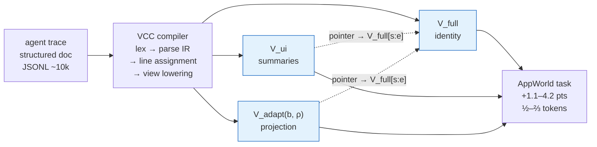

## Three views definition (paper §2.1)

All views share a single line-number coordinate system; views are *transformations*, not copies.

```
V_full(b) = identity(b)          // every IR node verbatim, defines coordinates L = V(txt)
V_ui(b)   = project to 1-line per tool call, elide internals, merge same message.id, L = I
V_adapt(b,ρ) = filter(b, ρ) where ρ ∈ {regex, BM25, embedding, LLM} via match_lines(b,ρ)
             // preserves turn/header/block delimiters, role tags, pointers (f:s-e)
V(txt) = L, V(min.txt)=I, V(view.txt)=I+M  (typesets §3.1)
```

Pointer invariant (SSA-like): any pointer in `V_ui` or `V_adapt` resolves structurally to `V_full[s:e]`.

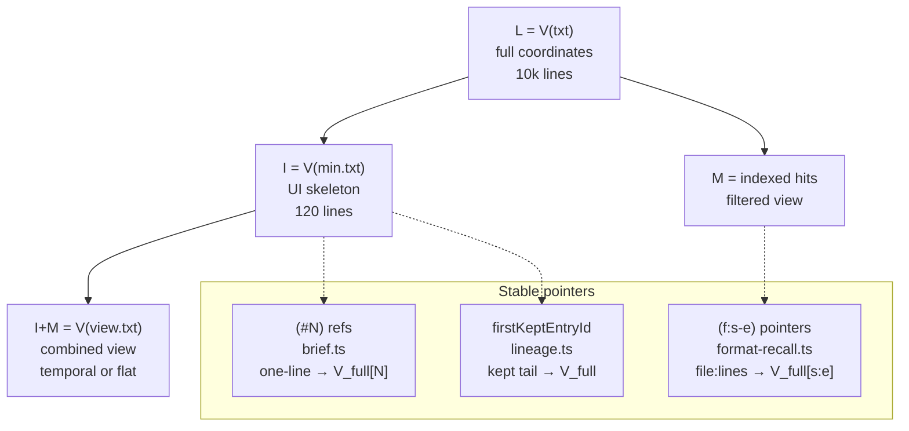

Two **transposed modalities** same data (Fig.1 right):

- *Document-oriented* (temporal, row-major) — preserves turn order, `(#N)` refs, `SEP` boundaries
- *Index-oriented* (flat list, column-major) — hits as flat list with file index

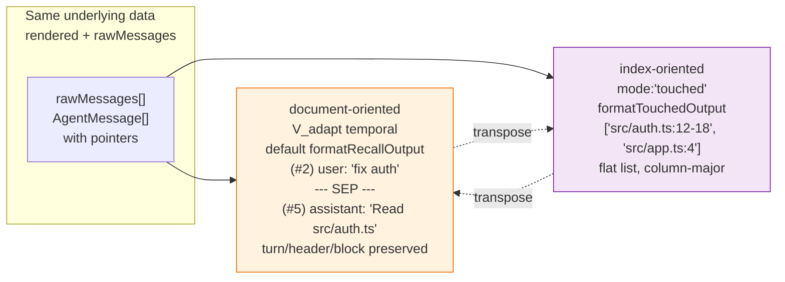

Workflow progressive disclosure §2.4: `V_ui → V_adapt(query) → resolve pointer → V_full[s:e]`.

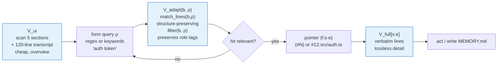

## Pipeline (§2.2–2.3)

```
raw JSONL → lex → parse to typed IR (user, assistant, thinking, tool_call, tool_result, subagent) → monotonic line assignment → view lowering
```

Assignment happens **once before lowering** — not per-view.

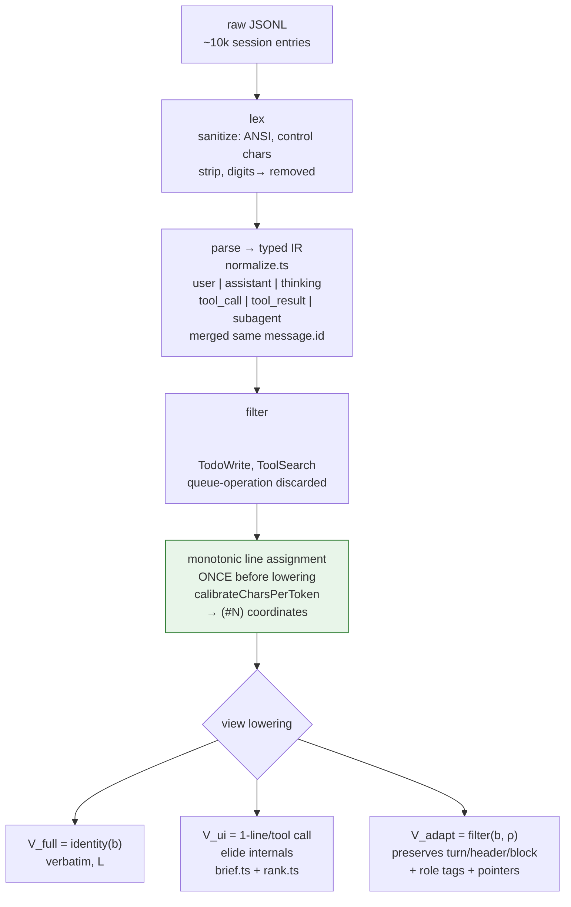

Transformations (§2.3, Fig.2):

- Escaped JSON tool params → block-indented text with `|` YAML scalar
- Read result `123→  content` → strip `digits→  `
- Harness XML `<system-reminder>`, `<ide_opened_file>` etc filtered
- Internal tool calls `TodoWrite`, `ToolSearch`, ANSI, control chars removed
- Assistant messages split by same `message.id` merged
- Zero-content records (`queue-operation`, `file-history-snapshot`, `progress`, `api_error`) discarded
- Base64 images extracted

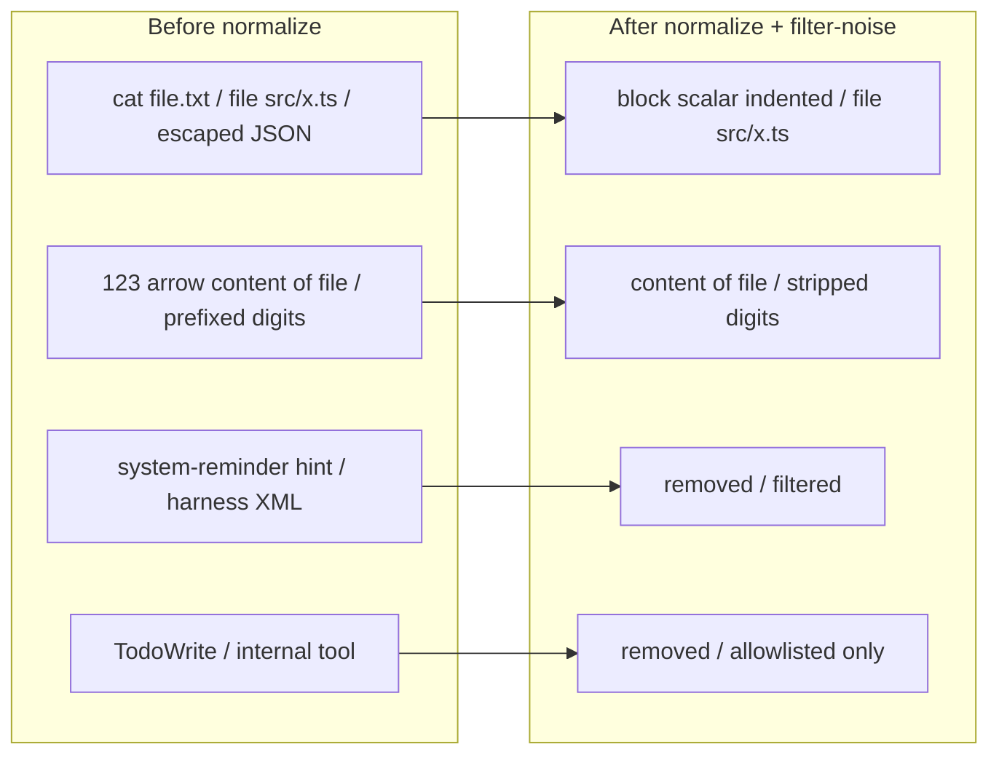

## Implementation mapping (omp-vcc)

| Paper concept | omp-vcc module |
|---|---|
| `lex` + `parse` IR | `normalize.ts` + `load-messages.ts` (`isContentBearing`, `extractPath`, `sanitize`) |
| Line assignment before lowering | `token-estimate.ts` `calibrateCharsPerToken` + stable `(#N)` refs / `firstKeptEntryId` lineage |
| `V_ui` one-line summaries | `brief.ts` + `format.ts` bracketed sections + `rank.ts` TF-IDF |
| `V_adapt` `match_lines(b,ρ)` | `search-entries.ts` `searchEntriesDetailed` (ρ regex → OR-ranked TF-IDF) + `format-recall.ts` `SEP` |
| Document vs index modalities | default `formatRecallOutput` (temporal) vs `mode:'touched'` `formatTouchedOutput` (flat list) + `drill-down.ts` `#N:path` |
| `V_full` pointers | `lineage.ts` active-leaf ancestry, `render-entries.ts` |

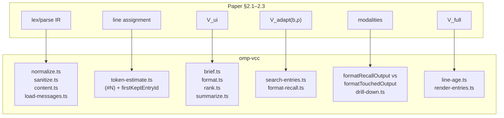

Comment headers in each ported file cite `arxiv:2603.29678 §2.x` and `lllyasviel/VCC#How It Works`.

## Experiment (§3)

**AppWorld** epoch protocol — 168 tasks dev + 416 test.

Per epoch `t`:

- `generator(t)` → trajectory (raw JSONL)
- `reflector(t)` input `V` (raw vs VCC) → `MEMORY.md` (procedural memory)
- `diff-merge` into global memory

90×2=180 analyses, 32 parallel. Three model configurations:

- Opus 4.6 (`claude-opus-4.6`) + Sonnet 4.5
- Sonnet 4.5 alone
- Haiku 4.5 + Sonnet 4.5

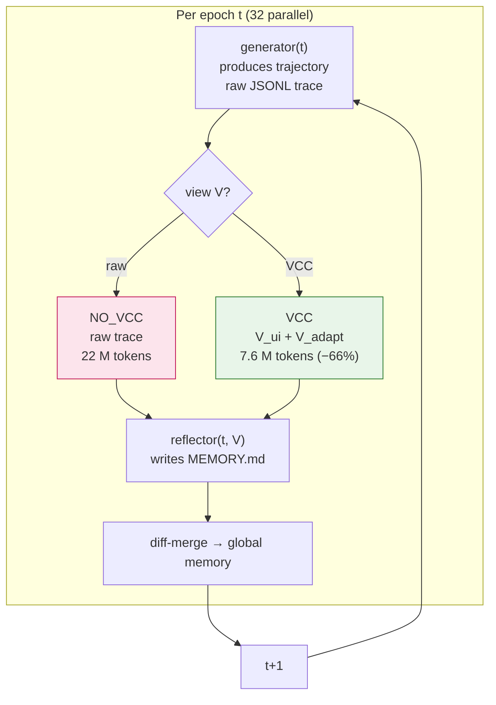

**Table 1** (test suites, mean ± std):

|  | `task_goal` NO_VCC → VCC | `test_case` | reflector tokens NO_VCC → VCC | memory size |
|---|---|---|---|---|
| Opus | 62.8±1.4 → **64.6±1.4** (+1.8, p=0.04) | 68.4 → 70.1 | 22.1 M → **7.6 M** (−66%) | larger → **smaller** |
| Sonnet | 58.2 → 62.4 (+4.2) | 64.1 → 67.9 | 20.5 M → 8.8 M (−57%) | — |
| Haiku | 47.3 → 48.4 (+1.1) | 53.0 → 54.2 | 23.3 M → 12.6 M (−46%) | — |

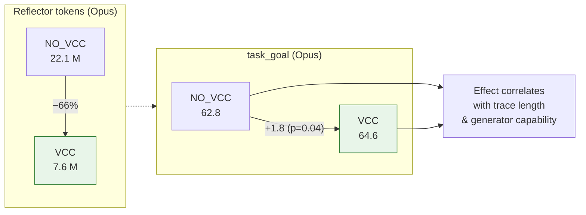

Raw JSONL loses to VCC on both quality and cost. Effect size correlates with generator capability (longer traces → more to compress, higher-quality patterns).

## Related work (§4)

- Multi-level memory (MemGPT, RAPTOR) — precomputed store vs VCC projective.
- Flat search — loses role/structure, VCC preserves.
- Context-length tradeoffs: Liu et al. 2024 *Lost in the Middle*, Xiao et al. 2025 redundant tokens 40–60% — motivates VCC's structure-preserving projection.

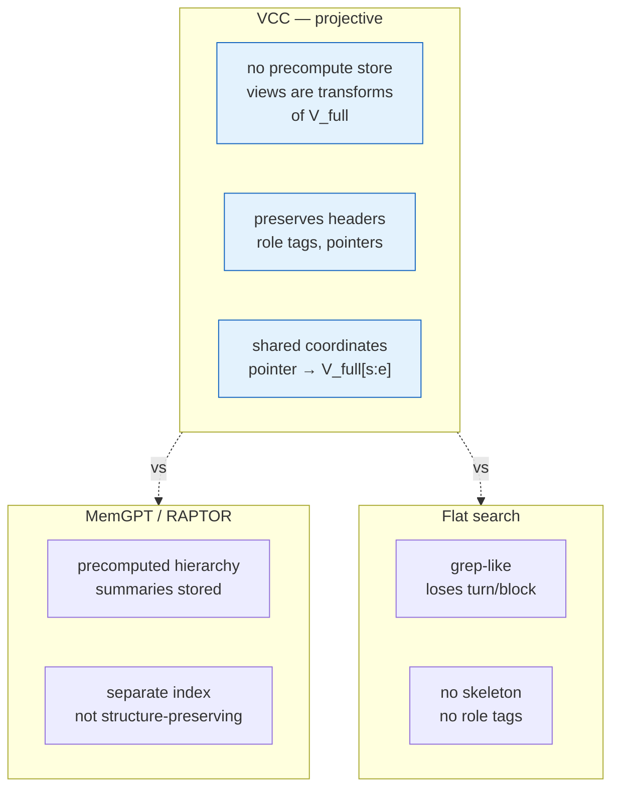

**Caveat**: AppWorld gains (+1.1–4.2) are not automatically transfer to code-edit tasks; VCC is context-engineering, not magically stronger reasoning. Paper notes same caution for long-context vs curated memory (Trivedi et al.).

## Takeaways for omp-vcc

- Keep single line assignment before lowering — don't re-number per view.
- Preserve skeleton + role tags in `V_adapt` — not just hit text.
- Use `ρ` predicate hierarchy: try regex, fallback to BM25 OR, then embedding/LLM if available (omp-vcc does regex→TF-IDF).
- Transposed views are same data, not separate stores — implement both from same `rendered` + `rawMessages`.
- Evaluation harness `scripts/benchmark-real-sessions.ts` mirrors paper's generator→reflector loop; for omp-vcc, compare `MEMORY.md` size and token cost.

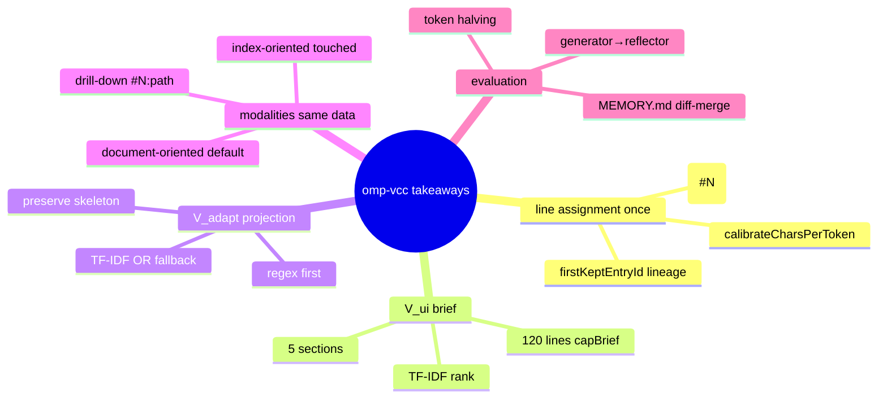
