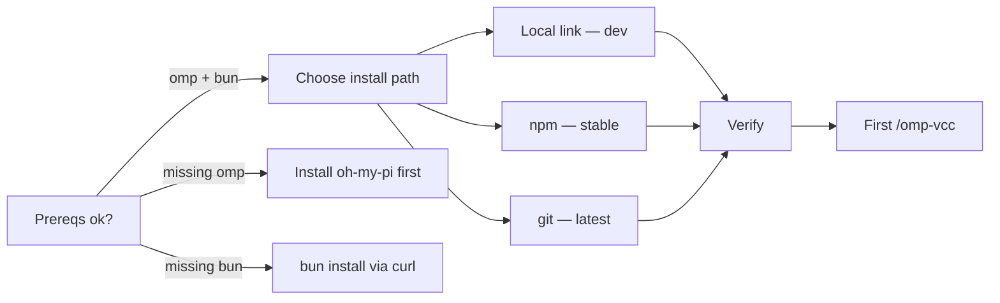
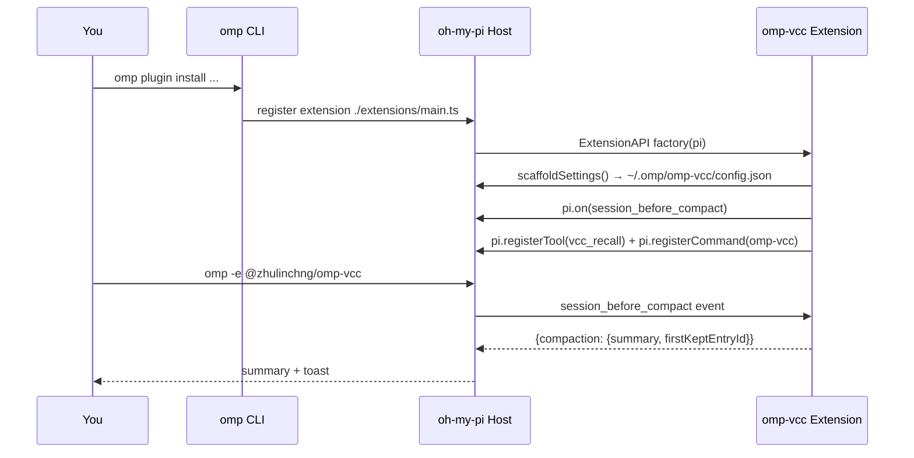

# Setup — omp-vcc

> 5-minute install. Zero LLM, deterministic 30–470 ms compaction. Works from source, npm, or git. No build step — `type:module` + `allowImportingTsExtensions`.

## Prerequisites

| Need | Check | Why |
|---|---|---|
| `oh-my-pi` (`omp`) | `omp --version` | Host that loads the plugin |
| `bun` ≥ 1.1 | `bun --version` | Runs `typecheck`/`test`/`smoke`; Node alone won't resolve `.ts` imports |
| `git` | `git --version` | `github:` installs and source link |
| POSIX shell, `~/.omp` writable | `ls -ld ~/.omp` | Config lives at `~/.omp/omp-vcc/config.json` |

If you installed `oh-my-pi` via `npm`, `omp` is already on `PATH` (`/opt/homebrew/bin/omp` on macOS).



## Option A — Local link (recommended for dev)

Use this when hacking on `omp-vcc` or pinning to a local checkout.

```sh
git clone https://github.com/zhulinchng/omp-vcc.git
cd omp-vcc

# link into oh-my-pi (creates symlink in ~/.omp/plugins)
omp plugin link .
# or explicit path
omp plugin link /Users/zhu/code/projects/omp-vcc

# verify
omp plugin list --json | jq '.[] | select(.name | contains("omp-vcc"))'
# → { "name": "@zhulinchng/omp-vcc", "enabled": true, "version": "0.1.0", ... }

omp plugin doctor
# → 5 ok 0 warnings 0 errors  (marketplace warning is fine)

# optional local gates (same as CI)
bunx tsc --noEmit
bun test
bun run smoke
```

Update: `git pull && omp plugin link .` (re-links). Unlink: `omp plugin unlink @zhulinchng/omp-vcc`.

## Option B — npm (stable release)

Unscoped package `omp-vcc` lives on npmjs; scoped `@zhulinchng/omp-vcc` on GitHub Packages (needs auth).

```sh
# from npmjs — no auth needed
omp plugin install omp-vcc

# from GitHub Packages — requires PAT (once)
# add to ~/.npmrc:
#   @zhulinchng:registry=https://npm.pkg.github.com
#   //npm.pkg.github.com/:_authToken=YOUR_PAT  # PAT needs read:packages
omp plugin install @zhulinchng/omp-vcc

omp plugin list | grep omp-vcc
```

Upgrade: `omp plugin update @zhulinchng/omp-vcc` or reinstall.

## Option C — Direct from git (latest main)

No registry needed, tracks `main`:

```sh
omp plugin install github:zhulinchng/omp-vcc
# specific ref
omp plugin install github:zhulinchng/omp-vcc#main
```

## Verify the install

```sh
# 1. plugin appears and is enabled
omp plugin list --json | jq '.[] | select(.name | contains("omp-vcc")) | {name, enabled, version, settings}'

# 2. commands are discovered
omp --help | grep -E "omp-vcc|vcc-recall"  # or check inside TUI: /help

# 3. smoke inside a live session
omp -e @zhulinchng/omp-vcc
# inside TUI:
/omp-vcc keep:1 hello from setup
# expect summary with [Session Goal]/[Brief transcript] + toast:
#   omp-vcc: kept 1/2 turns, ~0.8k tok
```

If you see `omp-vcc: kept ...` the hook is live. If not, check `overrideDefaultCompaction` (see Configuration).



## First compaction

Inside any `omp` TUI session with the plugin enabled:

```
# keep last 1 user turn (default), summarize the rest
/omp-vcc

# explicit keep + focus hint (focus is free text, not a scope filter)
/omp-vcc keep:2 fix auth token refresh

# compact everything (keep 0) — useful before /clear
/omp-vcc keep:0

# alias (migration from pi-vcc)
/pi-vcc keep:1
```

Manual compaction never needs `overrideDefaultCompaction:true`. Auto threshold/overflow compaction does — it's `true` by default.

## Recall (V_adapt)

```sh
# slash command (temporal, document-oriented)
/vcc-recall cache page:1
/vcc-recall "hook|inject" scope:all
/vcc-recall touched mode:touched

# tool (agent-callable)
/vcc-recall is a thin wrapper over the tool:
#   vcc_recall({ query: "redis cache", scope: "all", page: 1 })
#   vcc_recall({ query: "#12:src/auth.ts" })  # drill-down
#   vcc_recall({ query: "auth", mode: "touched" })
```

Plain keywords rank best; `regex|pipes` work too. Pagination is `5/page`.

## Configuration in 30 seconds

You have two surfaces — file (source of truth) and manifest `/settings` (UI overlay). File wins on restart, manifest via `ctx.settings` overlays at runtime.

```sh
# file (XDG)
cat ~/.omp/omp-vcc/config.json
# {
#   "vccEnabled": true,
#   "overrideDefaultCompaction": true,
#   "smartKeepTail": true,
#   "continueAfterThresholdCompact": true,
#   "debug": false
# }

# toggle without editing file (takes effect next compaction)
omp config set plugins."@zhulinchng/omp-vcc".debug true
omp config set plugins."@zhulinchng/omp-vcc".overrideDefaultCompaction false
omp config list | grep vcc

# or inside TUI: /settings → plugin section @zhulinchng/omp-vcc
```

| Flag | Default | When to flip |
|---|---|---|
| `vccEnabled` | `true` | `false` to disable all interception (plugin stays loaded) |
| `overrideDefaultCompaction` | `true` | `false` to let native LLM compaction handle threshold/overflow |
| `smartKeepTail` | `true` | `false` to always `keep:1` even when tail < 5 k tokens |
| `continueAfterThresholdCompact` | `true` | `false` to stop after auto-compaction instead of invisible-continue |
| `debug` | `false` | `true` to dump `/tmp/omp-vcc-debug.json` per compaction |

Resolution order for the file path: `$OMP_VCC_CONFIG_PATH` > `$PI_VCC_CONFIG_PATH` > `$OMP_DIR`/`$PI_CODING_AGENT_DIR` > `~/.omp/omp-vcc/config.json`. Legacy `~/.pi/agent/pi-vcc-config.json` is migrated once.

See [`configuration.md`](configuration.md) for full flag semantics and the optional one-file core patch for a native `/settings` → Context → Compaction dropdown.

## Updating

```sh
# link installs
cd /path/to/omp-vcc && git pull && omp plugin link .

# registry installs
omp plugin update @zhulinchng/omp-vcc
# or
omp plugin install omp-vcc  # re-install latest

# verify
bunx tsc --noEmit && bun test && bun run smoke && omp plugin doctor
```

## Uninstall & reset

```sh
omp plugin unlink @zhulinchng/omp-vcc
# or
omp plugin uninstall @zhulinchng/omp-vcc

# optional: remove config + debug snapshot
rm -rf ~/.omp/omp-vcc
rm -f /tmp/omp-vcc-debug.json /tmp/pi-vcc-debug.json

# repo helper (also runs on npm postuninstall)
node scripts/uninstall-reset.js
```

## Troubleshooting

| Symptom | Cause | Fix |
|---|---|---|
| `omp plugin list` doesn't show `omp-vcc` | Not linked / install failed | `omp plugin link .` then `omp plugin doctor` |
| `/omp-vcc` says `unknown command` | Extension not loaded | `omp -e @zhulinchng/omp-vcc` or check `extensions: ["./extensions/main.ts"]` in `package.json` |
| Auto compaction still calls LLM | `overrideDefaultCompaction:false` | `omp config set plugins."@zhulinchng/omp-vcc".overrideDefaultCompaction true` or edit `config.json` |
| Toast `no_live_messages` canceled | Session too small / sent `keep` too large | Use `keep:0` or add more turns |
| Config change ignored | File not reloaded / wrong path | Check `OMP_VCC_CONFIG_PATH` env; `cat ~/.omp/omp-vcc/config.json`; restart TUI — manifest overlay needs `ctx.settings` |
| `/tmp/omp-vcc-debug.json` missing | `debug:false` | `omp config set plugins."@zhulinchng/omp-vcc".debug true` then compact again |
| `bun test` fails with import errors | Ran with `node` | Use `bun test` and `bun run smoke` (`allowImportingTsExtensions`) |
| `types` errors | Vendored core is `// @ts-nocheck` | `bunx tsc --noEmit` should be 0; check `types.d.ts` shim |

Still stuck? Capture:

```sh
cat ~/.omp/omp-vcc/config.json
omp plugin list --json | jq '.[] | select(.name|contains("omp-vcc"))'
cat /tmp/omp-vcc-debug.json 2>/dev/null | jq '{usedOwnCut, tokensBefore, firstKeptEntryId, sections}'
omp plugin doctor
```

Open an issue at `https://github.com/zhulinchng/omp-vcc/issues` with that output.

## Next steps

- **Concepts** → [`architecture.md`](architecture.md) (VCC pipeline, extension lifecycle, invariants)
- **Flags & XDG** → [`configuration.md`](configuration.md)
- **Paper mapping** → [`paper-notes.md`](paper-notes.md)
- **Tests & proof** → [`verification.md`](verification.md)
