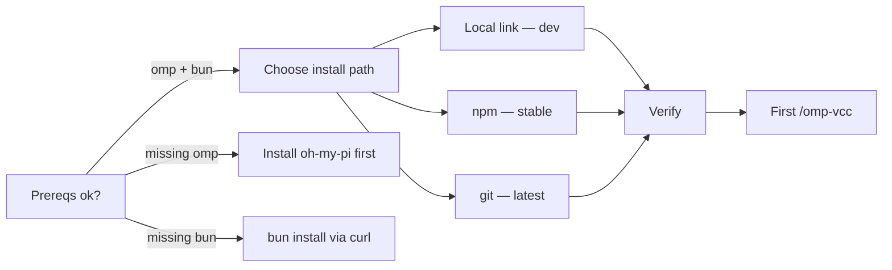
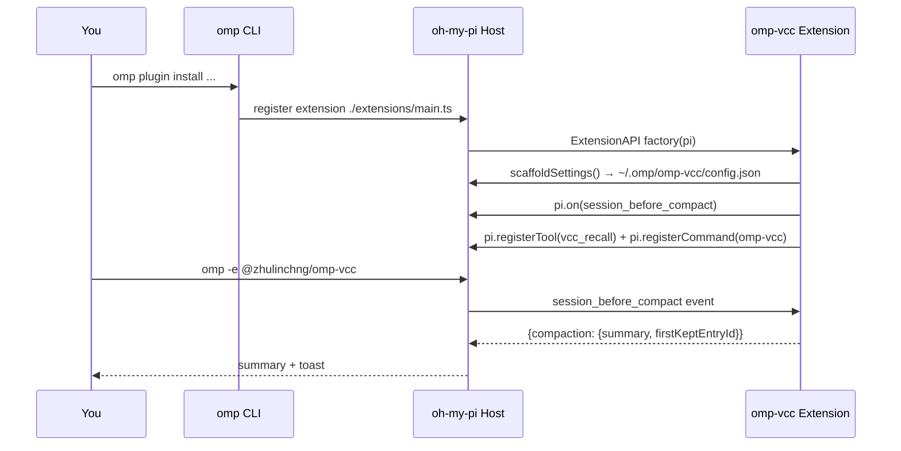
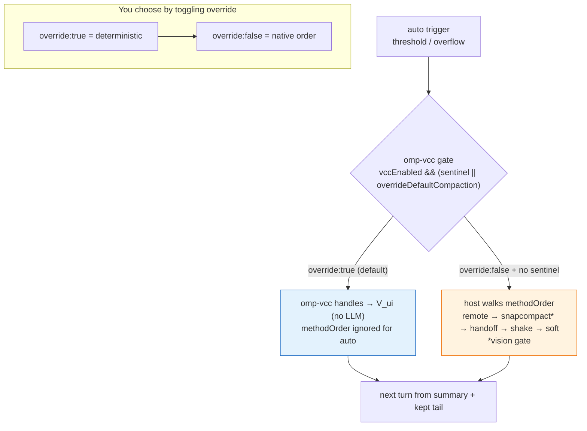
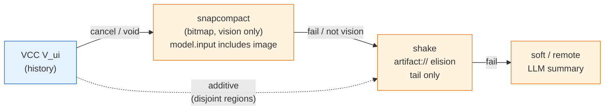
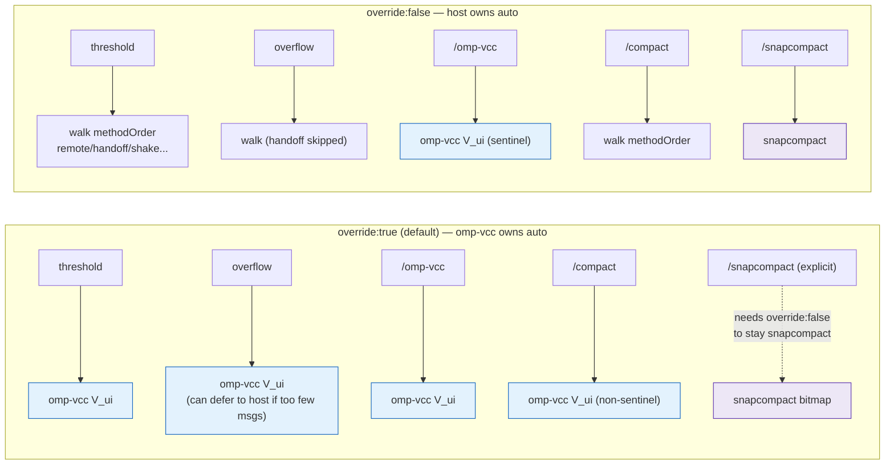

# Setup — omp-vcc

> 5-minute install. Zero LLM, deterministic 30–470 ms compaction. Works from source, npm, or git. No build step — `type:module` + `allowImportingTsExtensions`.

## Prerequisites

| Need | Check | Why |
|---|---|---|
| `oh-my-pi` (`omp`) | `omp --version` | Host that loads the plugin |
| `bun` ≥ 1.1 | `bun --version` | Runs `typecheck`/`test`/`smoke`; Node alone won't resolve `.ts` imports |
| `git` | `git --version` | `github:` installs and source link |
| POSIX shell, `~/.omp` writable | `ls -ld ~/.omp` | Config lives at `~/.omp/omp-vcc/config.json` |

If you installed `oh-my-pi` via `npm`, `omp` is already on `PATH` (`/opt/homebrew/bin/omp` on macOS).



## Option A — Local link (recommended for dev)

Use this when hacking on `omp-vcc` or pinning to a local checkout.

```sh
git clone https://github.com/zhulinchng/omp-vcc.git
cd omp-vcc

# link into oh-my-pi (creates symlink in ~/.omp/plugins)
omp plugin link .
# or explicit path
omp plugin link /Users/zhu/code/projects/omp-vcc

# verify
omp plugin list --json | jq '.[] | select(.name | contains("omp-vcc"))'
# → { "name": "@zhulinchng/omp-vcc", "enabled": true, "version": "0.1.0", ... }

omp plugin doctor
# → 5 ok 0 warnings 0 errors  (marketplace warning is fine)

# optional local gates (same as CI)
bunx tsc --noEmit
bun test
bun run smoke
```

Update: `git pull && omp plugin link .` (re-links). Uninstall: see [Uninstall & reset](#uninstall--reset).

## Option B — npm (stable release)

Unscoped package `omp-vcc` lives on npmjs; scoped `@zhulinchng/omp-vcc` on GitHub Packages (needs auth).

```sh
# from npmjs — no auth needed
omp plugin install omp-vcc

# from GitHub Packages — requires PAT (once)
# add to ~/.npmrc:
#   @zhulinchng:registry=https://npm.pkg.github.com
#   //npm.pkg.github.com/:_authToken=YOUR_PAT  # PAT needs read:packages
omp plugin install @zhulinchng/omp-vcc

omp plugin list | grep omp-vcc
```

Upgrade: `omp plugin update @zhulinchng/omp-vcc` or reinstall.

## Option C — Direct from git (latest main)

No registry needed, tracks `main`:

```sh
omp plugin install github:zhulinchng/omp-vcc
# specific ref
omp plugin install github:zhulinchng/omp-vcc#main
```

## Verify the install

```sh
# 1. plugin appears and is enabled
omp plugin list --json | jq '.[] | select(.name | contains("omp-vcc")) | {name, enabled, version, settings}'

# 2. commands are discovered
omp --help | grep -E "omp-vcc|vcc-recall"  # or check inside TUI: /help

# 3. smoke inside a live session
omp -e @zhulinchng/omp-vcc
# inside TUI:
/omp-vcc keep:1 hello from setup
# expect summary with [Session Goal]/[Brief transcript] + toast:
#   omp-vcc: kept 1/2 turns, ~0.8k tok
```

If you see `omp-vcc: kept ...` the hook is live. If not, check `overrideDefaultCompaction` (see Configuration).



## First compaction

Inside any `omp` TUI session with the plugin enabled:

```
# keep last 1 user turn (default), summarize the rest
/omp-vcc

# explicit keep + focus hint (focus is free text, not a scope filter)
/omp-vcc keep:2 fix auth token refresh

# compact everything (keep 0) — useful before /clear
/omp-vcc keep:0

# alias (migration from pi-vcc)
/pi-vcc keep:1
```

Manual compaction never needs `overrideDefaultCompaction:true`. Auto threshold/overflow compaction does — it's `true` by default.

## Recall (V_adapt)

```sh
# slash command (temporal, document-oriented)
/vcc-recall cache page:1
/vcc-recall "hook|inject" scope:all
/vcc-recall touched mode:touched

# tool (agent-callable)
/vcc-recall is a thin wrapper over the tool:
#   vcc_recall({ query: "redis cache", scope: "all", page: 1 })
#   vcc_recall({ query: "#12:src/auth.ts" })  # drill-down
#   vcc_recall({ query: "auth", mode: "touched" })
```

Plain keywords rank best; `regex|pipes` work too. Pagination is `5/page`.

## Configuration in 30 seconds

You have two surfaces — file (source of truth) and manifest `/settings` (UI overlay). File wins on restart, manifest via `ctx.settings` overlays at runtime.

```sh
# file (XDG)
cat ~/.omp/omp-vcc/config.json
# {
#   "vccEnabled": true,
#   "overrideDefaultCompaction": true,
#   "smartKeepTail": true,
#   "continueAfterThresholdCompact": true,
#   "debug": false
# }

# toggle without editing file (takes effect next compaction)
omp config set plugins."@zhulinchng/omp-vcc".debug true
omp config set plugins."@zhulinchng/omp-vcc".overrideDefaultCompaction false
omp config list | grep vcc

# or inside TUI: /settings → plugin section @zhulinchng/omp-vcc
```

| Flag | Default | When to flip |
|---|---|---|
| `vccEnabled` | `true` | `false` to disable all interception (plugin stays loaded) |
| `overrideDefaultCompaction` | `true` | `false` to let native LLM compaction handle threshold/overflow |
| `smartKeepTail` | `true` | `false` to always `keep:1` even when tail < 5 k tokens |
| `continueAfterThresholdCompact` | `true` | `false` to stop after auto-compaction instead of invisible-continue |
| `debug` | `false` | `true` to dump `/tmp/omp-vcc-debug.json` per compaction |

Resolution order for the file path: `$OMP_VCC_CONFIG_PATH` > `$PI_VCC_CONFIG_PATH` > `$OMP_DIR`/`$PI_CODING_AGENT_DIR` > `~/.omp/omp-vcc/config.json`. Legacy `~/.pi/agent/pi-vcc-config.json` is migrated once.

See [`configuration.md`](configuration.md) for full flag semantics and the optional one-file core patch for a native `/settings` → Context → Compaction dropdown.

## Working with existing compaction strategies

`oh-my-pi` ships 5 ordered strategies — `remote` (provider-native), `snapcompact` (bitmap archive, vision only), `handoff` (markdown doc), `shake` (local `artifact://` elision), `soft` (local LLM summary) — walked from `compaction.methodOrder` → `packages/coding-agent/src/session/compaction-methods.ts:10-84` (default `["remote","snapcompact","handoff","shake","soft"]`, `docs/compaction.md:142-151`). `omp-vcc` does not replace them in `methodOrder` — it adds a `context-full` extension hook (`session_before_compact` → `hook.ts:708-850`) that preempts the walk when it returns `{compaction}`. Full harness map: [`harness.md §8`](harness.md#8-working-with-existing-compaction-strategies).



### Combining omp-vcc with shake and snapcompact

`omp-vcc` summarizes **history** (`V_ui` 5 sections + ranked brief) while `shake` elides **kept tail** heavy blocks and `snapcompact` is an alternative history archiver (vision bitmaps). They touch disjoint regions or are mutually exclusive history paths, so combinations are additive or sequential — never simultaneous double-summarization.

> **One entry per trigger**: host commits exactly one `CompactionEntry` per `session_before_compact` (`shared-events.ts:375-381`). A “combo” is either (a) one Entry that merges VCC history + shake tail, or (b) two Entries chained across triggers/fallbacks (VCC then snapcompact/shake).

| Trigger | `override` | `methodOrder` | Result |
|---|---|---|---|
| threshold, `override:true`, `["remote","snapcompact","handoff","shake","soft"]` (default) | VCC handles, host rescue may shake if still over band | VCC + (shake if dead-end) |
| threshold, `override:false`, `["vcc","remote","snapcompact","handoff","shake","soft"]` (with patch) | walker picks VCC via `methodOrder`, fallback to snapcompact/shake | VCC → snapcompact/shake fallback |
| manual `/omp-vcc keep:2` | always VCC (sentinel `__omp_vcc__`) | VCC |
| manual `/omp-vcc keep:2` then `/compact snapcompact` | second call with `override:false` or explicit mode | VCC entry + snapcompact entry (sequential) |



*Additive*: VCC summarizes history, shake elides kept tail — disjoint, so both can apply across one or two Entries. With default `methodOrder` containing `shake`, host's `#rescueCompactionDeadEnd` (`session-maintenance.ts:2604`) runs `shake elide` automatically after VCC if `!compactionCreatedHeadroom()`. No second summary needed.

*Sequential*: VCC and snapcompact both archive the same `messagesToSummarize` slice; running both on the same cut would double-summarize. Valid sequential is: `/omp-vcc keep:2` (entry 1: VCC), do 10 more turns, then `/compact snapcompact` (entry 2: bitmap). For auto, put `vcc` first in `methodOrder` via the optional patch so the walk prefers VCC and falls to snapcompact/shake when VCC cancels or vision gate passes — see [harness §8.4](harness.md).

No action needed for the common case — default is correct:

```sh
# file is source of truth, but /settings overlay works immediately
cat ~/.omp/omp-vcc/config.json
# { "overrideDefaultCompaction": true, "vccEnabled": true, ... }

# host order can stay at default — it is dormant for auto while omp-vcc handles
omp config list | grep compaction.methodOrder
# ["remote","snapcompact","handoff","shake","soft"]  (dormant for threshold)

# manual /omp-vcc always works, and /vcc-recall works regardless of override
/omp-vcc keep:2 fix auth      # V_ui
/vcc-recall hook scope:all    # V_adapt

# eager post-VCC shake (forces second shake even when headroom made) — opt-in
omp config set plugins."@zhulinchng/omp-vcc".chainShakeHint true
```


### If you want native strategies to own auto (e.g., `snapcompact`/`handoff`)

Flip the intercept off - the walk resumes, `omp-vcc` only handles explicit `/omp-vcc` (sentinel path at `hook.ts:733` bypasses the flag):

```sh
# let host own threshold/overflow via methodOrder
omp config set plugins."@zhulinchng/omp-vcc".overrideDefaultCompaction false
# or edit file: "overrideDefaultCompaction": false  then restart TUI

# pick your preferred order in /settings → Context → General → Compaction method order
# or via CLI (example: prefer handoff + shake, no remote)
omp config set compaction.methodOrder '["handoff","shake","soft"]'
# example: prefer provider-native when available, else handoff
omp config set compaction.methodOrder '["remote","handoff","shake"]'

# verify host will walk it
omp config list | grep -E "compaction.enabled|compaction.methodOrder"
# expect at least one method + enabled:true

# explicit omp-vcc still works even with override:false
/omp-vcc keep:1    # still V_ui — sentinel is exempt
/compact           # now uses host order (remote/handoff/…), not omp-vcc
```

**When to keep `snapcompact` alongside `omp-vcc`**: `snapcompact` needs a vision model (`model.input includes "image"` → `compaction-methods.ts:124`). Keep `snapcompact` in `methodOrder` if you sometimes use vision models and want a *verbatim* image archive (costs vision tokens but preserves every char) vs `omp-vcc`'s distilled `V_ui` (5 sections + 1100→2000 tok brief, cheaper). With `override:true` manual `/snapcompact` still requires an explicit `snapcompact` mode — leave the method in order and it stays reachable for deliberate archival; with `override:false` the walk can pick it automatically for vision models.

**When to keep `handoff`**: `handoff` writes a long-form markdown doc via `handoff-document.md` and preserves it on disk (`docs/compaction.md:261-268`). Choose it if your workflow hands the session doc to another agent. Note auto `overflow` skips `handoff` (its request would reuse overflowing input → `docs/compaction.md:112`), so even first in order it will not run for overflow — `omp-vcc`'s cancel heuristic (`hook.ts:817` `tokensBefore>50k → defer to host`) then falls to `shake`/`soft`.



### Optional native dropdown (`vcc` in methodOrder)

Without a patch `/settings` shows `omp-vcc` as a separate **plugin section** `@zhulinchng/omp-vcc` (5 toggles) and `override` drives interception — no core edit needed. If you want `VCC` as a first-class entry in `/settings → Context → General → Compaction method order`, apply the one-file patch from `configuration.md:243` (`packages/coding-agent/src/session/compaction-methods.ts:11` add `{value:"vcc",...}` + `STRATEGY_BY["vcc"]="context-full"` + `DEFAULT` put `vcc` first, `isCompactionMethod = Object.hasOwn` at `60`). Then set `methodOrder = ["vcc","remote","snapcompact","handoff","shake","soft"]` and `override:false` so the walk treats `vcc` as the preferred `context-full` candidate whose impl is still the extension hook. See [`configuration.md#optional-native-strategy-patch`](configuration.md#optional-native-strategy-patch) for the full diff.

```sh
# verify where auto will go without switching TUI
grep -q '"overrideDefaultCompaction": true' ~/.omp/omp-vcc/config.json && echo "auto: omp-vcc" || echo "auto: host methodOrder"
omp config list | grep compaction.methodOrder
# with patch: expect ["vcc",...] when you set it; without patch: unknown "vcc" is filtered by resolveCompactionMethodOrder
```

## Updating

```sh
# link installs
cd /path/to/omp-vcc && git pull && omp plugin link .

# registry installs
omp plugin update @zhulinchng/omp-vcc
# or
omp plugin install omp-vcc  # re-install latest

# verify
bunx tsc --noEmit && bun test && bun run smoke && omp plugin doctor
```

## Uninstall & reset

```sh
# linked dev (Option A)
omp plugin uninstall omp-vcc

# registry / git (Option B/C) — use the name you installed with
omp plugin uninstall omp-vcc               # npmjs (unscoped)
omp plugin uninstall @zhulinchng/omp-vcc   # GPR or github: spec (scoped)
# if unsure:
omp plugin list --json | jq -r '.npm[].name | select(contains("omp-vcc"))'

# config + debug snapshot (either case)
rm -rf ~/.omp/omp-vcc
rm -f /tmp/omp-vcc-debug.json /tmp/pi-vcc-debug.json

# historic rename leftovers (@zhu/omp-vcc → omp-vcc) and orphaned
# symlinks left by old hosts are auto-cleaned here and on next
# extension startup (migrate-stale.ts); also runs on npm postuninstall
node scripts/uninstall-reset.js

omp plugin doctor  # should show no omp-vcc
```

Re-install: `omp plugin link .` (dev) or `omp plugin install omp-vcc` / `omp plugin install github:zhulinchng/omp-vcc`.

## Troubleshooting

| Symptom | Cause | Fix |
|---|---|---|
| `omp plugin list` doesn't show `omp-vcc` | Not linked / install failed | `omp plugin link .` then `omp plugin doctor` |
| `/omp-vcc` says `unknown command` | Extension not loaded | `omp -e @zhulinchng/omp-vcc` or check `extensions: ["./extensions/main.ts"]` in `package.json` |
| Auto compaction still calls LLM | `overrideDefaultCompaction:false` | `omp config set plugins."@zhulinchng/omp-vcc".overrideDefaultCompaction true` or edit `config.json` |
| Toast `no_live_messages` canceled | Session too small / sent `keep` too large | Use `keep:0` or add more turns |
| Config change ignored | File not reloaded / wrong path | Check `OMP_VCC_CONFIG_PATH` env; `cat ~/.omp/omp-vcc/config.json`; restart TUI — manifest overlay needs `ctx.settings` |
| `/tmp/omp-vcc-debug.json` missing | `debug:false` | `omp config set plugins."@zhulinchng/omp-vcc".debug true` then compact again |
| `bun test` fails with import errors | Ran with `node` | Use `bun test` and `bun run smoke` (`allowImportingTsExtensions`) |
| `types` errors | Vendored core is `// @ts-nocheck` | `bunx tsc --noEmit` should be 0; check `types.d.ts` shim |

Still stuck? Capture:

```sh
cat ~/.omp/omp-vcc/config.json
omp plugin list --json | jq '.[] | select(.name|contains("omp-vcc"))'
cat /tmp/omp-vcc-debug.json 2>/dev/null | jq '{usedOwnCut, tokensBefore, firstKeptEntryId, sections}'
omp plugin doctor
```

Open an issue at `https://github.com/zhulinchng/omp-vcc/issues` with that output.

## Next steps

- **Concepts** → [`architecture.md`](architecture.md) (VCC pipeline, extension lifecycle, invariants)
- **Flags & XDG** → [`configuration.md`](configuration.md)
- **Paper mapping** → [`paper-notes.md`](paper-notes.md)
- **Tests & proof** → [`verification.md`](verification.md)
- **Harness impact** → [`harness.md`](harness.md) (what is added vs intercepted, with mermaid)
