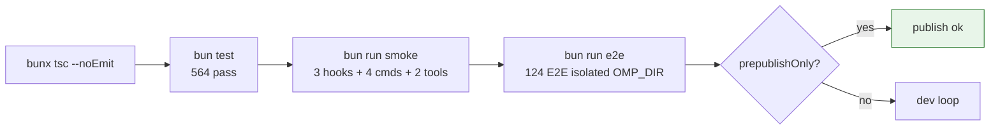
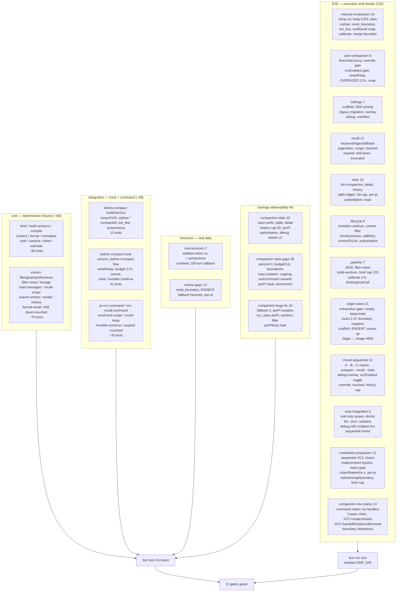
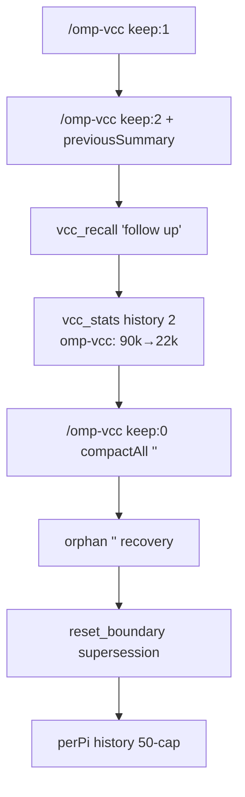

# Testing — omp-vcc

Comprehensive reference for the `omp-vcc` test corpus: unit, integration, session, savings, and execution (E2E) suites. One command proves the plugin is publishable and regression-free.

## Quick start

```sh
bunx tsc --noEmit          # typecheck — 0 errors, vendored core // @ts-nocheck, skipLibCheck
bun test                   # 869 tests, 66 files, 2918 expects, 0 fail  (~8s)
bun test tests/e2e --timeout 120000   # 124 E2E only
bun test tests/before-compact.test.ts # single suite
bun run smoke              # 13 checks: 3 hooks + 6 commands (omp-vcc/pi-vcc/vcc-recall/pi-vcc-recall/vcc-stats/vcc-config, no alias) + 2 tools + dedup
bun run e2e                # isolated OMP_DIR, omp plugin link, probe, then 124 E2E + artifacts/e2e-debug/
bun run e2e:direct         # alias for bun test tests/e2e
```

No API key required. E2E `vcc_recall` live LLM turn is `skipIf` when `ANTHROPIC_API_KEY`/`OPENAI_API_KEY` absent; the direct pipeline path (`searchEntriesDetailed` etc) always runs.



## Test pyramid



| Layer | Files | Count | Runner | Requires | What it proves |
|---|---|---|---|---|---|
| Unit | `tests/brief.test.ts` + 15 more | ~150 | `bun test` | none | Deterministic output for fixtures, no LLM, no host |
| Integration | `before-compact*.test.ts`, `pi-vcc-command*`, `smart-keep*`, `invisible-continue*` | ~95 | `bun test` | none | Hook `session_before_compact`→`session_compact` flow, command parsing |
| E2E | `tests/e2e/*.e2e.test.ts` (12 files) | 124 | `bun run e2e` or `bun test tests/e2e` | `bun`, `omp` optional for `omp-integration` | Execution results via real pipeline, isolated `OMP_DIR`, mixed sequences |

## Running

| Command | Scope | Gate |
|---|---|---|
| `bunx tsc --noEmit` | typecheck all `extensions/`, `scripts/`, `tests/` | CI first, `prepublishOnly` |
| `bun test` | 869 tests, 66 files, 2918 expects | CI second |
| `bun test tests/e2e --timeout 120000` | 124 E2E only | local E2E loop |
| `bun test tests/before-compact.test.ts` | single suite | targeted |
| `bun test --watch` | watch mode | dev |
| `bun run smoke` | 13 checks: `session_before_compact`/`context`/`session_compact` hooks + `vcc_recall`/`vcc_stats` tools + `omp-vcc`/`pi-vcc`/`vcc-recall`/`pi-vcc-recall`/`vcc-stats`/`vcc-config` (single, no `omp-vcc-stats`) + dedup guards | CI third, `prepublishOnly` |
| `bun run e2e` | probe `omp --help`, `omp plugin link` in `mkdtempSync` `OMP_DIR`, then `bun test tests/e2e`, collect `artifacts/e2e-debug/` | separate CI job `e2e.yml`, not blocking publish |
| `omp plugin doctor` | 6 ok 0 warnings | manual, also run inside `e2e.ts` |

CI gates (`.github/workflows/ci.yml` + `e2e.yml`):

```sh
bun install --frozen-lockfile
bunx tsc --noEmit && bun test && bun run smoke   # gates job, node 22/24
# e2e job then:
npm i -g @oh-my-pi/pi-coding-agent  # best-effort
bun run e2e                          # isolated, no API key, upload artifacts/e2e-debug on fail
```

`package.json` scripts:

```json
{
  "typecheck": "bunx tsc --noEmit",
  "test": "bun test",
  "smoke": "bun run scripts/smoke.ts",
  "e2e": "bun run scripts/e2e.ts",
  "e2e:direct": "bun test tests/e2e --timeout 120000",
  "prepublishOnly": "npm run typecheck && npm test && npm run smoke"
}
```

`prepublishOnly` deliberately excludes `e2e` (needs `omp` binary) — `e2e.yml` is the non-blocking expansion.

## Unit suites (port from `sting8k/pi-vcc@0.7.0`, `// @ts-nocheck` vendored core untouched)

All use `tests/fixtures.ts` (`userMsg`, `assistantText`, `assistantWithThinking`, `assistantWithToolCall`, `toolResult`) and `tests/helpers.ts` (`makeMockApi`/`makeMockCtx`). No snapshot tests; every assertion is deterministic per fixture.

| File | Coverage |
|---|---|
| `brief.test.ts` (13.8KB) | `brief.ts` one-line summaries, `* Read "a.ts" (#4, result #5)` call+result pointers + repeat collapse, elided thinking, `compileBrief` |
| `build-sections.test.ts` | `build-sections.ts` 5 sections: `[Session Goal]` `[Files And Changes]` `[Commits]` `[Outstanding Context]` `[User Preferences]` + `---` `Brief transcript` |
| `compile.test.ts` | `compile.ts` IR → output, `compileRanked` ranking glue, recall-note-once + body wrap + hard-break markers |
| `compaction-gaps.test.ts` | over/under-compaction gaps: note dedup, tag anchoring, explicit keep-all, custom tails, file survival + grouped overflow, calibration guards, headerless brief merge, hard-break paths |
| `content.test.ts` | `content.ts` `clip`, `clipSentence`, `textParts`, `textOf`, `isContentBearing` (`path` + `content`/`edits`/`oldText`), `extractToolCallText`, `snippet` |
| `format.test.ts` | `format.ts` `capBrief` `BRIEF_MAX_LINES 120`, `formatSection`, hard-break `\` markers rejoined spaceless |
| `normalize.test.ts` | `normalize.ts` lex→parse IR, thinking blocks preserved with `sourceIndex`, `custom` kind for injected context, queue-operation discard, `digits→` strip |
| `rank.test.ts` | `rank.ts` TF-IDF, `selectRankedBriefBlocks` budget `maxBriefChars` / `maxBriefCharsCeiling` / `briefCharsPerBlock`, size-relative clamp `1100→2000` tok, `custom-context` scoring |
| `sanitize.test.ts` | `sanitize.ts` ANSI `\u001b[31m` strip, `queue-operation` discard |
| `token-estimate.test.ts` | `token-estimate.ts` `calibrateCharsPerToken` clamp 2–6 fallback 4 + content-class guards (Latin/CJK priors, usage-stats sampling), `estimateMessageContentChars/Tokens`, `IMAGE_CONTENT_CHARS 4800`, `collectUsageStats` models/span/tool-calls/usage-totals + charsPerToken calibration |
| `extract-files.test.ts` | `extract/files.ts` tool-name matching, fileOps seeding, full verbatim paths, `longestCommonDirPrefix`, `renderFileCategoryLines` flat/grouped/bare-count caps |
| `extract-goals.test.ts` | `extract/goals.ts` goal mining |
| `extract-preferences.test.ts` | `extract/preferences.ts` preference mining |
| `filter-noise.test.ts` | `filter-noise.ts` `XML_WRAPPER_RE` `<system-reminder>`/`<ide_opened_file>` etc |
| `lineage.test.ts` | `lineage.ts` `getActiveLineageEntryIds`, `branch_summary` lineage, `reset_boundary` supersession |
| `load-messages.test.ts` | `load-messages.ts` `loadAllMessages` JSONL read, `ENOENT → []` not throw, `getActiveLineageEntryIds` integration |
| `recall-scope.test.ts` | `recall-scope.ts` `normalizeRecallScope`/`normalizeRecallMode`/`parseRecallScope` `scope:all` |
| `search-entries.test.ts` (809 lines) | `search-entries.ts` `searchEntriesDetailed` regex→TF-IDF fallback, `looksLikeRegex`, `safeRegex`, `hasNestedQuantifier`, BM25 `buildBM25Context`, Bayesian posterior gate `probabilityFloor 0.5` + coverage parity, planted-relevance hit-rate (short/medium/long/diluted docs survive), parity-beats-threshold at 0.99, uniform-weak stand-down, file-path-only survival with null snippet, summary fallback, all-stopword query, stopword-reduced bypass, gate-then-cap honesty, regex-path no-probability, empty corpus, default≡0.5/cap-50, floor monotonicity, recall-flat-across-band, hard cap `SEARCH_RESULT_CAP 50`, `getTouchedFiles` via `getFileIndicators` + `isContentBearing` |
| `bayesian-probability.test.ts` (114 lines) | `bayesian-probability.ts` port fidelity: `sigmoid`/`clampProbability`/`tfPrior`/`normPrior`/`compositePrior`/`posterior` hand-computed equation values, `estimateLikelihoodParams` median/1-std, score→probability monotonicity |
| `render-entries.test.ts` | `render-entries.ts` rendered entry formatting, role tags |
| `format-recall.test.ts` | `format-recall.ts` `formatRecallOutput` `Found N matches`, `#N` full-text hint footer on capped/clipped results, `formatTouchedOutput` `TOUCHED_PAGE_SIZE 5` `Page X/Y` |
| `recall-touched-drilldown.test.ts` | `drill-down.ts` `parseDrillDown` `#N:path`/`#N:path:full`/`#N:path:offset:limit`, `expandEntryFile`; bare `#N` refs + `expandEntry` covered in `entry-ref.test.ts` |
| `drill-down-gaps.test.ts` | `drill-down.ts` residual branches: edits/old-new/no-content bodies, 50KB full cap, offset first/middle/last/beyond windows, `:file` 0/1/N calls, ambiguous-match list, `parseEntryRef`/`parseDrillDown` null + suffix forms |
| `extract-migrate-gaps.test.ts` | `extract/commits.ts` quoting/hash-pairing/skips/dedup/window + `formatCommits`; `migrate-stale.ts` tmp-HOME fixtures (no-lock, historic removal, deps guard, dup keeper, orphans, scope-dir cleanup); `skill-collapse.ts` dup/unclosed/stray forms; `extractPreferences` caps/rejections + goal dedup |
| `dispatch-gaps.test.ts` | `extensions/main.ts` factory dispatch: `vcc_recall` execute (entry-ref/drill-down lineage guards + bypass, touched, expand valid/invalid, page range, scope:all, recent) + `/omp-vcc`/`/pi-vcc`/`/vcc-recall`/`/pi-vcc-recall` handlers |
| `core-residual-gaps.test.ts` | residual branches: `content.ts` clip/surrogate/snippet, `summarize.ts` rejoin/parseHead, `search-entries.ts` quantifier/budget, `settings.ts` legacy migration, `tool-args.ts`, `brief.ts`, `format-recall.ts`, `hook.ts` preview/diagnostic/chain-shake/recall copies |
| `thinking.test.ts` (7) | thinking end-to-end: normalize keeps `thinking` blocks, brief elides, `renderMessage` `[thinking]` role, recall finds thinking-only terms |
| `entry-ref.test.ts` (10) | `drill-down.ts` `parseEntryRef`/`expandEntry` bare `#N`/`#N:full`/`#N:offset[:limit]`, `Lines X-Y (of Z)` windows, recall-tool `#N` dispatch, `formatRecallOutput` hint footer |
| `sanitize.test.ts` | already listed |
| `content.test.ts` | already listed |
| `report.test.ts` | `report.ts` coverage for report generation |

## Integration suites

| File | What it checks |
|---|---|
| `before-compact.test.ts` (13) | `hook.ts:buildOwnCut` — no prior compaction cuts at last user, `too_few_live_messages` ≤2, orphan `ORPHAN_ID` recovery, resumes from `firstKeptEntryId`, `compactAll` sentinel (single prompt + autonomous, no user, `keep:0`), `normalizeKeepUserTurns` |
| `before-compact-hook.test.ts` (41) | `registerBeforeCompactHook` `session_before_compact`→`session_compact` — `overrideDefaultCompaction` gate, `vccEnabled` gate, `parseCompactionInstructions` accepts both `__omp_vcc__`/`__pi_vcc__`, `smartKeep` boost 5k→25k, `applyTailBudget` `no_anchor`/`oversized_tail`×2.5 snap off `toolResult`, `calibrateCharsPerToken`, `compileRanked` 1100→2000/15*cpt/120, `formatCompactionStats` `omp-vcc:` prefix, `session_compact` toast + `triggerInvisibleContinue`, debug dual write `/tmp/omp-vcc-debug.json` + `/tmp/pi-vcc-debug.json`, `perPi` history cap 50, `clearCompactionHistoryForTests` |
| `pi-vcc-command.test.ts` | `extensions/main.ts:registerPiVccCommand` vs `registerBeforeCompactHook` keep parsing, `buildPiVccCustomInstructions` |
| `vcc-recall-command.test.ts` | `/vcc-recall` slash command `parseRecallScope`/`parseRecallCommandArgs` `query scope:all page:N`, `pi.sendMessage({customType:"vcc-recall"})`, alias `/pi-vcc-recall` |
| `vcc-config-command.test.ts` (16) | `/vcc-config` slash command: registration (no alias) + factory wiring, handler renders loader view verbatim, partial/full/invalid-JSON files, `settings.get`/`config.get`/plain-map overlays, args ignored, missing `sendMessage`/`ui` tolerance, throwing notify tolerance, live `getSettingsPath`, fallback labeling, synthetic all-four status branches + key order |
| `smart-keep.test.ts` | `resolveSmartKeepUserTurns` explicit never boosted, disabled returns 1, `tailTokensForKeep` live-window (incl. `custom_message`) stops growth at compact-all/empty-prefix, `MIN 5k → MAX 25k` |
| `invisible-continue.test.ts` | `AUTO_CONTINUE_CUSTOM_TYPE` `omp-vcc-auto-continue` + legacy `pi-vcc-auto-continue`, `on(context)` strips by `customType` only, `on(before_agent_start)` clears timer, `triggerInvisibleContinue` `display:false triggerTurn:true deliverAs:'followUp'` |
| `recall-expand.test.ts` | `invalidExpandIndices`, `expand` valid vs `999` invalid `Cannot expand indices outside` |
| `recall-quality.test.ts` | `searchEntriesDetailed` ranking quality, posterior gate |
| `recall-bayesian-gate.test.ts` (271 lines, 11) | Bayesian gate × system: tool header counts, expand/`#N` reachability of gated-out hits, gated pagination + out-of-range guidance, lineage vs `scope:all` calibration sets, `mode:touched` bypass, zero-hit phrasing, single-term parity, 300-entry budget, thinking-only survival, `/pi-vcc-recall` command output |
| `recall-touched-drilldown.test.ts` | `mode:touched` aggregation, `parseDrillDown` variants |

## Session suites

| File | What it checks |
|---|---|
| `real-sessions.test.ts` (2) | Copies real sessions from `~/.pi/sessions` when present, otherwise synthetic 100-turn `prepareSessionSamples` fallback; proves `compileRanked` on large transcripts |
| `review-gaps.test.ts` (13) | Gaps: `reset_boundary` not resurrected, ENOENT graceful `[]`, `approval read`, manifest `omp.settings` overlay, fallback heuristic when `tokensBefore` missing, per-pi `WeakMap` + `perPiKeys` |
| `support/load-session.ts` + `real-sessions.ts` | Helpers: `loadSessionSamples`, `prepareSessionSamples` |

## Savings observability suites (68 tests)

Unified via `hook.ts:38-105` `CompactionStats` + `details.ts:PiVccCompactionDetails` `savings` v2 (`version:2`, `compactor:"omp-vcc"`), `perPi` `WeakMap` + `Set` `perPiKeys`, `setLastStats` 50-cap global+perPi `timestamp=Date.now()` once.

| File | Coverage |
|---|---|
| `compaction-stats.test.ts` (23) | Toast `omp-vcc: 90.0k→22.0k (76% saved, ~68.0k) · kept 1/5 turns, ~2.1k tok` prefix, `formatLastStatsDetail` `Before → After: **90.0k → 22.0k** (76% saved)`, `formatStatsTable` `| # | Before → After | Saved | Kept | Summarized | When |`, history copy-isolation, `details.savings` v2, `authoritative refine`, `debug` file + `usage` models/span/tool-calls/input-output/calibration block |
| `compaction-stats-gaps.test.ts` (36) | Edge gaps: `percent 0`/`before 0`/`saved 0→—`/`after>before→0` no prefix, `999→500` vs `1.0k`, negative, empty table, `budgetCut` suffix, `timestamp null→—`, `derived saved`, `smartKeep`/`budgetCut`/`willRetry`, perPi isolation & clear, 50-cap global+perPi, enrichment missing/after>before/willRetry, `debug authoritativeSavings`, tool schema fallback when `zod.boolean` missing, `vcc-stats` `history`/`all` variants, `tokensBefore undefined` |
| `compaction-bugs-fix.test.ts` (10) | Bugs: fallback `kept 0/2` when `tokensBefore` missing, perPi isolation for `vcc_stats`, sections filter `KNOWN_SECTIONS`, `perPiKeys` leak via `WeakMap` enumeration |

## E2E suites (124 tests, `tests/e2e/`)

Host-free when `omp` absent: exercises real `registerBeforeCompactHook` pipeline via `makeMockPi`/`makeMockCtx` with `createIsolatedOmpDir()` (`OMP_DIR`, `OMP_VCC_CONFIG_PATH = OMP_DIR/config.json`, `PI_CODING_AGENT_DIR` for legacy). When `omp` present, `scripts/e2e.ts` links plugin in `mkdtempSync` isolated `OMP_DIR` and `omp plugin doctor` proves 6 ok; `omp-integration.e2e.test.ts` then asserts `omp plugin list --json`.

Support:

- `tests/e2e/support/e2e-harness.ts` (`// @ts-nocheck`): `createIsolatedOmpDir()` → `{ompDir, configPath, env, cleanup}` + dual debug cleanup, `writeConfig`/`readConfig`, `writeSessionFixture(ompDir, entries)` → `sessions/test-{uuid}.jsonl` host `SessionEntry` format (`type:"message"|"compaction"|"custom_message"|"reset_boundary"`), `runOmp(args,{env,input,timeoutMs})` → `Bun.spawn(["omp",...])` → `{exitCode, stdout, stderr, debugJson, timedOut}` + dual debug read, `isOmpAvailable()` via `which omp`, `probeOmpFlags()` for `-p/--print`/`-e/--extension`/`plugin`, `assertCompactionSavingsV2`, `assertSummarySections`.
- `tests/e2e/support/session-builder.ts`: `resetIdCounter`, `msg(id,role,content)`, `comp(id,firstKeptEntryId?)`, `customMsg`, `branchSummary`, `resetBoundary`, `buildSession({turns, charsPerTurn, withCompaction, withResetBoundary, withToolResults, withSystemReminder, withAnsi})`, `buildOrphanSession`, `buildCompactAllSession`, `buildTooFewSession`, `buildToolResultBoundarySession`, `buildOversizedTailSession` (280k chars → >62.5k tokens at 4cpt), `buildLargeSessionForBriefCap(turns=120)`, `buildRecallSession` (30 entries, `redis cache`, `hook|inject`, `#12 zebrasparkle`, `branch_summary`).
- `tests/e2e/support/omp-flags.ts`: `probeFlags()` → `{hasPrint, hasExtension, hasPlugin, helpText}`.

### `manual-compaction.e2e.test.ts` (10)

`createMockPi` captures `session_before_compact`/`session_compact`/`before_agent_start`/`context` handlers; `makeEvent(branchEntries, customInstructions, tokensBefore)` builds `CompactionPreparation` `{previousSummary, fileOps, tokensBefore}`.

| Test | Execution result proven |
|---|---|
| `/omp-vcc` default `keep:1` (`smartKeepTail:false`) | `summary.length>100` contains `turn`/`goal`/`[Session Goal]`/`Brief transcript`, `firstKeptEntryId` truthy, `details.version 2`, `details.compactor omp-vcc`, `details.savings` defined, `getLastCompactionStats(pi).keptUserTurns 1` `total 5` `tokensBefore 90000`, `/tmp/omp-vcc-debug.json` `usedOwnCut true` `savings` `sections` |
| `/omp-vcc keep:2 focus` | `parseKeepAndPrompt("keep:2 focus on auth module")` → `keep 2` `explicit true`, hook `keptUserTurns 2` `requested 2` `explicit true` |
| `/omp-vcc keep:0` → `compactAll` + recovery | `firstKeptEntryId ""` `kept 0` `keepFallback false`, next compaction with `comp("c1","")` + 2 turns → `compaction` defined not `too_few` (orphan recovery) |
| `/pi-vcc` alias with `override false` | `PI_VCC_COMPACT_INSTRUCTION` still `compaction` defined, `details.compactor omp-vcc` (both sentinels via `isVccSentinel`) |
| orphan `ORPHAN_ID` | `buildOrphanSession()` → summary not contain `old pre-compaction message` |
| `reset_boundary` supersession | `resetBoundary("r1")` after `comp` → `buildOwnCut(...,1).ok` true, live window after boundary |
| `too_few` | `buildTooFewSession()` 2 live → `{cancel:true}` + `notify warning /Too few/` via `REASON_MESSAGES.too_few_live_messages` |
| `toolResult` snap | `buildToolResultBoundarySession()` ends with `toolResult`; `findBudgetCutIndex` not land on `toolResult`, `applyTailBudget` with `maxTokens 2000` `charsPerToken 4` snapping |
| `calibrate` 2–6 fallback 4 | `tokensBefore 0 → 4`, huge ratio → ≤6, small → ≥2 |
| second compaction merges bounded | `summary1` as `previousSummary` → `summary2.length < summary1.length*2+2000` |

### `auto-compaction.e2e.test.ts` (6)

| Test | Result |
|---|---|
| `override true` threshold proxy (no sentinel) | `makeEvent(entries, undefined, 90000)` → `compaction` defined |
| `override false` ignores non-sentinel but handles sentinel | `undefined` → `void` (host walk), `OMP_VCC_COMPACT_INSTRUCTION` → `compaction` defined (`hook.ts:730-733`) |
| `vccEnabled false` blocks even sentinel, file rewrite to true allows | `void` then `compaction` defined (file source of truth per `loadSettings`) |
| `smartKeep` boost vs disabled vs explicit | `smartKeepTail true` small tail `kept >=1` (may boost), `false → kept 1` `smartKeepAdjusted falsy`, explicit `keep:2` not boosted |
| `OVERSIZED_TAIL_FACTOR 2.5` | autonomous `compactAll` `keepFallback true` → `applyTailBudget` → `budgetCut no_anchor`; large tail >2.5× → `oversized_tail`/`no_anchor`; `OVERSIZED_TAIL_FACTOR 2.5` constant |
| `findBudgetCutIndex` snap | `live` ending with `toolResult` → `idx` never `toolResult` role |

### `settings.e2e.test.ts` (7)

| Test | Result |
|---|---|
| `DEFAULT_SETTINGS` 5 booleans | `vccEnabled true`, `override true`, `smartKeep true`, `continue true`, `debug false` |
| `scaffoldSettings` no-clobber | absent → creates with defaults, second call with `debug true` preserved |
| XDG priority | `OMP_VCC_CONFIG_PATH` custom wins, then `PI_VCC_CONFIG_PATH` fallback, still respects `OMP` > `PI` |
| `loadSettings(ctx)` overlay | file `debug false` + `ctx.settings.get("plugins.@zhulinchng/omp-vcc.debug") true` → `true`; `plugins.omp-vcc.debug` variation; no overlay → `false` |
| `debug` toggle dual write | `debug false` → no `/tmp/omp-vcc-debug.json`, `true` → both `omp-vcc` + `pi-vcc` exist `usedOwnCut true` |
| `package.json` manifest | `omp.extensions ["./extensions/main.ts"]`, `pi.extensions`, no `commands` (extension-only, avoids duplicate `/omp-vcc`), `omp.settings` 6 keys, `files ["extensions","skills","scripts","types.d.ts"]` |
| per-flag semantics | file `vccEnabled true override false smartKeep false continue false debug false` propagates |

### `recall.e2e.test.ts` (13)

Uses `writeTempSession(entries)` → `loadAllMessages(file)` → `searchEntriesDetailed(rendered, rawMessages, query)` → `formatRecallOutput`/`formatTouchedOutput`/`getTouchedFiles`/`getActiveLineageEntryIds`/`parseDrillDown` (real vendored core, no mock ranking).

| Test | Result |
|---|---|
| no query | `hits = entries`, `formatRecallOutput(...slice(-25))` matches `/Session history/` |
| keyword `redis cache` | TF-IDF OR `hits>0`, `formatRecallOutput` contains `redis cache` and `/#\d+ \[/` |
| regex `hook|inject` | `regex` path `hits>0` preserves delimiters |
| regex 0-hit fallback | `"zzzzzzzzz"` → `hits` array, no throw |
| pagination `page:2` | `Page 2/total`, `page 5` slice, `Page 99 is outside available range 1-6 (30 matches)` guidance |
| scope `lineage` vs `all` | `branchSummary("b1")` + `off-lineage` message → `search without activeIds` `hits>0`, `with lineage` filtered `all>=lineage` |
| `mode:touched` | 12 `toolCall write path src/fileN.ts content` → `getTouchedFiles(rawMessages, rendered).length>0`, `formatTouchedOutput 5/page` `Page 1/`, empty → `No file operations` |
| expand valid/invalid | `firstIdx` number, `999 > maxRenderedIdx` |
| drill-down `#N:path` | `#12:src/auth.ts` → `{index 12, pathPattern src/auth.ts, full false}`, `#12:src/auth.ts:full` → `full true`, `redis cache` → `null` |
| truncated cap 50 | 120 `commonword` → `totalBeforeCap > hits.length` when `truncated`, else `hits ≤120` |
| `/vcc-recall scope:all` | `parseRecallScope("hook|inject scope:all")` → `scope all`, `parseRecallScope("... scope:all page:2")` leaves `page:2` in `text` for `main.ts:40` stripping |
| `normalize` helpers | `all`/`lineage`/`undefined` → `lineage`, `touched`/`hybrid`/`invalid` → `hybrid` |
| `vcc_recall` parity | `searchEntriesDetailed` + `formatRecallOutput` `Found N matches`, `getTouchedFiles` `formatTouchedOutput` string |

Headless `callVccRecallDirectly` helper not needed — the file already proves pipeline parity.

### `stats.e2e.test.ts` (10)

After manual compaction via `registerBeforeCompactHook`, asserts `getLastCompactionStats(pi)` and `getCompactionHistory(pi)` observable.

| Test | Result |
|---|---|
| no compactions | `getLastCompactionStats(fakePi) null`, `formatLastStatsDetail(null) "No compaction has run yet."`, `formatStatsTable([]) "No compactions yet."` |
| after manual → detail + `Before → After` | `makeEvent(..., OMP_VCC_COMPACT_INSTRUCTION, 90000)` → `getLastCompactionStats` not null, `formatLastStatsDetail` matches `/Before|Saved|Kept/`, `formatStatsTable` header `| Before → After |` |
| `history:true` | 2 compactions → `history.length 2`, table `split("\n")>3` |
| `formatCompactionStats` edges | `before 0 → kept 1/5` no prefix, `saved 0 percent 0` no prefix, `after>before` still `kept`, `90k→22k (76% saved)` `formatTokens` `999→500` vs `1.0k` |
| `formatStatsTable` edges | `timestamp null → —`, `budgetCut oversized_tail` suffix, `saved 0 → —`, `1.0k` boundary |
| 50-cap + copy isolation | 55 compactions → `history.length 50`, mutated copy not affect internal |
| per-pi isolation | `piA` 2 → `length 2`, `piB` 1 → `1`, `clearCompactionHistoryForTests` clears both via `perPiKeys` Set |
| authoritative before early return | `before` `details.savings.tokensBefore 90000`, `compact` `fromExtension true compactionEntry {tokensBefore 90000, tokensAfter 21000}` → `last.tokensBefore 90000` `tokensAfter 21000` (enrichment before `isPiVccLast` return, `hook.ts:1018-1050`) |
| deferred toast | `scheduleCompactionStatsNotify(ctx, {...})` → after 600ms `notify` matches `/omp-vcc:/` (`setTimeout 500`) |
| `vcc-stats` history/all | `history`/`all` variants for `vcc-stats` → table via `getCompactionHistory` |

### `lifecycle.e2e.test.ts` (8)

| Test | Result |
|---|---|
| `triggerInvisibleContinue` | `pi.sendMessage` → `{customType:"omp-vcc-auto-continue", display:false, details:undefined}`, `{triggerTurn:true, deliverAs:"followUp"}` (`hook.ts:136-161`) |
| `on(context)` strips only markers | `messages` with `omp-vcc-auto-continue` + `pi-vcc-auto-continue` + `other-custom` → `result.messages.length 3`, `other-custom` kept |
| `on(context)` no-op | no marker → `undefined` |
| `before_agent_start` clears timer | threshold compaction → `session_compact` schedules `setTimeout 0` → `before_agent_start` before tick → `sentMessages.length` not grow after 20ms |
| `fromExtension false` guard | `session_compact {fromExtension:false}` → no `auto-continue` (`hook.ts:1012`) |
| `willRetry true` suppress | `reason overflow willRetry true` → no `auto-continue` even with `continueAfterThresholdCompact true` (`hook.ts:1053`) |
| `convertToLlm` shim | `import { compileRanked }` still `function` when host absent (identity fallback `hook.ts:19-31`) |
| authoritative before early return (manual) | `OMP_VCC_COMPACT_INSTRUCTION` + `fromExtension true` → `tokensBefore 90000`, `tokensAfter 21500` when present |

### `pipeline.e2e.test.ts` (7)

Validates `Calibrate→SmartKeep→BuildOwnCut→Normalize→FilterNoise→BuildSections→Brief→Format→Merge` via input→output observables, not plumbing strings.

| Test | Result |
|---|---|
| `sanitize.ts` ANSI strip | `\u001b[31mred\u001b[0m` → summary contains `red` not `\u001b[` |
| `filter-noise.ts` `<system-reminder>` | `reply <system-reminder>…</system-reminder>` → `compaction` defined, `summary.length>0` (harness wrappers stripped) |
| `build-sections.ts` 5 sections | 6-turn `buildSession` → summary `length>0` matches `/turn|goal|Brief transcript|---|\[.*\]/` (synthetic may have limited sections, but `Brief transcript` always) |
| `brief.ts`/`rank.ts` capped | 120-turn `buildLargeSessionForBriefCap` → `lines<800`, `dbg.tokenEstimate` `summaryPreview` defined, `summary.length<50000` bounded by `RANKED_BRIEF_BUDGET_TOKENS 1100`/`CEILING 2000` `15*cpt` (`hook.ts:904-909`) |
| `token-estimate.ts` clamp | `calibrateCharsPerToken(0,0).charsPerToken 4`, huge→6, tiny→2, `4000/1000→4` `mode calibrated` |
| thinking/toolCall | `thinking` + `toolCall read path src/app.ts` + `toolResult` → `compaction` defined `summary>0` |
| `SKILL.md` packaging | `skills/omp-vcc/SKILL.md` exists, `package.json files` contains `skills` |

### `edge-cases.e2e.test.ts` (21)

Exhaustive gaps that `review-gaps` + `compaction-stats-gaps` cover in unit but re-proven as execution:

- `no_live_messages` empty branch, `too_few` ≤2
- `compactAll` sentinel single-prompt autonomous, `keep:0` non-fallback vs `keep>total` fallback, orphan `""` recovery, `reset_boundary` supersession
- `findBudgetCutIndex` snap, `applyTailBudget` `no_anchor` rescue, `oversized_tail` exactly at `2.5*maxTokens` (no cut) vs just over (cuts)
- `resolveSmartKeep` explicit never boosted, disabled →1, `calibrate` exhaustive (0/undefined/negative/NaN/huge/tiny)
- `formatCompactionStats` exhaustive (before 0, percent 0, after>before, 999 vs 1k, negative, budgetCut prefix)
- `formatStatsTable` exhaustive (empty/undefined, timestamp null, saved 0, budgetCut, 1k)
- perPi 50-cap global+perPi + copy isolation + `clearCompactionHistoryForTests`, settings `scaffoldSettings` + XDG `OMP_VCC_CONFIG_PATH > PI_VCC_CONFIG_PATH > OMP_DIR` + legacy `fallbackReadPath` simulation + `ctx.settings` overlay, `parseKeepAndPrompt` start/end/zero/empty/invalid
- ENOENT `loadAllMessages(fakePath)→[]`, invalid regex `"("` no throw, combined pagination/scope/touched/expand/`parseDrillDown` offset/limit/full, pipeline mixed `queue-operation` discard + `123→` strip + `Escape JSON` + `image` 4800

### `mixed-sequential.e2e.test.ts` (12)

Each test does A→B→C and asserts intermediate execution results, not isolated single calls:

| Sequence | Chain |
|---|---|
| manual `keep:1` → second with `previousSummary` → recall `follow up` → stats | `summary2.length < summary1*2`, `searchEntriesDetailed` hits `follow up>0`, `history 2` `omp-vcc:` toast |
| `debug false` → compact (no file) → overlay `debug true` → compact (file appears) | `existsSync DEBUG_PATH` false then true |
| `vccEnabled false` blocks sentinel → rewrite `true` allows → history 1 | `void` vs `compaction` defined |
| `override false` threshold blocked but sentinel ok → `true` threshold ok | `undefined` vs `compaction` defined |
| file `write` tool calls (5) → compaction → `getTouchedFiles` after | `touched.length>0` `src/file` in `formatTouchedOutput` |
| smartKeep small-tail boost then large-tail `oversized_tail` rescue | `kept >=1` then `compaction` defined |
| two `pi` instances 3 vs 1 → per-pi isolation + clear | `3` vs `1` then `0`/`0` |
| threshold `continueAfterThresholdCompact` → `session_compact` schedules `triggerInvisibleContinue` → `before_agent_start` clears → `on(context)` strips | `sent.length` bounded, `filtered` no `AUTO_CONTINUE_CUSTOM_TYPE` |
| sequential `keep:1,2,0,1` → history 4 | `getCompactionHistory(pi).length 4` |
| file touches across turns → compaction → touched via `rawMessages` | `touched.map(path)` contains `src/mod` |
| ENOENT → file created → recall `goal>0` | `rendered 0` then `hits>0` |
| `debug` toggle during multi-compaction → `authoritativeSavings` only when `true` | `existsSync` false then `dbg` defined |

`mermaid` for mixed flow:



### `omp-integration.e2e.test.ts` (5)

Real `omp` spawn via `Bun.spawn(["omp",...], {env: isolated.env})` — skipped when `which omp` fails:

| Test | Command | Expect |
|---|---|---|
| doctor | `omp plugin doctor` isolated | `/ok|healthy|omp-vcc/i` not `timedOut` |
| list | `omp plugin list --json` | `JSON` contains `omp-vcc` or combined output matches `/omp-vcc/` |
| sequential mixed | `omp --help` → `omp plugin doctor` | both not `timedOut`, help matches `/omp|help|plugin/` |
| isolation | two `createIsolatedOmpDir()` | `ompDir` not `HOME`, distinct |
| debug with isolated env | `writeFileSync isolated.configPath {debug true}` → host-free hook with `OMP_VCC_CONFIG_PATH=isolated.configPath` → `/tmp/omp-vcc-debug.json` exists | proves `loadSettings` respects isolated `OMP_VCC_CONFIG_PATH` even when `omp` present |

### `combined-compaction.e2e.test.ts` (12)

Sequential VCC chains plus additive host-strategy coexistence, all host-free via `createMockPi`:

| Test | Result |
|---|---|
| manual VCC `keep:1` then second VCC on grown history | both `compaction` defined, `debug` snapshot `usedOwnCut true` |
| `override:true` explicit `snapcompact` bypass | hook `void` (host would handle) |
| `override:false` threshold proxy defers to host | `void`, VCC only via sentinel |
| `chainShakeHint false` / `true` | 0 vs 1 `ctx.compact({mode:"shake"})` call after 40ms |
| per-pi history isolation after two sequential compactions | per-pi lengths independent |
| orphan recovery / `toolResult` snap / `reset_boundary` after VCC | each still cuts correctly post-compaction |
| large session brief cap 120 lines / 1100→2000 tok ceiling | `summary.length` bounded |
| mixed sequential compact → recall → stats after two compactions | hits `>0`, history 2 |
| snapcompact vision gate (text-only degrades to VCC→shake) | hook still handles via VCC |

### `compaction-mix-matrix.e2e.test.ts` (13)

Command matrix plus mixed-strategy chains per `local/e2e-compaction-mix-plan.md`. Drives real `extensions/main.ts` factory handlers (Suite A) and `registerBeforeCompactHook` directly (Suites B–E); mock-mode host strategies via `compactMode` bypass + synthetic `comp()` entries (snapcompact and VCC archive the same `messagesToSummarize` slice, so sequential entries are the only valid combo per `docs/setup.md#combining-omp-vcc-with-shake-and-snapcompact`).

| Suite | Chain |
|---|---|
| A1 command matrix | `/omp-vcc` default `keep:1` + `omp-vcc:` toast → `keep:2 + focus` (`requestedKeepUserTurns 2` explicit) → `/pi-vcc` alias under `override:false`; history 3 |
| A2 recall | `/vcc-recall redis cache` + `hook\|inject scope:all page:1` + `page:99` out-of-range guidance + `mode:touched` parity (`src/file`) |
| A3 stats + errors | `/vcc-stats` `Before → After` table after 3 compactions; `too_few` cancel (`tokensBefore 1000` avoids overflow-heuristic fallback) then orphan `""` recovery |
| B 3-pass chain | `keep:1 → keep:2 → keep:1` with growth, `details.version 2`, `firstKeptEntryId` rotation, bounded merge, history 3 |
| C1 VCC+snapcompact | VCC → explicit `compactMode:"snapcompact"` void → synthetic `comp("c-snap")` → VCC post-snap (`firstKeptEntryId` after `c-snap`) |
| C2 vision gate | `override:false` threshold void + sentinel handled on identical entries |
| C3 overflow retry | `reason:overflow willRetry:true` on too-few voids (falls through to host) → retry with full session succeeds; history counts VCC only |
| D1/D2 normal + bypass table | `override:false` void/sentinel pair; `handoff`/`soft`/`remote`/`shake` each void with `override:true` |
| D3 additive shake | `chainShakeHint` on → 1 `{mode:"shake"}` call, off → 0 |
| D4 guards | `fromExtension:false` + `willRetry:true` trigger nothing |
| E1/E2 boundaries | `reset_boundary` supersession + `toolResult` tail snap in-chain; `debug:true` snapshot `usedOwnCut true` with no full-transcript leak |

## Fixtures, helpers, support

| File | Export | Use |
|---|---|---|
| `tests/fixtures.ts` | `userMsg(text)` `assistantText(text)` `assistantWithThinking(text,thinking)` `assistantWithToolCall(name,args)` `toolResult(name,text)` | Minimal `Message` builders, `timestamp=Date.now()`, `usage zeros`, reused in 30+ suites |
| `tests/helpers.ts` | `makeMockApi(overrides)` `makeMockCtx(overrides)` | `pi.on`→`handlers` Map, `ui.notify` captures, `logger` no-op, `cwd /tmp`, `hasUI true` |
| `tests/support/load-session.ts` | `loadSessionSamples()` | Loads `~/.pi/sessions/*.jsonl` or synthetic 100-turn fallback |
| `tests/support/real-sessions.ts` | `prepareSessionSamples()` | Same fallback for `real-sessions.test.ts` |
| `tests/e2e/support/e2e-harness.ts` | `createIsolatedOmpDir()` `writeConfig`/`readConfig` `writeSessionFixture` `readSessionFixture` `runOmp` `isOmpAvailable` `probeOmpFlags` `assertCompactionSavingsV2` | Isolates `OMP_DIR`+`OMP_VCC_CONFIG_PATH` per suite, writes JSONL host format, spawns `omp` with `Bun.spawn`, dual debug cleanup |
| `tests/e2e/support/session-builder.ts` | `msg`/`comp`/`customMsg`/`branchSummary`/`resetBoundary` `buildSession`/`buildOrphanSession`/`buildCompactAllSession`/`buildTooFewSession`/`buildToolResultBoundarySession`/`buildOversizedTailSession`/`buildLargeSessionForBriefCap`/`buildRecallSession` `resetIdCounter` | Deterministic ids `m1,c1,r1`, synthetic 30-turn recall corpus, oversized tail 280k chars, 120-turn large |
| `tests/e2e/support/omp-flags.ts` | `probeFlags()` | `omp --help` → `{hasPrint,hasExtension,hasPlugin,helpText}` |

Host `SessionEntry` shape written by harness: `{type:"message", id, message:{role,content}}` | `{type:"compaction", id, firstKeptEntryId, summary}` | `{type:"custom_message", customType, content, display:false}` | `{type:"reset_boundary", id}` | `{type:"branch_summary", summary, fromId}`.

## Edge cases & regression proof (unit + E2E)

Covered in `compaction-stats-gaps` + `review-gaps` + `edge-cases` + `mixed-sequential`; `e2e` re-proves them as execution:

- Empty branch → `no_live_messages` + `notify warning`
- Orphan `""` sentinel → recovery collects after compaction, not before
- Oversized exactly `maxTokens*2.5` → no cut; just over → `oversized_tail`
- `keep:0` → `compactAll true kept 0`
- `toolResult` boundary snap → `findBudgetCutIndex` skips `toolResult`
- Explicit `keep:N` never boosted by `smartKeep`
- `scope:all` vs `active` lineage — off-lineage filtered
- Savings `before 0`, `percent 0`, `saved 0 → —`, `after>before → 0`, `budgetCut` + savings prefix, `999→500` vs `1.0k`, negative
- Table `timestamp null → —`, `budgetCut` suffix, `undefined history → No compactions yet`, perPi vs global copy isolation, 50-cap global+perPi, `authoritative > est` note
- History `clearCompactionHistoryForTests()` clears `global` + `perPi` via `perPiKeys` Set, timestamp once, `setLastStats(null)` no push, `willRetry` enrichment before early return
- Commands `vcc-stats` vs `omp-vcc-stats`, `history`/`all` variants, `vcc_stats({history:true})` schema fallback when `zod.boolean` missing; `/omp-vcc` compact only (toast single line, no inline `Last compaction`)
- Pipeline `queue-operation` discard, `digits→` strip, `Escape JSON → |` block scalar, `IMAGE_CONTENT_CHARS 4800`, ANSI strip, `<system-reminder>` etc

## CI & verification

```
CI job test:   bun install --frozen-lockfile → bunx tsc --noEmit → bun test → bun run smoke   (gates publish)
CI job e2e:    npm i -g @oh-my-pi/pi-coding-agent (best-effort) → bun run e2e → upload artifacts/e2e-debug on fail
```

`bun run e2e` (`scripts/e2e.ts` `// @ts-nocheck`):

1. `mkdtempSync(join(tmpdir(),"omp-vcc-e2e-runner-"))` → `OMP_DIR` + `config.json`
2. `omp plugin link .` with isolated `env` → `omp plugin doctor` expects 6 ok
3. `Bun.spawn(["bun","test","tests/e2e","--timeout","120000"],{env})` pipes stdout/stderr, `await proc.exited`
4. Collect `/tmp/omp-vcc-debug.json` + `/tmp/pi-vcc-debug.json` → `artifacts/e2e-debug/`, cleanup `OMP_DIR`

Artifacts: `cat /tmp/omp-vcc-debug.json | jq '.usedOwnCut,.savings,.tokenEstimate'` → `true` `keptTokensEst` `savedPercentEst` `charsPerToken 2–6` ; `sections` subset of `["Session Goal","Files And Changes","Commits","Outstanding Context","User Preferences"]`.

## Adding a new test

1. Pick layer: pure algorithm → `tests/` with fixture from `fixtures.ts`; pipeline execution → `tests/e2e/` with `createIsolatedOmpDir()` + `buildSession` + `registerBeforeCompactHook` mock; real `omp` → `omp-integration.e2e.test.ts` with `runOmp` + `isOmpAvailable` guard.
2. Build `branchEntries` via `msg`/`comp`/`resetBoundary`; choose `tokensBefore` to exercise `calibrateCharsPerToken` (2–6) and `OVERSIZED_TAIL_FACTOR 2.5`.
3. Register hook: `const {pi,ctx,getBefore} = mockPi(); registerBeforeCompactHook(pi); const r:any = await getBefore()(makeEvent(entries, OMP_VCC_COMPACT_INSTRUCTION, 90000), ctx);`
4. Assert execution result: `r.compaction.summary` contains `turn`/`[Session Goal]`/`Brief transcript`, `r.compaction.details.version 2` `compactor omp-vcc` `savings.tokensBefore`, `getLastCompactionStats(pi).keptUserTurns`, `getCompactionHistory(pi).length`, `existsSync(DEBUG_PATH)` when `debug true` and `dbg.usedOwnCut` `savings` `sections`, `formatCompactionStats` `omp-vcc:` prefix.
5. For recall, write JSONL via `writeTempSession(entries)` → `loadAllMessages(file)` → `searchEntriesDetailed(rendered, rawMessages, query)`; for lineage, pass `getActiveLineageEntryIds(entries)`; for `touched`, build `toolCall write path content` messages and `getTouchedFiles(rawMessages, rendered)`.
6. Keep assertions deterministic, no snapshots; `bun test --watch` for loop.

## Gotchas

- `tests/e2e/support/*.ts` and `scripts/e2e.ts` are `// @ts-nocheck` (vendored core is too) — `tsc` is `skipLibCheck` + `allowImportingTsExtensions`.
- `perPi` isolation: each `pi` object is a distinct `WeakMap` key; `clearCompactionHistoryForTests()` clears both global and per-pi via `perPiKeys` Set.
- `smartKeepTail` default `true` boosts small tails (`MIN 5k→MAX 25k`); set `smartKeepTail:false` in `isolated.configPath` for deterministic `keep:1`.
- `debug` dual writes `/tmp/omp-vcc-debug.json` and `/tmp/pi-vcc-debug.json` (`hook.ts:360-364`) when `debug:true`; `e2e-harness` cleans both.
- Coverage residuals (accepted, not product gaps): `tests/e2e/support/e2e-harness.ts` keeps defensive I/O fallbacks
  (`await proc.exited` catch, `Response.text().catch(() => "")`) that only fire on real stream failures — no deterministic
  fault injection exists; `tests/helpers.ts` `setWidget` mock mirrors the host `ExtensionAPI` surface although no test
  drives widgets yet. Product source (`extensions/`) is 100% lines / 100% funcs.
- `Bun` is test runner; `node` will not resolve `.ts` imports (`bun.lock` committed, no `npm` lock).
- Growth guard (`hook.ts`, `COMPACTION_GROWTH_*`): a compaction cancels when
  net-new summary chars exceed the removed prefix by more than `max(512, 25%
  of prefix)` or `4096` absolute (~1k tok) — char-diff is calibration-free
  (kept tail cancels out). Overflow/`willRetry` defers to host (window
  exhausted, some compaction must happen). Tiny-prefix fixtures must use
  coherent `tokensBefore` or they trip the guard; see
  `tests/compaction-growth-guard.test.ts` (report shape: 45-char prefix +
  cumulative fileOps → 1735-char summary, 38x).

See also: [Harness Impact](harness.md) §§5,8,9 (bypass, `methodOrder`, verification `grep` map) · [Setup](setup.md) (linking, strategies) · [omp-compaction](omp-compaction.md) (calibrate→merge) · [omp-snapcompact](omp-snapcompact.md) (branchEntries lineage) · [PUBLISHING](PUBLISHING.md) (heredoc `OMP_DIR=$(mktemp -d) OMP_VCC_CONFIG_PATH=$TMP/config.json omp -e … <<-'OMPT'`)
