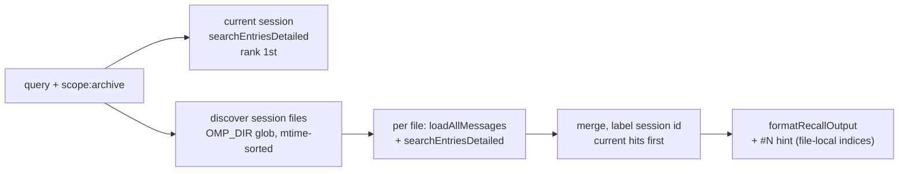

# VCC paper alignment — gaps, changes, Phases 6–7

Status: Phases 1–5 shipped in `09dafbf` (tsc 0, 564 pass / 0 fail, smoke all pass,
doctor 0/0). Phases 6–7 are approved-scope opt-ins, not started.

Background lives in [Paper notes](paper-notes.md) (paper summary, §3 experiment,
takeaways) and [Architecture](architecture.md) (pipeline map). This doc records what
differed, what changed, what was probed N/A, and the design for what remains.

Ground truth for the review: arXiv:2603.29678 HTML, `lllyasviel/VCC-experiments`
(`vcc/VCC.py`, `prompt_template.py`), `lllyasviel/VCC` (recall/searchchat/readchat
skills). Context7 has no VCC coverage, so no docs there.

## Architecture contrast (why some gaps stay gaps)

Reference VCC is an **offline compiler**: archived Claude Code JSONL → `V_full` /
`V_ui` / `V_adapt` as files + stdout, consumed via progressive disclosure by a
reflector or human. omp-vcc is an **inline-compaction port**: `session_before_compact`
summarizes the pre-cut into `compaction.summary`, and `/vcc-recall` searches live
session entries. There is no lossless full view in the compaction path, so the
paper's pointer invariant (`V_ui → V_full[s:e]`) is realized here as **resolvable
entry refs** (`#N` → `expandEntry`), not line ranges into a transcript.

## Gap register

| # | Reference behavior | Ours before | Disposition |
|---|---|---|---|
| D1 | Thinking is a first-class IR node (`>>>thinking`, searchable, in full + adaptive views, elided only in brief) | `normalize.ts` assistant loop dropped thinking parts at lex time — unrecoverable | **Closed, Phase 1** |
| D2 | Monotonic line numbers assigned once; every pointer resolves into `V_full` | Message-index refs (`(#N)`, `#N [role]`), no full view, refs unresolvable beyond summaries | **Closed inline, Phase 4** — every hit resolves via `expandEntry`; no line system (see above) |
| D3 | Brief tool line carries call + result ranges (`* Read "x" (f:Ls-Le,…)`) | Only the call's `(#N)`; result bodies omitted with no pointer back | **Closed, Phase 2** — `(#call, result #res)` |
| D4 | Lexer discards `queue-operation`/`file-history-snapshot`/`last-prompt`/`progress`/system `stop_hook_summary`/`api_error`/`bridge_status`/`informational`/`local_command`; `merge_chunks`; `ide_selection` strip; `command-name` unwrap; meta-user hiding | `filter-noise.ts` covers TodoWrite/ToolSearch (+4 more) and 4 XML wrappers; comp entries define the live window | **Probed, Phase 3** — all remainder N/A (evidence below) |
| D5 | Per-node token truncation (`-t 128`, `-tu 256`) with `...(truncated from file:Ls-Le)` | `TRUNCATE_USER=256`, assistant head/tail 80/120 words, ranked budget 1100→2000 tok / 120 lines; `pushText` already appends `(#N)` after truncation | Near parity; no change needed |
| D6 | `_collect_stats` footer (models, api_calls, tool_uses, duration, token splits, subagent share) | Savings-only stats | **Closed debug-only, Phase 5** — `usage` block in `/tmp/omp-vcc-debug.json`; user-visible formats untouched |
| D7 | `ρ ∈ {regex, BM25, embedding, LLM}` (paper); `VCC.py --grep` regex-only | `safeRegex` + BM25-lite (K=1.2, B=0.75, cap, 3 s budget) with Bayesian posterior tail gate (`probabilityFloor 0.5`, see `docs/bayesian-recall-gate.md`) — covers the paper's regex **and** BM25 | Embedding/LLM ρ need model calls — deferred, revisit only on Phase 7 evidence |
| D8 | `/recall` + `/searchchat` over months of archived JSONL; post-compact detail recovery | Live-session recall only; drill-down limited to content-bearing tool calls | **Partial, Phase 4** (every live hit resolves); archive search is **Phase 6** |
| D9 | Escaped-JSON params → `\|` block scalars; Read `N→content` strip; base64 → files + `[image: fn]` | `summarizeToolArgs` one-liners; `[image: mimeType]` placeholders | **Deferred with reason** — placeholders suffice for compaction input; extraction only matters for file outputs we don't produce |

## Changes by phase (`09dafbf`, 18 files, +660/−34)

**Phase 1 — thinking end-to-end** (`types.ts` kind union; `normalize.ts:48-50`;
`brief.ts` `case "thinking": break`; `content.ts` `thinkingParts`/`thinkingOf`;
`render-entries.ts:48-56` thinking-only → `role: "thinking"`; `search-entries.ts`
`fullText` indexes thinking). Contract: elided in brief, searchable everywhere else
(paper §2.3). Extractors (`goals`, `preferences`, `files`, `commits`,
outstanding-context) all kind-guard, so thinking can't leak into sections.
Tests: `thinking.test.ts` (7) + `normalize.test.ts` update (old drop-behavior assertion replaced).

**Phase 2 — result pointers** (`brief.ts` `findToolResultIndex` + two-ref emission +
token-based repeat collapse, which also fixes a latent old-code bug: a ref-less `* Name`
line could merge into `(#1, #) x3`). Contract: `* Read "a.ts" (#4, result #5)`;
merges accumulate tokens (`(#4, result #5, #6, result #7) x2`); no-result calls keep
the old single-ref form. Tests: 5 appended to `brief.test.ts`; no existing
ref-format assertions broke (only assistant/bash `(#N)` pins exist).

**Phase 3 — lexer probes, no code.** Evidence:

| Probe | Result |
|---|---|
| `ide_selection`, `command-name/args` | Zero hits in `extensions/`, `tests/`, `skills/` — Claude Code transcript artifacts; stripping them here could destroy pasted user content |
| `task-notification`, `local-command-*`, skill-base-dir meta-users | Zero hits — N/A |
| `merge_chunks` need | N/A — `load-messages.ts:31-41` proves 1 record = 1 complete message; `normalize.ts` already handles multi-part content |
| `progress`/`api_error`/`bridge_status`/`informational`/`local_command` | Zero hits in `hook.ts`; omp entry types are message/compaction/custom_message/reset_boundary/branch_summary/queue-operation — N/A |
| Read `N→content` strip | Zero `→` in support builders; Claude-Code-Read-specific — N/A (ANSI/CTRL strip already in `sanitize.ts`; `queue-operation` discard already e2e-covered) |

**Phase 4 — resolvable recall** (`drill-down.ts` `parseEntryRef`/`expandEntry`;
dispatch branches in `main.ts:96-113` + `hook.ts:1133-1143` with lineage guards;
`format-recall.ts` `opts` param + `--- Use #N for full entry text ---` footer on
capped/clipped results, passed at all 5 paged call sites). Precedence note:
`parseEntryRef` runs before `parseDrillDown`, so `#42:30` now reads as entry 42 at
line offset 30 (no test pinned it as filepath "30"; consistent with the
trailing-number-means-offset convention). `:full` body is the
`renderMessage(msg, N, true)` summary verbatim under a `#[N] [role]` header.
Tests: `entry-ref.test.ts` (10).

**Phase 5 — usage stats** (`token-estimate.ts` `collectUsageStats` + `UsageStats`;
`hook.ts:975` debug payload only). Assistant counts as output; user/toolResult/bash
as input; chars/token calibrates against summed provider `usage` when present
(`calibrated`), heuristic 4 otherwise. Tests: 3 in `token-estimate.test.ts`, 1
debug-snapshot test in `compaction-stats.test.ts`.

## Deliberately unchanged

User-visible summary/details formats; embedding/LLM `ρ`; media extraction;
offline `.txt`/`.min.txt`/`.view.txt` output mode (the reference's product, not this
plugin's — would be a new command, not a phase here).

## Phase 6 — cross-session recall (opt-in, not started)

**Goal:** `/vcc-recall` reaches prior sessions, so post-compact original detail is
recoverable across session boundaries — the exact pain the VCC README claims to fix
(D8 remainder). **Non-goals:** no archive file outputs, no re-ranking model, no
`scope:archive` as default.

Design:

Steps:

1. Spike first: locate the real session store layout (`real-sessions.test.ts` copies
   from `~/.pi/sessions`; confirm the OMP_DIR equivalent) and confirm
   `sessionManager` exposes nothing beyond `getSessionFile`/`getBranch`/`getEntries`.
   If no stable discovery API exists, glob `<OMP_DIR>/sessions/**/*.jsonl` directly
   (same approach as the reference's `~/.claude/projects` glob).
2. Add `scope: "archive"` to the `vcc_recall` schema in `main.ts` (the
   factory owns the single tool registration), plus `parseRecallScope` in
   `recall-scope.ts`. Bare `#N` refs stay file-local (current session); archived hits
   carry a `session:` label prefix in the rendered line.
3. Reuse `loadAllMessages` + `searchEntriesDetailed` + `formatRecallOutput` per file;
   cap files scanned and reuse `SEARCH_RESULT_CAP` so cost stays bounded; mtime sort
   newest-first; current-session hits always rank first.
4. Tests: session-file discovery + isolation via `createIsolatedOmpDir`
   (`tests/e2e/support/e2e-harness.ts`), multi-file merge order, `#N` still resolving
   to the current session under `scope:archive`.

Risks: other sessions' content entering context (privacy — the tool is already
`approval: read`; call it out in the description text); scan cost on large stores
(mtime cap + file cap, both constant-documented); lineage scoping is meaningless
across files (force `all`-equivalent, document it).

Acceptance: `/vcc-recall <seeded keyword> scope:archive` surfaces a hit from a
prior session file labeled with its session id, while `#N` expansion still targets
the live session; full gate green.

## Phase 7 — brief-quality eval harness (opt-in, not started)

**Goal:** deterministic, LLM-free quality bars over the existing
`session-builder.ts` corpus, inspired by the paper's §3 reflector method but without
its LLM loop (cost + nondeterminism). **Non-goal:** reproducing `train.py`/`evaluate.py`
teacher templates (`vcc`/`vccp`/`vccpf`/`naive`).

Three metrics, each a pure function of (session, brief, recall index):

1. **Pointer-resolution rate** — parse every `(#N)` / `result #M` ref from
   `compileRanked` output over `buildSession({turns})` corpora; rate =
   resolved-to-live-entry / total. Target 1.0; fails loudly on any dangling ref
   (the inline version of the §2.2 invariant).
2. **Truncation honesty** — every capped turn shows the `(N earlier tool-call entries
   omitted)` marker; assert no silent drops by comparing emitted tool-line count
   against normalized `tool_call` block count within the allowed cap math.
3. **Recall hit-rate** — seed unique per-turn tokens (the `sigma{i}` pattern from
   `entry-ref.test.ts`); query each; hit must include the seeding entry index.
   Report recall@k over the corpus; guards BM25 floor/cap regressions.

Location: new `tests/eval/` (or extend `tests/e2e/support/` builders — decide at
implementation; do not scatter across per-module suites). Acceptance: harness runs
inside `bun test`, deterministic, <30 s; documents its baselines in `testing.md`.

## Verification log

`bunx tsc --noEmit` 0 errors · `bun test` 564 pass / 52 files / 1621 expects
(non-e2e 440/40/1153, e2e 124/12) · `bun run smoke` all pass · `omp plugin doctor`
0 warnings 0 errors. `docs/testing.md` totals + suite rows updated in the same commit.

See also: [Paper notes](paper-notes.md) · [Architecture](architecture.md) · [Testing](testing.md).
