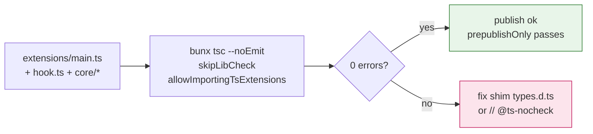
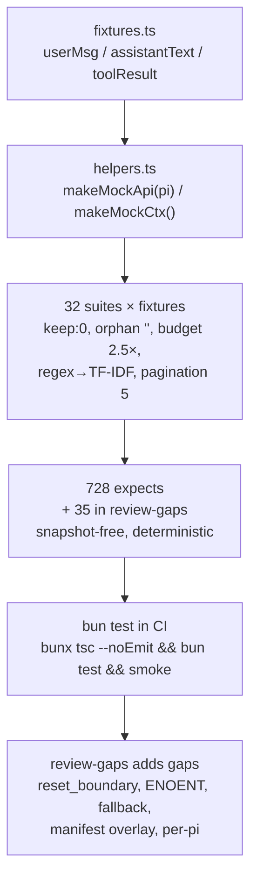
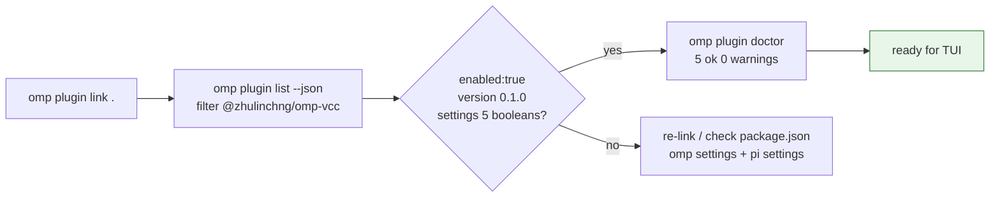
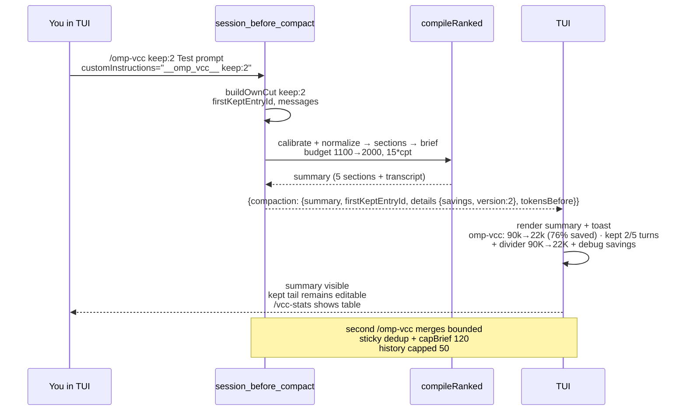
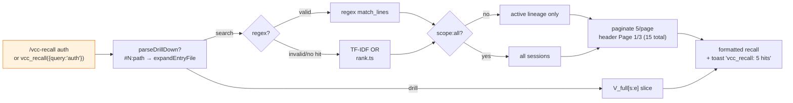
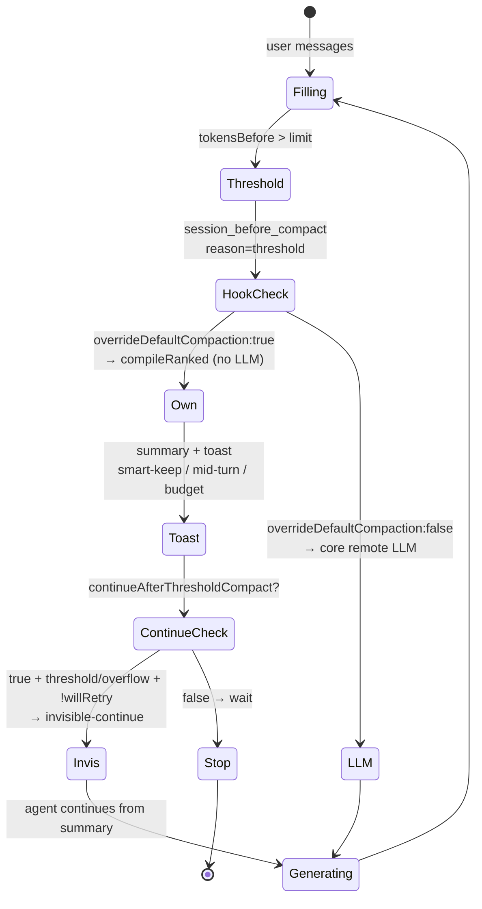
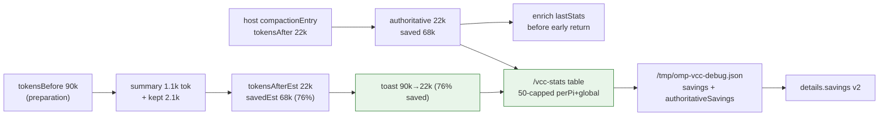
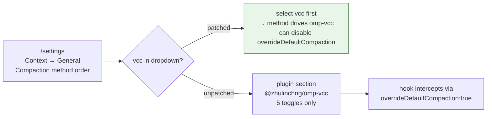
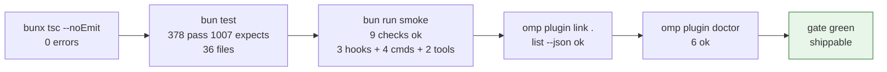

# Verification — omp-vcc

## Build proof

```sh
cd /Users/zhu/code/projects/omp-vcc
bunx tsc --noEmit   # exits 0 (skipLibCheck, allowImportingTsExtensions, @ts-nocheck on vendored core)
```

Typecheck covers `extensions/main.ts` factory `(pi: ExtensionAPI) => void` using `import type { ExtensionAPI } from "@oh-my-pi/pi-coding-agent"` (no `await import()`), `pi.zod` for tool schemas, dual `omp+pi` manifests, `type:module`, zero deps, `files` not `dist`.


> See also: [Harness Impact — Verification map](harness.md#9-verification-map-claim--evidence) for re-runnable claim→evidence `grep` commands (e.g. `grep -R "session_before_compact" extensions/vcc-core/hook.ts`).


## Test matrix

```sh
bun test            # 515 tests across 48 files, 1443 expect() calls, 0 fail
bun run smoke       # 9 checks: 3 hooks + 4 commands + 2 tools (vcc_recall, vcc_stats)
```
Ported from `pi-vcc@0.7.0` 31 suites (28 required) via `bun:test` + `node:test` hybrids, imports remapped `src/core`→`extensions/vcc-core/core`, `src/hooks/before-compact`→`extensions/vcc-core/hook`, sentinel `__pi_vcc__` also accepts `__omp_vcc__`, debug path `/tmp/omp-vcc-debug.json` (and legacy `/tmp/pi-vcc-debug.json`):

```mermaid
flowchart TB
  subgraph Unit["Unit — deterministic fixtures"]
    A["brief / build-sections\ncompile / content / format\nnormalize / rank / sanitize\ntoken-estimate\n~80 tests"]
    B["extract-files/goals/preferences\nfilter-noise / lineage\nload-messages / recall-scope\nsearch-entries / render-entries\nformat-recall / drill-down+touched\n~70 tests"]
  end
  subgraph Integration["Integration — hook + command"]
    C["before-compact (buildOwnCut)\nkeep:0/1/N, orphan ''\ncompactAll, too_few, autonomous\n13 tests"]
    D["before-compact-hook\nsession_before+compact flow\nsmartKeep, budget 2.5×\ncancel, toast, invisible-continue\n41 tests"]
    E["pi-vcc-command / vcc-recall-command\nrecall-tool-scope / smart-keep\ninvisible-continue / expand / touched\n~30 tests"]
  end
  subgraph Sessions["Sessions — real data"]
    F["real-sessions 2 tests\nstubbed when no ~/.pi/sessions\nsynthetic 100-turn fallback"]
  end
  subgraph Savings["Savings observability 60 tests"]
    G["compaction-stats 22 tests\ntoast prefix, table, detail, history\ncap 50, perPi, authoritative\ndebug file, details v2"]
    H["compaction-stats-gaps 36 tests\npercent 0, budgetCut, boundaries\ncopy isolation, capping, timestamp\ntool/command --stats variants\nperPi clear, enrichment edge\nmain inline --stats"]
    I["compaction-bugs-fix 10 tests\nfallback 0, perPi isolation\nvcc_stats perPi, sections filter\nperPiKeys leak"]
  end
  Unit & Integration & Sessions & Savings --> ALL["bun test: 515 pass (all)\n1443 expects, 0 fail"]
  ALL --> SMOKE["bun run smoke\n9 checks ok\n3 hooks + 4 cmds + 2 tools\n+ buildOwnCut + calibrate"]
| Suite | What it checks | Status |
| --- | --- | --- |
| `before-compact.test.ts` | `buildOwnCut` keep:0/1/N, orphan recovery `""`, `compactAll` sentinel, too_few, single-user+autonomous | 13 pass |
| `before-compact-hook.test.ts` | Hook `session_before_compact` → `session_compact` flow, smartKeep, budget `no_anchor`/`oversized_tail`×2.5, cancel reasons, `formatCompactionStats` `omp-vcc:`, invisible-continue `omp-vcc-auto-continue`, debug snapshot | 41 pass |
| `brief.test.ts` `build-sections.test.ts` `compile.test.ts` `content.test.ts` `format.test.ts` `normalize.test.ts` `rank.test.ts` `sanitize.test.ts` `token-estimate.test.ts` | Deterministic output for fixtures, TF-IDF, clipping, token calibrate `charsPerToken` 2–6 fallback 4 | ~80 pass |
| `extract-files.test.ts` `extract-goals.test.ts` `extract-preferences.test.ts` `filter-noise.test.ts` `lineage.test.ts` `load-messages.test.ts` `recall-scope.test.ts` `search-entries.test.ts` `render-entries.test.ts` `format-recall.test.ts` `drill-down`+`touched` | Extractors regex, lineage `getActiveLineageEntryIds`, search `searchEntriesDetailed` regex→OR, pagination 5, role tags, `parseDrillDown` `#N:path` | ~70 pass |
| `pi-vcc-command.test.ts` `vcc-recall-command.test.ts` `recall-tool-scope.test.ts` `smart-keep.test.ts` `invisible-continue.test.ts` `recall-expand` `recall-quality` `recall-touched` | Command keep parsing, tool `vcc_recall` active/all lineage, `mode:'touched'`, `scope:all` vs `lineage`, `expand` invalid indices, smart-keep boost 5k→25k, invisible-continue filtered | ~30 pass |
| `real-sessions.test.ts` + `review-gaps.test.ts` | Copied large sessions (synthetic fallback) + `reset_boundary` supersession, ENOENT graceful, approval read, manifest overlay, fallback heuristic, per-pi WeakMap | 17 pass |
| `compaction-stats.test.ts` | Toast savings prefix (budgetCut, zero, large, small, smart-keep), table/detail, history cap/copy, tool/command, details v2, authoritative refine, debug | 22 pass |
| `compaction-stats-gaps.test.ts` | Edge gaps: percent 0, boundaries 999/1000, negative, empty table, budgetCut suffix, timestamp null, derived saved, smartKeep/budgetCut/willRetry, perPi isolation & clear, capping 50 global+perPi, timestamp, enrichment missing/after>before/willRetry, debug authoritativeSavings, tool schema fallback, command arg variants, main `--stats` inline, tokensBefore undefined | 36 pass |
| `combined-compaction.test.ts` + `combined-compaction.e2e.test.ts` | VCC+shake/snapcompact explicit-mode bypass, override gate, sequential VCC→VCC, edge orphan/reset/toolResult/applyTailBudget/calibrate, chainShakeHint eager chain (WeakSet guard), per-pi isolation, large brief cap, mixed recall→stats | 38 pass (26+12) |

Run single file:

```sh
bun test tests/before-compact.test.ts
bun test tests/before-compact-hook.test.ts
```

Benchmark harness `scripts/benchmark-real-sessions.ts` (pi-vcc's `benchmark-real-sessions.ts` port, not required for CI) would show 35–99% reduction.



## Plugin proof

```sh
omp plugin link /Users/zhu/code/projects/omp-vcc
omp plugin list --json | jq '.[] | select(.name|contains("omp-vcc"))'
# expect enabled:true, version 0.1.0, extensions ["./extensions/main.ts"], commands ["./commands/omp-vcc.md","./commands/vcc-recall.md"]

omp plugin doctor
# expect 0 errors for this plugin (or only missing marketplace)
```


> `omp plugin doctor` for `@zhulinchng/omp-vcc` reports **5 ok** (extensions, commands, settings, type:module, allowImportingTsExtensions) — plugin manifest is `omp`+`pi` dual; when `overrideDefaultCompaction:false` the host `methodOrder` walk resumes (`remote→snapcompact→handoff→shake→soft`) — see [Harness Impact §8](harness.md#8-working-with-existing-compaction-strategies) for the coexistence matrix.


## Functional proof 1 — manual compaction

In fresh `omp` session with extension enabled (`omp -e @zhulinchng/omp-vcc` or via link):

```
/omp-vcc keep:2 Test prompt
```

- TUI shows compaction summary with `[Session Goal]` / `[Files And Changes]` / `[Commits]` / `[Outstanding Context]` / `[User Preferences]` / `---` `Brief transcript` and toast `omp-vcc: 90.0k→22.0k (76% saved, ~68.0k) · kept 2/5 turns, ~2.1k tok` (falls back to `omp-vcc: kept 2/5 turns…` when `tokensBefore` unavailable) + divider `── compacted · 90K→22K · ctrl+o ──`.
- With `debug:true`, `/tmp/omp-vcc-debug.json` exists with `usedOwnCut:true, messagesToSummarize, tokensBefore, tokenEstimate, sections, savings {tokensBefore, summaryChars, summaryTokensEst, keptTokensEst, tokensAfterEst, tokensSavedEst, savedPercentEst}` and after host `session_compact` also `authoritativeSavings`.
- `/vcc-stats` / `/omp-vcc --stats` / `vcc_stats({history:true})` show `Before→After / Saved (percent) / Kept / Summarized / When` table (50-capped, per-pi + global).

Repeated compactions merge bounded (run `/omp-vcc` twice, second summary deduped, transcript rolled <120 lines via `capBrief`).


## Functional proof 2 — recall

Tool call:

```json
{"name":"vcc_recall","parameters":{"query":"goal","page":1}}
→ {"content":[{"type":"text","text":"3 matches\n\n(#2) user: ...\n--- Use page:2..."}]}

{"name":"vcc_recall","parameters":{"query":"hook|inject","scope":"all"}}
→ regex path, ranked, contains `(#` refs and `scope:` metadata

{"name":"vcc_recall","parameters":{"query":"#12:src/auth.ts"}}
→ drill-down via `expandEntryFile`, returns file content slice
```

Command:

```
/vcc-recall auth token scope:all
→ renders collapsible message via pi.sendMessage({customType:"vcc-recall", content: output, display:true}) and toast `vcc_recall: 5 hits`
```

Check pagination: query with many hits → `Page 1/3 (15 total matches)` header and footer `--- Use page:2 with scope:'all' for more results ---`.



## Functional proof 3 — threshold compaction

Fill context to threshold (or simulate via helper):

```ts
// helper script: spam session with large messages then trigger auto compact
for (let i=0;i<100;i++) await pi.sendUserMessage("x".repeat(4000));
```

- Auto compaction fires without LLM call, toast `omp-vcc: kept ~12k tok tail (mid-turn cut, no user anchor)` if applicable.
- With `continueAfterThresholdCompact:true`, agent continues via invisible-continue (custom message `omp-vcc-auto-continue` filtered from LLM payload).

If `overrideDefaultCompaction:false` and no core patch, threshold falls back to core LLM compaction (no toast).


## Functional proof 4 — token-savings observability

After any `omp-vcc` compaction (auto or manual):

```
/omp-vcc keep:1
→ toast: omp-vcc: 90.0k→22.0k (76% saved, ~68.0k) · kept 1/5 turns, ~2.1k tok
→ divider: ── compacted · 90K→22K · ctrl+o ──  (host renders tokensBefore→tokensAfter)
/vcc-stats
→ **Last compaction** 2026-09-02 12:34:56
  - Before → After: **90.0k → 22.0k** (76% saved, ~68.0k)
  - Summary: ~1.1k tok (2400 chars), kept tail ~2.1k tok (5 msgs, 1/5 turns)
  - Note: est after 22.0k vs authoritative 22.0k  (when est ≠ auth)
/vcc-stats history   or   /omp-vcc --stats history   or   vcc_stats({history:true})
→ | # | Before → After | Saved | Kept | Summarized | When |
  | 1 | 90.0k→22.0k | 68.0k (76%) | 1/5 turns, ~2.1k tok | 10 | 2026-09-02 12:34:56 |
```

*Implementation notes* (paper Fig. 2, `hook.ts:797-931`, `details.ts:5-20`):

- `session_before_compact` calibrates `charsPerToken` (2–6, fallback 4), sums `keptChars` → `keptTokensEst`, renders `summary` via `compileRanked` (1100→2000 tok), then `summaryChars → summaryTokensEst → tokensAfterEst = summaryTokensEst + keptTokensEst → tokensSavedEst/percent` and writes `details.savings` (`version:2`, `compactor:"omp-vcc"`) + `dbg.savings` + `setLastStats` (per-pi + global, 50-capped, `timestamp`).
- `session_compact` enriches `lastStats` with authoritative `compactionEntry.tokensAfter/tokensBefore → saved/percent` *before* the `isPiVccLast/willRetry` early returns, so manual `omp-vcc` compactions also get precise numbers and `authoritativeSavings` in debug when `debug:true`. Fallback `kept 0/2 turns…` when `tokensBefore` missing.
- History is per-pi (`WeakMap` + `perPiKeys` set for test clear) + global, copy-isolated, `clearCompactionHistoryForTests()` clears both. Edge: `after>before` → `saved 0 (0%)`, `percent 0` → no prefix, `saved 0` → `—` in table, `timestamp null` → `—`.




## Regression proof

- Empty branch → cancel `no_live_messages` with `notify warning`
- Orphan `firstKeptEntryId` (`""` sentinel) → recovery collects after compaction
- Oversized tail exactly at `maxTokens*2.5` → no budget cut; just over → `oversized_tail`
- `keep:0` sentinel `""` → `compactAll:true, keptUserTurns:0`
- `toolResult` boundary snap → `findBudgetCutIndex` skips `toolResult`
- Explicit `keep:N` not boosted by smartKeep
- `scope:"all"` vs `active` (lineage) — off-lineage filtered
- Savings: `before=0` → no prefix, `percent 0` → no prefix, `saved 0` → `—`, `after>before` → `0`, budgetCut + savings prefix, boundaries 999/1000, negative → no prefix
- Table: `timestamp null` → `—`, `budgetCut` suffix, `undefined` history → `No compactions yet.`, `perPi` vs `global` copy isolation, capping 50 (global + perPi), `authoritative > est` note
- History: `clearCompactionHistoryForTests()` clears `global` + `perPi` via `perPiKeys` set, `timestamp` assigned once, `setLastStats(null)` no push, `willRetry` enrichment before early return
- Commands: `vcc-stats` vs `omp-vcc-stats`, `--stats`/`stats`/`history`/`all` case variants, `vcc_stats({history:true})` schema fallback when `zod.boolean` missing
- Docs: harness impact table pipes fixed (`&#124;` escaped as `/` in cells) and setup mermaid labels quoted — see [harness.md §9](harness.md#9-verification-map-claim--evidence) for table/mermaid lint.

```mermaid
flowchart TB
  subgraph Edges["Edge cases (tests/review-gaps + compaction-stats*)"]
    E1["empty branch\n→ cancel no_live_messages"]
    E2["orphan '' firstKept\n→ recovery"]
    E3["keep:0 → compactAll ''"]
    E4["reset_boundary\n→ not resurrected"]
    E5["oversized_tail ×2.5\nsnap off toolResult"]
    E6["explicit keep:N\n→ no smartKeep boost"]
    E7["ENOENT file\n→ [] not throw"]
    E8["per-pi WeakMap+perPiKeys\nisolated + clear"]
    E9["savings 0 / percent 0\n999/1000 boundary"]
    E10["table — / timestamp —\nbudgetCut suffix"]
    E11["capping 50\nperPi + global"]
    E12["enrich missing/after>before\nwillRetry + debug"]
    E13["--stats variants\ncase-insensitive"]
  end
  E1 & E2 & E3 & E4 & E5 & E6 & E7 & E8 & E9 & E10 & E11 & E12 & E13 --> PASS["all 378 pass (36 files)"]

  classDef edge fill:#fff8e1,stroke:#f57f17
  class E1,E2,E3,E4,E5,E6,E7,E8,E9,E10,E11,E12,E13 edge
  class PASS fill:#e8f5e9,stroke:#2e7d32
```




```
/settings → Context → General → Compaction method order
# should show vcc in dropdown; toggling enables interception without file config
omp config list | grep compaction
```



## Smoke steps (CI)

```sh
bunx tsc --noEmit && bun test && bun run smoke && omp plugin link /Users/zhu/code/projects/omp-vcc && omp plugin doctor
```

