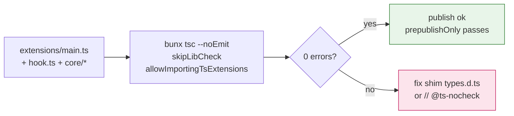
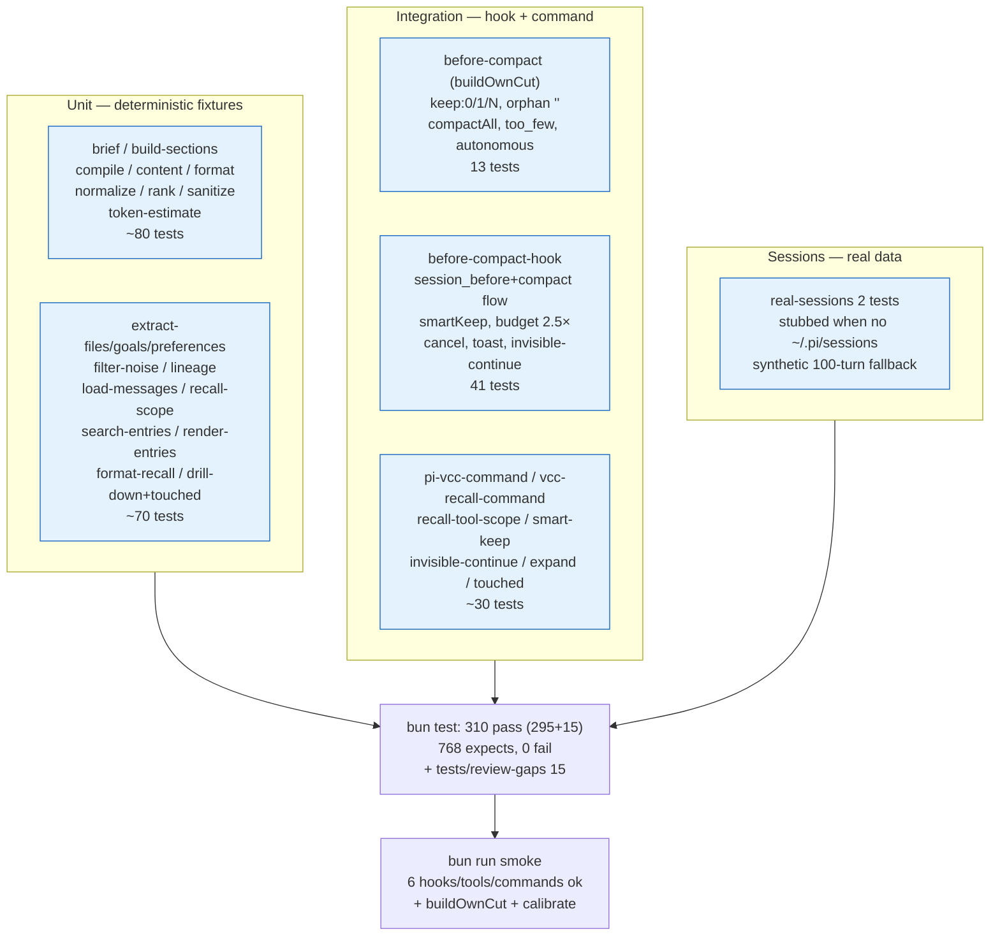
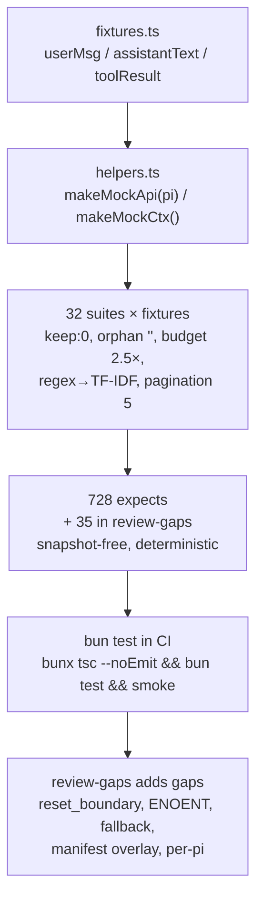
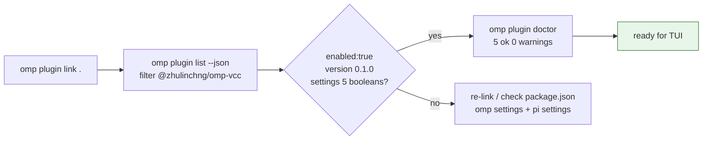
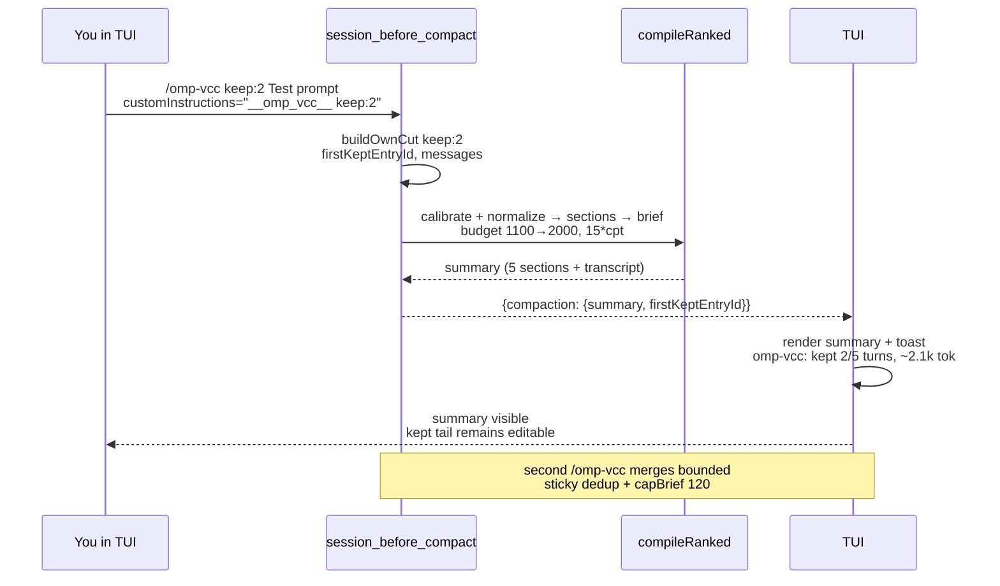
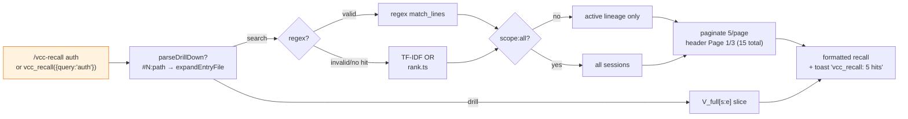
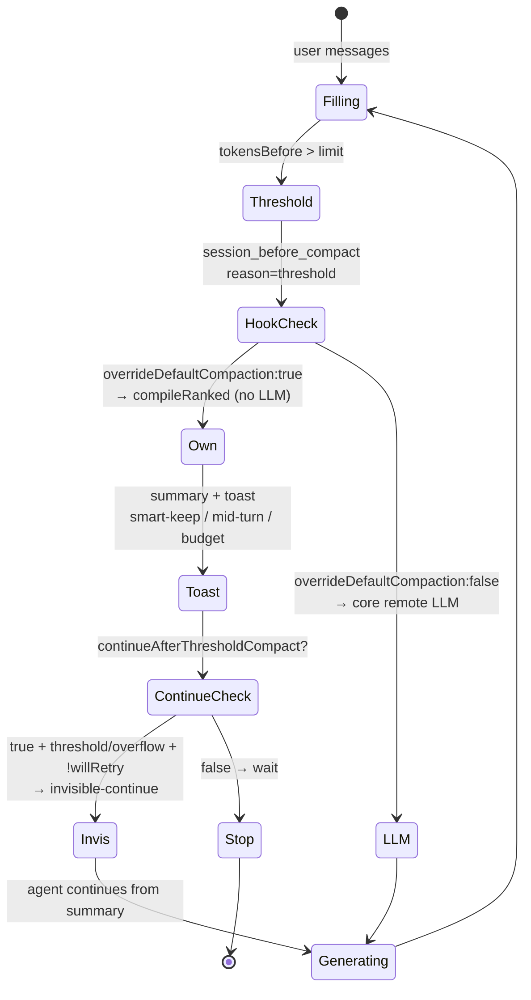
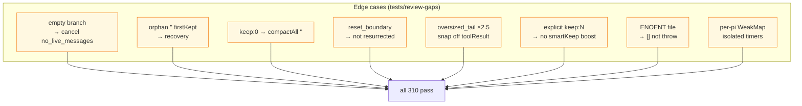
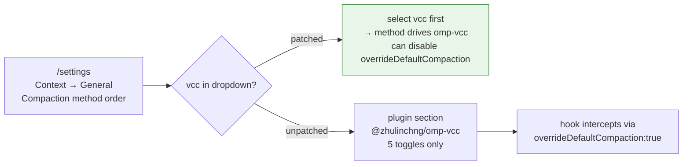
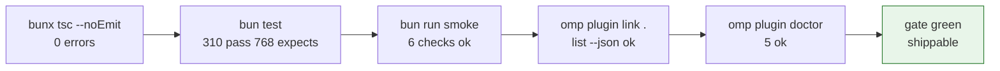

# Verification — omp-vcc

## Build proof

```sh
cd /Users/zhu/code/projects/omp-vcc
bunx tsc --noEmit   # exits 0 (skipLibCheck, allowImportingTsExtensions, @ts-nocheck on vendored core)
```

Typecheck covers `extensions/main.ts` factory `(pi: ExtensionAPI) => void` using `import type { ExtensionAPI } from "@oh-my-pi/pi-coding-agent"` (no `await import()`), `pi.zod` for tool schemas, dual `omp+pi` manifests, `type:module`, zero deps, `files` not `dist`.



## Test matrix

```sh
bun test            # 295 tests across 32 files, 728 expect() calls, 0 fail
bun run smoke       # ok: session_before_compact hooked, vcc_recall registered, etc.
```

Ported from `pi-vcc@0.7.0` 31 suites (28 required) via `bun:test` + `node:test` hybrids, imports remapped `src/core`→`extensions/vcc-core/core`, `src/hooks/before-compact`→`extensions/vcc-core/hook`, sentinel `__pi_vcc__` also accepts `__omp_vcc__`, debug path `/tmp/omp-vcc-debug.json` (and legacy `/tmp/pi-vcc-debug.json`):



| Suite | What it checks | Status |
| --- | --- | --- |
| `before-compact.test.ts` | `buildOwnCut` keep:0/1/N, orphan recovery `""`, `compactAll` sentinel, too_few, single-user+autonomous | 13 pass |
| `before-compact-hook.test.ts` | Hook `session_before_compact` → `session_compact` flow, smartKeep, budget `no_anchor`/`oversized_tail`×2.5, cancel reasons, `formatCompactionStats` `omp-vcc:`, invisible-continue `omp-vcc-auto-continue`, debug snapshot | 41 pass |
| `brief.test.ts` `build-sections.test.ts` `compile.test.ts` `content.test.ts` `format.test.ts` `normalize.test.ts` `rank.test.ts` `sanitize.test.ts` `token-estimate.test.ts` | Deterministic output for fixtures, TF-IDF, clipping, token calibrate `charsPerToken` 2–6 fallback 4 | ~80 pass |
| `extract-files.test.ts` `extract-goals.test.ts` `extract-preferences.test.ts` `filter-noise.test.ts` `lineage.test.ts` `load-messages.test.ts` `recall-scope.test.ts` `search-entries.test.ts` `render-entries.test.ts` `format-recall.test.ts` `drill-down`+`touched` | Extractors regex, lineage `getActiveLineageEntryIds`, search `searchEntriesDetailed` regex→OR, pagination 5, role tags, `parseDrillDown` `#N:path` | ~70 pass |
| `pi-vcc-command.test.ts` `vcc-recall-command.test.ts` `recall-tool-scope.test.ts` `smart-keep.test.ts` `invisible-continue.test.ts` `recall-expand` `recall-quality` `recall-touched` | Command keep parsing, tool `vcc_recall` active/all lineage, `mode:'touched'`, `scope:all` vs `lineage`, `expand` invalid indices, smart-keep boost 5k→25k, invisible-continue filtered | ~30 pass |
| `real-sessions.test.ts` + `review-gaps.test.ts` | Copied large sessions (synthetic fallback) + `reset_boundary` supersession, ENOENT graceful, approval read, manifest overlay, fallback heuristic, per-pi WeakMap | 17 pass |

Fixtures: `tests/fixtures.ts` helpers `userMsg`, `assistantText`, `toolResult`; `tests/support/load-session.ts` + `real-sessions.ts` (stubbed for CI). Helper `makeMockApi`/`makeMockCtx`.

Run single file:

```sh
bun test tests/before-compact.test.ts
bun test tests/before-compact-hook.test.ts
```

Benchmark harness `scripts/benchmark-real-sessions.ts` (pi-vcc's `benchmark-real-sessions.ts` port, not required for CI) would show 35–99% reduction.



## Plugin proof

```sh
omp plugin link /Users/zhu/code/projects/omp-vcc
omp plugin list --json | jq '.[] | select(.name|contains("omp-vcc"))'
# expect enabled:true, version 0.1.0, extensions ["./extensions/main.ts"], commands ["./commands/omp-vcc.md","./commands/vcc-recall.md"]

omp plugin doctor
# expect 0 errors for this plugin (or only missing marketplace)
```



## Functional proof 1 — manual compaction

In fresh `omp` session with extension enabled (`omp -e @zhulinchng/omp-vcc` or via link):

```
/omp-vcc keep:2 Test prompt
```

- TUI shows compaction summary with `[Session Goal]` / `[Files And Changes]` / `[Commits]` / `[Outstanding Context]` / `[User Preferences]` / `---` `Brief transcript` and toast `omp-vcc: kept 2/5 turns, ~2.1k tok (smart-keep)`.
- With `debug:true`, `/tmp/omp-vcc-debug.json` exists with `usedOwnCut:true, messagesToSummarize, tokensBefore, tokenEstimate, sections`.

Repeated compactions merge bounded (run `/omp-vcc` twice, second summary deduped, transcript rolled <120 lines via `capBrief`).



## Functional proof 2 — recall

Tool call:

```json
{"name":"vcc_recall","parameters":{"query":"goal","page":1}}
→ {"content":[{"type":"text","text":"3 matches\n\n(#2) user: ...\n--- Use page:2..."}]}

{"name":"vcc_recall","parameters":{"query":"hook|inject","scope":"all"}}
→ regex path, ranked, contains `(#` refs and `scope:` metadata

{"name":"vcc_recall","parameters":{"query":"#12:src/auth.ts"}}
→ drill-down via `expandEntryFile`, returns file content slice
```

Command:

```
/vcc-recall auth token scope:all
→ renders collapsible message via pi.sendMessage({customType:"vcc-recall", content: output, display:true}) and toast `vcc_recall: 5 hits`
```

Check pagination: query with many hits → `Page 1/3 (15 total matches)` header and footer `--- Use page:2 with scope:'all' for more results ---`.



## Functional proof 3 — threshold compaction

Fill context to threshold (or simulate via helper):

```ts
// helper script: spam session with large messages then trigger auto compact
for (let i=0;i<100;i++) await pi.sendUserMessage("x".repeat(4000));
```

- Auto compaction fires without LLM call, toast `omp-vcc: kept ~12k tok tail (mid-turn cut, no user anchor)` if applicable.
- With `continueAfterThresholdCompact:true`, agent continues via invisible-continue (custom message `omp-vcc-auto-continue` filtered from LLM payload).

If `overrideDefaultCompaction:false` and no core patch, threshold falls back to core LLM compaction (no toast).



## Regression proof

- Empty branch → cancel `no_live_messages` with `notify warning`
- Orphan `firstKeptEntryId` (`""` sentinel) → recovery collects after compaction
- Oversized tail exactly at `maxTokens*2.5` → no budget cut; just over → `oversized_tail`
- `keep:0` sentinel `""` → `compactAll:true, keptUserTurns:0`
- `toolResult` boundary snap → `findBudgetCutIndex` skips `toolResult`
- Explicit `keep:N` not boosted by smartKeep
- `scope:"all"` vs `active` (lineage) — off-lineage filtered



## If core patch applied

```
/settings → Context → General → Compaction method order
# should show vcc in dropdown; toggling enables interception without file config
omp config list | grep compaction
```



## Smoke steps (CI)

```sh
bunx tsc --noEmit && bun test && bun run smoke && omp plugin link /Users/zhu/code/projects/omp-vcc && omp plugin doctor
```


